# Lead Lifecycle

> **Module:** CRM / Lead Management
> **Version:** 1.0
> **Last Updated:** December 2025

---

## Overview

Every lead in FleetCore progresses through a structured lifecycle from initial capture to final outcome. The system tracks leads using two parallel dimensions: **status** (workflow state managed by sales reps) and **stage** (qualification level calculated by algorithms). Understanding this dual-tracking model is essential for effective CRM usage.

---

## Lead Status (Workflow State)

Status represents where a lead sits in the sales workflow. Sales representatives manually update status as they work leads through the pipeline.

```mermaid
stateDiagram-v2
    [*] --> new: Demo Request / Manual Entry
    new --> working: First Contact Made
    working --> qualified: Score ≥ 70 achieved
    working --> lost: No Response / Rejected
    qualified --> converted: Opportunity Created
    qualified --> lost: Deal Declined
    converted --> [*]: Lifecycle Complete
    lost --> [*]: Lifecycle Complete
```



### Status Definitions

| Status      | Description                               | Who Sets It            | Typical Duration |
| ----------- | ----------------------------------------- | ---------------------- | ---------------- |
| `new`       | Lead just created, awaiting first contact | System (on creation)   | < 24 hours (SLA) |
| `working`   | Sales rep actively engaging with lead     | Sales Rep              | 1-4 weeks        |
| `qualified` | Lead achieved sales_qualified stage       | System (auto-sync)     | 1-2 weeks        |
| `converted` | Opportunity successfully created          | System (on conversion) | Terminal         |
| `lost`      | Lead rejected or became unresponsive      | Sales Rep              | Terminal         |

**Source:** Prisma enum `lead_status` in `prisma/schema.prisma:5154-5160`

### Status Transitions

Not all status transitions are valid. The system enforces logical progression:

| From        | To          | Trigger                            |
| ----------- | ----------- | ---------------------------------- |
| `new`       | `working`   | Sales rep makes first contact      |
| `new`       | `lost`      | Lead immediately disqualified      |
| `working`   | `qualified` | System auto-sync when stage = SQL  |
| `working`   | `lost`      | No response after follow-ups       |
| `qualified` | `converted` | Convert to Opportunity action      |
| `qualified` | `lost`      | Deal declined during qualification |

**Important:** Status `qualified` is automatically set by the system when a lead reaches `sales_qualified` stage. Manual override is possible but discouraged.

---

## Lead Stage (Qualification Level)

Stage represents the lead's qualification level based on scoring algorithms. Unlike status, stage is primarily **calculated automatically** based on the qualification score.

```mermaid
flowchart LR
    TOF[Top of Funnel<br>score < 40<br>🔵 Early Interest]
    MQL[Marketing Qualified<br>40 ≤ score < 70<br>🟣 Shows Promise]
    SQL[Sales Qualified<br>score ≥ 70<br>🟢 Ready for Sales]
    OPP[Opportunity<br>Converted<br>✅ Deal in Progress]

    TOF -->|Score increases| MQL
    MQL -->|Score increases| SQL
    SQL -->|Convert action| OPP
    MQL -->|Score decreases| TOF
    SQL -->|Score decreases| MQL
```



### Stage Definitions

| Stage                 | Score Range | Meaning                           | Next Action              |
| --------------------- | ----------- | --------------------------------- | ------------------------ |
| `top_of_funnel`       | 0-39        | Early interest, needs nurturing   | Send educational content |
| `marketing_qualified` | 40-69       | Shows promise, warrants attention | Schedule discovery call  |
| `sales_qualified`     | 70-100      | Ready for active sales engagement | Begin sales process      |
| `opportunity`         | N/A         | Converted to opportunity record   | Work the pipeline        |

**Source:** Prisma enum `lead_stage` in `prisma/schema.prisma:5147-5152`

### Stage Calculation

Stage is determined by the qualification score formula:

```
qualification_score = (fit_score × 0.6) + (engagement_score × 0.4)

Where:
- fit_score: 0-60 points (fleet size + country tier)
- engagement_score: 0-100 points (behavior metrics)
- Thresholds: SQL ≥ 70, MQL ≥ 40, TOF < 40
```

**Source:** `lib/services/crm/lead-scoring.service.ts:9-11`

---

## Status vs Stage: Critical Distinction

Understanding the relationship between status and stage is crucial:

| Aspect              | Status             | Stage                    |
| ------------------- | ------------------ | ------------------------ |
| **Purpose**         | Workflow tracking  | Qualification level      |
| **Control**         | Manual (Sales Rep) | Automatic (Algorithm)    |
| **Updates**         | On user action     | On score recalculation   |
| **Can Go Backward** | No (forward only)  | Yes (if score decreases) |
| **Visible To**      | Internal team      | Internal team            |

### Auto-Sync Rules

The system automatically synchronizes status with stage in specific scenarios:

```typescript
// From lib/actions/crm/qualify.actions.ts:132-139

// When stage reaches MQL and status is "new"
if (newStage === "marketing_qualified" && currentLead.status === "new") {
  updateData.status = "working";
}

// When stage reaches SQL
if (newStage === "sales_qualified") {
  updateData.status = "qualified";
}
```

---

## Lifecycle Events

### Creation Event

When a lead is created (via demo form or manual entry):

1. **Status:** Set to `new`
2. **Stage:** Calculated based on initial data
3. **Scores:** Fit and engagement scores computed
4. **Assignment:** Auto-assigned to sales rep
5. **Notification:** Sales rep notified of new lead

### Qualification Event

When lead stage changes to `sales_qualified`:

1. **Status:** Auto-synced to `qualified`
2. **qualified_date:** Timestamp recorded
3. **Notification:** Sales rep notified of SQL achievement
4. **Audit Log:** Stage transition recorded

### Conversion Event

When lead is converted to opportunity:

1. **Status:** Set to `converted`
2. **Stage:** Set to `opportunity`
3. **converted_date:** Timestamp recorded
4. **Opportunity:** New record created with stage `qualification`
5. **Lead:** `opportunity_id` field populated

### Loss Event

When lead is marked as lost:

1. **Status:** Set to `lost`
2. **lost_reason:** Should be captured (recommended, not required)
3. **lost_date:** Timestamp recorded (if field exists)

---

## Terminal States

### Converted

When a lead reaches `converted` status:

- Lead record remains in database (not deleted)
- `opportunity_id` links to created opportunity
- Stage is set to `opportunity`
- No further status changes possible
- Lead appears in "Converted Leads" reports

### Lost

When a lead reaches `lost` status:

- Lead record remains in database (soft delete pattern)
- `lost_reason` should document why (free text, not enum)
- No automatic reactivation mechanism exists
- **Reactivation:** Possible via manual status update by manager, but not recommended

**Note:** Lost leads are NOT soft-deleted (deleted_at remains null). They remain visible for reporting and analytics.

---

## Audit Trail

All significant lifecycle events are logged to `adm_audit_logs`:

```typescript
// From lib/actions/crm/qualify.actions.ts:172-189

await db.adm_audit_logs.create({
  data: {
    tenant_id: tenantUuid,
    member_id: memberUuid,
    entity: "crm_lead",
    entity_id: leadId,
    action: "QUALIFY", // or "CREATE", "UPDATE", "CONVERT"
    old_values: { lead_stage: currentStage },
    new_values: { lead_stage: newStage, notes },
    severity: "info",
    category: "operational",
  },
});
```

### Logged Events

| Event          | Action    | What's Captured         |
| -------------- | --------- | ----------------------- |
| Lead created   | `CREATE`  | Initial lead data       |
| Stage changed  | `QUALIFY` | Old stage → New stage   |
| Lead converted | `CONVERT` | Lead → Opportunity link |
| Lead updated   | `UPDATE`  | Changed fields          |
| Lead deleted   | `DELETE`  | Deletion reason         |

---

## Lifecycle Constraints

### Forward-Only Stage Progression (Manual Qualification)

The `qualifyLeadAction` enforces forward-only progression:

```typescript
// From lib/actions/crm/qualify.actions.ts:113-124

const STAGE_ORDER = [
  "top_of_funnel",
  "marketing_qualified",
  "sales_qualified",
  "opportunity",
];

const currentIndex = STAGE_ORDER.indexOf(currentStage);
const newIndex = STAGE_ORDER.indexOf(newStage as LeadStage);

if (newIndex <= currentIndex) {
  return { success: false, error: "Cannot move to previous or same stage" };
}
```

**However:** Automatic stage recalculation (via scoring) CAN move a lead backward if their score decreases. This typically happens during score degradation for inactive leads.

### Conversion Requirement

Only `sales_qualified` leads can be converted to opportunities:

```typescript
// From lib/actions/crm/convert.actions.ts:121-127

if (currentLead.lead_stage !== "sales_qualified") {
  return {
    success: false,
    error: "Lead must be Sales Qualified to convert",
  };
}
```

---

_Next: [Lead Scoring](./02_lead_scoring.md)_
