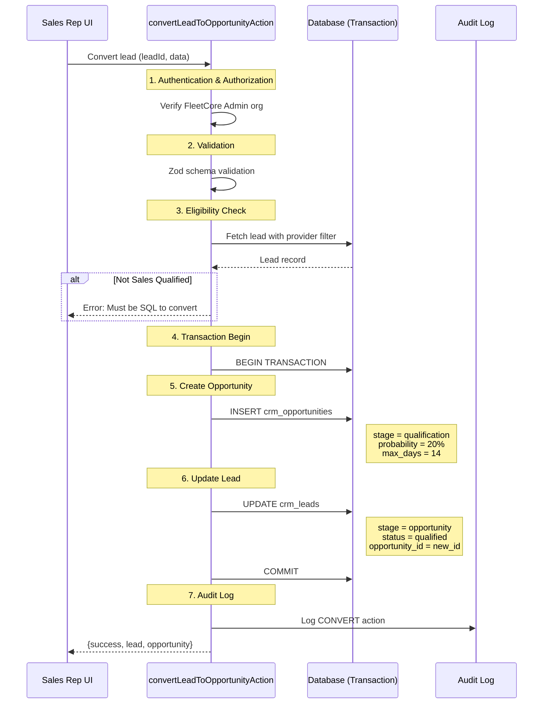
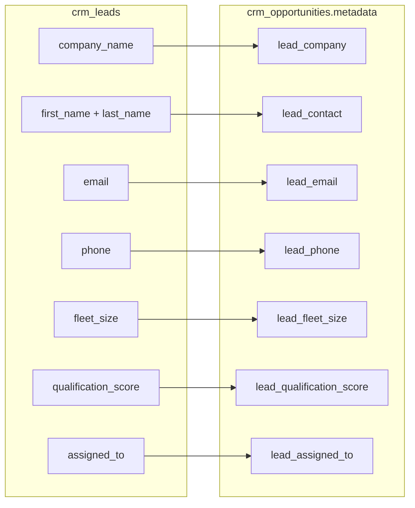
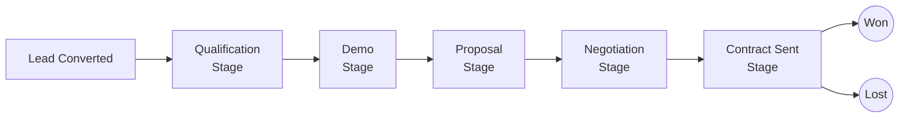

# Lead Conversion

> **Module:** CRM / Lead Management
> **Version:** 1.0
> **Last Updated:** December 2025

---

## Overview

Lead conversion is the process of transforming a Sales Qualified Lead (SQL) into an Opportunity. This action marks the transition from lead management to pipeline management, creating a new deal record that will be tracked through the sales pipeline stages.

---

## Conversion Flow



**Source:** `lib/actions/crm/convert.actions.ts:62-318`

---

## Eligibility Requirements

Only leads that meet specific criteria can be converted to opportunities.

### Conversion Prerequisite

```typescript
// From lib/actions/crm/convert.actions.ts:121-126

if (currentLead.lead_stage !== "sales_qualified") {
  return {
    success: false,
    error: "Lead must be Sales Qualified to convert",
  };
}
```

| Criterion                 | Required | Rationale                                |
| ------------------------- | -------- | ---------------------------------------- |
| Stage = `sales_qualified` | ✅ Yes   | Ensures lead has been properly qualified |
| Status = Any              | -        | Status is auto-synced on conversion      |
| Assigned sales rep        | -        | Recommended but not required             |

**Why SQL Only?** The qualification threshold (score ≥ 70) ensures leads entering the pipeline have demonstrated sufficient fit and engagement to warrant sales investment.

---

## Conversion Input

The conversion action accepts structured input for the new opportunity.

### Input Schema

```typescript
// From lib/actions/crm/convert.actions.ts:31-40

const ConvertSchema = z.object({
  opportunityName: z
    .string()
    .min(2, "Name must be at least 2 characters")
    .max(200),
  expectedValue: z.string().optional(),
  expectedCloseDate: z.string().optional(),
  stage: z.string().optional(),
  notes: z.string().max(2000).optional(),
});
```

### Input Fields

| Field               | Type   | Constraints          | Default           |
| ------------------- | ------ | -------------------- | ----------------- |
| `opportunityName`   | String | 2-200 characters     | Required          |
| `expectedValue`     | String | Numeric string       | `null`            |
| `expectedCloseDate` | String | ISO date string      | `null`            |
| `stage`             | String | Valid pipeline stage | `"qualification"` |
| `notes`             | String | Max 2000 characters  | `null`            |

### Example Input

```json
{
  "opportunityName": "Acme Corp - 200 Vehicle Fleet",
  "expectedValue": "75000",
  "expectedCloseDate": "2025-03-15",
  "stage": "qualification",
  "notes": "CEO interested, budget approved for Q1"
}
```

---

## Transaction Operations

Conversion is executed as an atomic transaction to ensure data consistency.

### Step 1: Create Opportunity

```typescript
// From lib/actions/crm/convert.actions.ts:141-183

const opportunityData = {
  lead_id: leadId,
  stage: selectedStage, // Default: "qualification"
  probability_percent: getStageProbability(selectedStage), // Default: 20%
  max_days_in_stage: getStageMaxDays(selectedStage), // Default: 14
  stage_entered_at: new Date(),
  expected_close_date: validation.data.expectedCloseDate
    ? new Date(validation.data.expectedCloseDate)
    : null,
  expected_value: validation.data.expectedValue
    ? parseFloat(validation.data.expectedValue)
    : null,
  currency: "EUR",
  metadata: {
    opportunity_name: validation.data.opportunityName,
    converted_from_lead: true,
    lead_company: currentLead.company_name,
    lead_contact: `${currentLead.first_name} ${currentLead.last_name}`.trim(),
    lead_email: currentLead.email,
    lead_phone: currentLead.phone,
    lead_fleet_size: currentLead.fleet_size,
    lead_qualification_score: currentLead.qualification_score,
    lead_assigned_to: currentLead.assigned_to,
    notes: validation.data.notes || null,
    created_by_clerk_id: userId,
  },
};
```

### Opportunity Defaults

| Field                 | Default Value     | Source                      |
| --------------------- | ----------------- | --------------------------- |
| `stage`               | `"qualification"` | `DEFAULT_OPPORTUNITY_STAGE` |
| `probability_percent` | `20%`             | `getStageProbability()`     |
| `max_days_in_stage`   | `14 days`         | `getStageMaxDays()`         |
| `status`              | `"open"`          | Schema default              |
| `currency`            | `"EUR"`           | Hardcoded                   |

**Source:** `lib/config/opportunity-stages.ts`

### Step 2: Update Lead

```typescript
// From lib/actions/crm/convert.actions.ts:187-194

const updatedLead = await tx.crm_leads.update({
  where: { id: leadId },
  data: {
    lead_stage: "opportunity",
    status: "qualified", // Auto-sync status
    converted_date: new Date(),
    opportunity_id: opportunity.id,
    updated_at: new Date(),
  },
});
```

### Lead Updates on Conversion

| Field            | New Value            | Purpose                   |
| ---------------- | -------------------- | ------------------------- |
| `lead_stage`     | `"opportunity"`      | Terminal stage            |
| `status`         | `"qualified"`        | Consistent with SQL       |
| `converted_date` | Current timestamp    | Conversion tracking       |
| `opportunity_id` | New opportunity UUID | Links lead to opportunity |

---

## Metadata Preservation

Critical lead information is preserved in the opportunity's metadata JSONB field.

### Preserved Fields



### Why Metadata?

| Reason          | Explanation                                             |
| --------------- | ------------------------------------------------------- |
| **Audit trail** | Original lead data preserved even if lead is modified   |
| **Reporting**   | Easy access to conversion source data                   |
| **Context**     | Sales reps see qualification context without navigating |
| **Flexibility** | JSONB allows extension without schema changes           |

---

## Audit Trail

Conversion events are logged to `adm_audit_logs` for compliance and analytics.

### Audit Entry

```typescript
// From lib/actions/crm/convert.actions.ts:217-233

await db.adm_audit_logs.create({
  data: {
    tenant_id: tenantUuid,
    member_id: memberUuid,
    entity: "crm_lead",
    entity_id: leadId,
    action: "CONVERT",
    old_values: { lead_stage: currentLead.lead_stage },
    new_values: {
      lead_stage: "opportunity",
      opportunity_id: result.opportunity.id,
      opportunity_name: validation.data.opportunityName,
    },
    severity: "info",
    category: "operational",
  },
});
```

### Audit Fields

| Field        | Value                                   |
| ------------ | --------------------------------------- |
| `action`     | `"CONVERT"`                             |
| `entity`     | `"crm_lead"`                            |
| `old_values` | `{ lead_stage: "sales_qualified" }`     |
| `new_values` | Stage, opportunity ID, opportunity name |

---

## Notifications

### Post-Conversion Notifications

| Event                 | Template                               | Recipient                      | Status  |
| --------------------- | -------------------------------------- | ------------------------------ | ------- |
| Opportunity created   | `crm_opportunity_created_notification` | Manager commercial             | Planned |
| Onboarding prep       | -                                      | Customer Success team          | Planned |
| Marketing attribution | -                                      | Marketing team (if utm_source) | Planned |

**Current State:** Post-conversion notifications are not yet implemented. The audit log records the conversion event, but automated stakeholder notifications are planned for a future sprint.

**Planned Notifications (from specs):**

| Notification          | Recipient        | Message Content                                                              |
| --------------------- | ---------------- | ---------------------------------------------------------------------------- |
| Manager Alert         | Sales Manager    | "New opportunity created by [rep], estimated value [amount], company [name]" |
| CS Prep               | Customer Success | "Prepare onboarding for [company], expected closing [date]"                  |
| Marketing Attribution | Marketing        | "Lead from [utm_source] converted to opportunity, campaign [utm_campaign]"   |

### Implementation Notes

When implemented, notifications will:

1. Queue via `NotificationService.queueNotification()`
2. Use templates from `adm_notification_templates`
3. Include opportunity metadata for personalization
4. Respect user notification preferences

**Source:** Not yet implemented in `lib/actions/crm/convert.actions.ts`

---

## Authorization

Conversion requires FleetCore Admin organization membership.

```typescript
// From lib/actions/crm/convert.actions.ts:85-94

if (!ADMIN_ORG_ID || orgId !== ADMIN_ORG_ID) {
  return {
    success: false,
    error: `Forbidden: Admin access required`,
  };
}
```

### Who Can Convert

| Role              | Can Convert | Notes                       |
| ----------------- | ----------- | --------------------------- |
| Sales Rep         | ✅          | Primary conversion workflow |
| Sales Manager     | ✅          | Oversight capability        |
| CRM Administrator | ✅          | Full access                 |
| External Users    | ❌          | No CRM access               |

---

## Post-Conversion State

### Lead State

After conversion, the lead enters a terminal state:

| Field            | Value           | Significance                      |
| ---------------- | --------------- | --------------------------------- |
| `lead_stage`     | `"opportunity"` | Terminal - no further progression |
| `status`         | `"qualified"`   | Reflects SQL achievement          |
| `converted_date` | Timestamp       | Marks conversion moment           |
| `opportunity_id` | UUID            | Links to created opportunity      |

### Opportunity State

The new opportunity enters the pipeline:

| Field                 | Value             | Significance              |
| --------------------- | ----------------- | ------------------------- |
| `stage`               | `"qualification"` | First pipeline stage      |
| `probability_percent` | `20%`             | Default for qualification |
| `max_days_in_stage`   | `14`              | Rotting threshold         |
| `stage_entered_at`    | Timestamp         | For rotting calculation   |
| `status`              | `"open"`          | Active deal               |

---

## Path Revalidation

After successful conversion, Next.js paths are revalidated to refresh UI:

```typescript
// From lib/actions/crm/convert.actions.ts:243-245

revalidatePath("/[locale]/(crm)/crm/leads");
revalidatePath(`/[locale]/(crm)/crm/leads/${leadId}`);
revalidatePath("/[locale]/(crm)/crm/opportunities");
```

This ensures:

- Leads list shows updated status
- Lead detail page shows conversion
- Opportunities list shows new deal

---

## Error Handling

### Common Errors

| Error                                     | Cause                        | Resolution            |
| ----------------------------------------- | ---------------------------- | --------------------- |
| "Unauthorized"                            | No authenticated user        | Ensure logged in      |
| "Forbidden: Admin access required"        | Wrong organization           | Contact administrator |
| "Name must be at least 2 characters"      | Validation failure           | Provide valid name    |
| "Lead not found"                          | Invalid ID or wrong provider | Verify lead exists    |
| "Lead must be Sales Qualified to convert" | Wrong stage                  | Qualify lead first    |

### Transaction Rollback

If any step fails within the transaction, all changes are rolled back:

```typescript
// Transaction ensures atomicity
const result = await db.$transaction(async (tx) => {
  // If opportunity creation fails → rollback
  const opportunity = await tx.crm_opportunities.create({...});

  // If lead update fails → rollback opportunity too
  const updatedLead = await tx.crm_leads.update({...});

  return { lead: updatedLead, opportunity };
});
```

---

## Conversion Result

### Success Response

```typescript
{
  success: true,
  lead: {
    id: "lead-uuid",
    lead_stage: "opportunity",
    status: "qualified",
    converted_date: "2025-01-20T10:30:00Z",
    opportunity_id: "opp-uuid",
    // ... other lead fields
  },
  opportunity: {
    id: "opp-uuid",
    lead_id: "lead-uuid",
    stage: "qualification",
    probability_percent: 20,
    expected_value: 75000,
    // ... other opportunity fields
  }
}
```

### Decimal Serialization

Decimal fields are converted to plain numbers for client compatibility:

```typescript
// From lib/actions/crm/convert.actions.ts:256-273

const serializedOpportunity = {
  ...result.opportunity,
  expected_value: result.opportunity.expected_value
    ? Number(result.opportunity.expected_value)
    : null,
  probability_percent: result.opportunity.probability_percent
    ? Number(result.opportunity.probability_percent)
    : null,
  // ... other decimal fields
};
```

---

## What Happens Next

After conversion, the opportunity enters the pipeline workflow:



### Next Steps for Sales Rep

1. **Schedule discovery call** - Understand detailed requirements
2. **Prepare demo** - Customize for lead's fleet size and needs
3. **Progress pipeline** - Move through stages as deal advances
4. **Monitor rotting** - Don't let deal stall beyond `max_days_in_stage`

---

## Related Documentation

- [Lead Lifecycle](./01_lead_lifecycle.md) - Terminal states
- [Lead Qualification](./04_lead_qualification.md) - Reaching SQL
- [Opportunity Pipeline](../03_OPPORTUNITY_MANAGEMENT/01_opportunity_pipeline.md) - Post-conversion workflow

---

_Next: [Opportunity Pipeline](../03_OPPORTUNITY_MANAGEMENT/01_opportunity_pipeline.md)_
