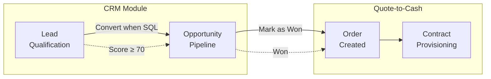
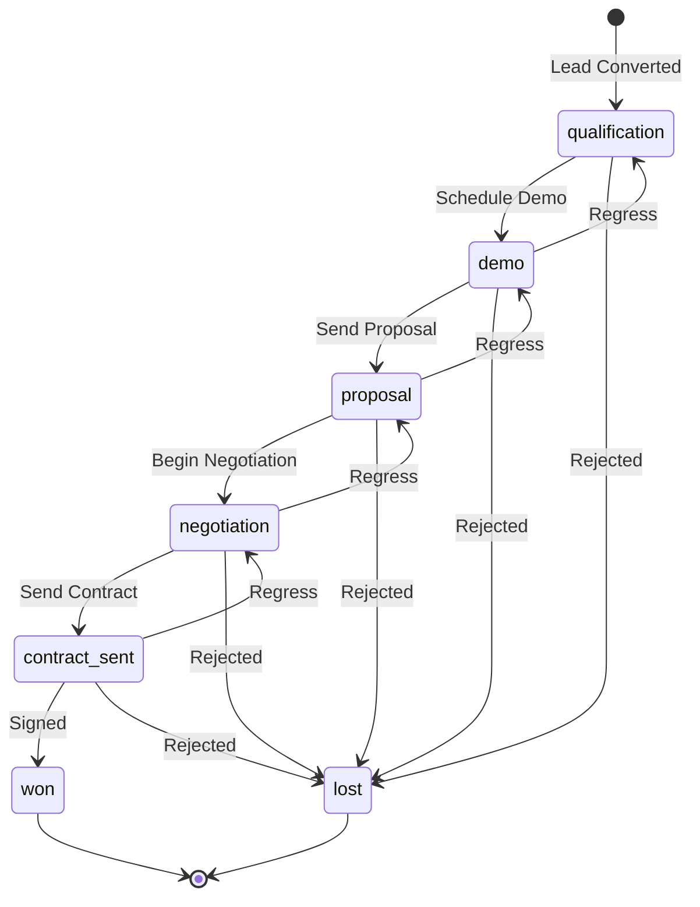

# Opportunity Pipeline

> **Module:** CRM / Opportunity Management
> **Version:** 1.0
> **Last Updated:** December 2025

---

## Overview

An opportunity represents a qualified sales deal moving through the commercial pipeline. Unlike leads which track initial interest and qualification, opportunities track the active sales process from first engagement to contract signature. Each opportunity progresses through defined stages, with automated probability calculations and deal rotting detection to ensure pipeline health.

---

## Lead to Opportunity to Contract



The opportunity sits at the center of the sales workflow. It begins when a Sales Qualified Lead converts, and ends when the deal closes as won (creating an order) or lost. This document focuses on the pipeline stages and transitions; see [Lead Conversion](../02_LEAD_MANAGEMENT/05_lead_conversion.md) for the entry point and [Opportunity Closure](./03_opportunity_closure.md) for terminal states.

---

## Pipeline Stages

FleetCore uses a five-stage sales pipeline. Each stage has a default probability reflecting historical close rates, and a maximum duration before the deal is flagged as "rotting."



### Stage Configuration

| Stage           | Probability | Max Days | Color  | Order | Typical Action              |
| --------------- | ----------- | -------- | ------ | ----- | --------------------------- |
| `qualification` | 20%         | 14       | Blue   | 1     | Schedule discovery call     |
| `demo`          | 40%         | 10       | Purple | 2     | Conduct product demo        |
| `proposal`      | 60%         | 14       | Yellow | 3     | Prepare and send proposal   |
| `negotiation`   | 80%         | 10       | Orange | 4     | Negotiate terms and pricing |
| `contract_sent` | 90%         | 7        | Green  | 5     | Await contract signature    |

**Source:** `lib/config/opportunity-stages.ts:41-87`

### Stage vs Status

FleetCore separates **stage** (pipeline position) from **status** (workflow state):

| Field    | Purpose            | Values                                                              |
| -------- | ------------------ | ------------------------------------------------------------------- |
| `stage`  | Pipeline position  | `qualification`, `demo`, `proposal`, `negotiation`, `contract_sent` |
| `status` | Deal outcome state | `open`, `won`, `lost`, `on_hold`, `cancelled`                       |

When a deal closes as won or lost, the stage remains unchanged (preserving where in the pipeline the deal closed), while the status changes to reflect the outcome.

**Source:** `prisma/schema.prisma:5271-5277` (opportunity_status enum)

---

## Stage Transitions

### Transition Rules

Stage transitions are controlled but flexible, allowing both forward progression and backward regression by one step only:

```typescript
// From lib/config/opportunity-stages.ts:163-178

function isValidStageTransition(fromStage: string, toStage: string): boolean {
  // Allow same stage (no change)
  if (from.value === to.value) return true;

  // Allow forward or backward by 1 step
  const diff = to.order - from.order;
  return diff === 1 || diff === -1;
}
```

### Valid Transitions

| From            | To              | Allowed | Rationale                    |
| --------------- | --------------- | ------- | ---------------------------- |
| `qualification` | `demo`          | Yes     | Forward progression          |
| `demo`          | `qualification` | Yes     | Regression if demo postponed |
| `demo`          | `proposal`      | Yes     | Forward progression          |
| `qualification` | `proposal`      | No      | Cannot skip stages           |
| `qualification` | `negotiation`   | No      | Cannot skip stages           |
| Any stage       | `won`/`lost`    | Yes     | Via Mark as Won/Lost action  |

**Skipping stages is not allowed.** Sales reps must progress through each stage sequentially, though they can regress by one step if circumstances change.

### On Stage Change

When the stage changes, the system automatically updates several fields:

```typescript
// From lib/actions/crm/opportunity.actions.ts:249-273

const updateData = {
  stage,
  stage_entered_at: now, // Reset timer
  max_days_in_stage: newMaxDays, // From config
  probability_percent: newProbability, // From config
  forecast_value: expectedValue * (newProbability / 100),
  metadata: {
    ...existingMetadata,
    stage_history: [
      ...stageHistory,
      { from: oldStage, to: stage, at: now.toISOString() },
    ],
  },
};
```

---

## Auto-Calculations

### Probability Percent

By default, probability updates automatically when stage changes:

| Stage           | Default Probability |
| --------------- | ------------------- |
| `qualification` | 20%                 |
| `demo`          | 40%                 |
| `proposal`      | 60%                 |
| `negotiation`   | 80%                 |
| `contract_sent` | 90%                 |

Sales reps can override this by manually editing the probability field. The system tracks whether probability was manually set versus auto-calculated, though the `probability_override` flag is stored in metadata rather than as a dedicated field.

**Source:** `lib/config/opportunity-stages.ts:115-117`

### Forecast Value

Forecast value is calculated automatically whenever expected_value or probability_percent changes:

```
forecast_value = expected_value × (probability_percent / 100)
```

**Example:**

- Expected Value: €50,000
- Stage: negotiation (80%)
- Forecast Value: €50,000 × 0.80 = €40,000

**Source:** `lib/actions/crm/opportunity.actions.ts:410-427`

---

## Stage History

Every stage transition is recorded in the `metadata.stage_history` JSONB array for audit and analytics purposes.

### History Entry Format

```json
{
  "stage_history": [
    {
      "from": "qualification",
      "to": "demo",
      "at": "2025-01-15T10:30:00.000Z"
    },
    {
      "from": "demo",
      "to": "proposal",
      "at": "2025-01-22T14:15:00.000Z"
    },
    {
      "from": "proposal",
      "to": "demo",
      "at": "2025-01-25T09:00:00.000Z"
    }
  ]
}
```

### What Stage History Captures

| Field  | Description                 |
| ------ | --------------------------- |
| `from` | Previous stage              |
| `to`   | New stage                   |
| `at`   | ISO timestamp of transition |

**Note:** The history array is append-only; entries are never removed. This provides a complete audit trail of how the deal progressed (or regressed) through the pipeline.

**Source:** `lib/actions/crm/opportunity.actions.ts:262-271`

---

## Stage Entered At

The `stage_entered_at` field tracks when the opportunity entered its current stage. This timestamp is critical for deal rotting detection.

### When It Resets

| Event                     | Reset? |
| ------------------------- | ------ |
| Stage change (forward)    | Yes    |
| Stage change (backward)   | Yes    |
| Field update (same stage) | No     |
| Status change to won/lost | No     |

**Source:** `prisma/schema.prisma:1529` (`stage_entered_at` field with default `now()`)

---

## Status Constraints

Stage changes are only allowed when the opportunity is open:

```typescript
// From lib/actions/crm/opportunity.actions.ts:229-235

if (current.status !== "open") {
  return {
    success: false,
    error: `Cannot change stage: opportunity is ${current.status}`,
  };
}
```

Once an opportunity is marked as `won`, `lost`, `on_hold`, or `cancelled`, the stage becomes locked. This preserves historical accuracy for pipeline analytics.

---

## Pipeline Metrics

Key metrics derived from the pipeline:

| Metric                    | Calculation                                        |
| ------------------------- | -------------------------------------------------- |
| **Pipeline Value**        | Sum of `expected_value` for all open opportunities |
| **Weighted Pipeline**     | Sum of `forecast_value` for all open opportunities |
| **Stage Conversion Rate** | % of opportunities advancing from stage N to N+1   |
| **Average Days in Stage** | Mean of `days_in_stage` per stage                  |
| **Win Rate**              | % of closed opportunities with status = won        |

---

## Related Documentation

- [Lead Conversion](../02_LEAD_MANAGEMENT/05_lead_conversion.md) - How opportunities are created
- [Deal Rotting](./02_deal_rotting.md) - Detecting stalled deals
- [Opportunity Closure](./03_opportunity_closure.md) - Won and Lost workflows

---

_Next: [Deal Rotting](./02_deal_rotting.md)_
