# PLAN DE DÉVELOPPEMENT FLEETCORE - VERSION DÉFINITIVE

**Date:** 10 Janvier 2025  
**Version:** 1.0 FINALE  
**Basé sur:** Audit technique du 09/10/2025 + Spécifications complètes  
**Durée totale:** 26 semaines (~6.5 mois)

---

## 📊 1. ANALYSE FACTUELLE DE L'EXISTANT

### 1.1 Infrastructure Confirmée (Audit 09/10/2025)

#### Base de données

- **55 tables** Prisma déployées sur Supabase PostgreSQL
- **12 domaines** : ADM (8), DIR (5), DOC (1), FLT (6), RID (7), SCH (4), TRP (6), FIN (7), REV (3), BIL (6), CRM (3), SUP (3)
- **2157 lignes** de schema.prisma avec relations complètes
- **RLS activé** sur 54/55 tables avec 2 policies par table:
  - `temp_allow_all_*` : PERMISSIVE pour développement
  - `tenant_isolation_*` : RESTRICTIVE prêt pour production

#### Stack technique

```yaml
Frontend:
  - Next.js: 15.5.3 (App Router + Turbopack)
  - React: 19.1.0
  - TailwindCSS: 4.1.13
  - Framer Motion: 12.1.0
  - i18n: react-i18next (EN/FR)

Backend:
  - Runtime: Node.js avec Next.js Server Components
  - ORM: Prisma 6.16.2
  - Database: PostgreSQL (Supabase)
  - Auth: Clerk 6.32.2 (Organizations)

Monitoring:
  - Sentry: 8.50.0 (configuré et fonctionnel)
```

#### Code métier existant

- **6 APIs CRM** : /api/demo-leads/\* (CRUD + activity)
- **Webhook Clerk** : Synchronisation organizations → tenants/members
- **Services utilitaires** : 176 lignes total
  - `lib/audit.ts` : 120 lignes (commenté pour dev)
  - `lib/organizations.ts` : 47 lignes
  - `lib/prisma.ts` : 9 lignes

### 1.2 Ce qui MANQUE (80% du système)

| Composant          | Existant | À construire | Criticité     |
| ------------------ | -------- | ------------ | ------------- |
| **APIs métier**    | 6/130    | 124          | 🔴 CRITIQUE   |
| **Service layer**  | 0/35     | 35           | 🔴 CRITIQUE   |
| **Business logic** | 0%       | 100%         | 🔴 CRITIQUE   |
| **UI/Dashboards**  | 3/50     | 47           | 🟠 HAUTE      |
| **Intégrations**   | 1/6      | 5            | 🟠 HAUTE      |
| **Tests**          | 0%       | 80% cible    | 🟡 IMPORTANTE |

---

## 🔗 2. INTERDÉPENDANCES VÉRIFIÉES

### 2.1 Dépendances entre domaines

```mermaid
graph TD
    DIR[Directory - Référentiels] --> FLT[Fleet - Véhicules]
    DIR --> RID[Drivers - Conducteurs]

    FLT --> ASG[Assignments]
    RID --> ASG

    ASG --> TRP[Trips - Trajets]
    TRP --> REV[Revenue - Revenus]
    REV --> FIN[Finance]
    FIN --> BIL[Billing SaaS]

    FLT --> SCH[Scheduling]
    RID --> SCH
```



### 2.2 Matrice de dépendances

| Module          | Dépend de       | Bloque                  | Peut être parallélisé avec |
| --------------- | --------------- | ----------------------- | -------------------------- |
| **Directory**   | Rien            | Fleet, Drivers          | -                          |
| **Fleet**       | Directory       | Assignments, Scheduling | Drivers                    |
| **Drivers**     | Directory       | Assignments, Scheduling | Fleet                      |
| **Assignments** | Fleet + Drivers | Trips                   | -                          |
| **Trips**       | Assignments     | Revenue                 | -                          |
| **Revenue**     | Trips           | Finance                 | -                          |
| **Finance**     | Revenue         | Billing                 | -                          |
| **Billing**     | Finance         | -                       | Support, CRM               |
| **Scheduling**  | Fleet + Drivers | -                       | Trips, Revenue             |

---

## 🚀 3. PLAN D'EXÉCUTION PAR PHASES

### PHASE 1: CORE MÉTIER MINIMAL (6 semaines)

#### Semaines 1-2: Architecture Service Layer

**Objectif:** Créer l'architecture manquante pour supporter la logique métier

**Structure à créer:**

```
lib/
├── core/
│   ├── base.service.ts       # Transaction support, error handling
│   ├── base.repository.ts    # CRUD générique, soft-delete
│   └── errors.ts             # Custom error classes
├── services/
│   ├── vehicles/
│   │   ├── vehicle.service.ts
│   │   └── vehicle.types.ts
│   ├── drivers/
│   │   ├── driver.service.ts
│   │   └── driver.types.ts
│   └── documents/
│       ├── document.service.ts
│       └── document.types.ts
├── repositories/
│   ├── vehicle.repository.ts
│   ├── driver.repository.ts
│   └── document.repository.ts
└── validators/
    ├── base.validators.ts    # Pagination, sorting
    ├── vehicle.validators.ts  # Zod schemas vehicles
    └── driver.validators.ts   # Zod schemas drivers
```

**APIs de base (10 endpoints):**

```typescript
// Directory APIs (référentiels)
GET    /api/v1/directory/makes
GET    /api/v1/directory/models
GET    /api/v1/directory/vehicle-classes
GET    /api/v1/directory/platforms
GET    /api/v1/directory/regulations

// Document APIs (générique)
POST   /api/v1/documents
GET    /api/v1/documents/:id
DELETE /api/v1/documents/:id
POST   /api/v1/documents/:id/verify
GET    /api/v1/documents/expiring
```

#### Semaines 3-4: Fleet Management

**Référence:** Section 3 du functional_specification_v3.md

**APIs Fleet (20 endpoints):**

```typescript
// Vehicle CRUD
POST   /api/v1/vehicles
GET    /api/v1/vehicles
GET    /api/v1/vehicles/:id
PATCH  /api/v1/vehicles/:id
DELETE /api/v1/vehicles/:id

// Vehicle Operations
POST   /api/v1/vehicles/:id/maintenance
GET    /api/v1/vehicles/:id/maintenance
PATCH  /api/v1/vehicles/:id/maintenance/:maintenanceId

POST   /api/v1/vehicles/:id/expenses
GET    /api/v1/vehicles/:id/expenses

POST   /api/v1/vehicles/:id/insurances
GET    /api/v1/vehicles/:id/insurances
PATCH  /api/v1/vehicles/:id/insurances/:insuranceId

POST   /api/v1/vehicles/:id/events
GET    /api/v1/vehicles/:id/events

// Vehicle Documents
POST   /api/v1/vehicles/:id/documents
GET    /api/v1/vehicles/:id/documents

// Vehicle Reports
GET    /api/v1/vehicles/:id/performance
GET    /api/v1/vehicles/:id/history
GET    /api/v1/vehicles/kpis
```

**Business Logic Fleet:**

- Cycle de vie véhicule (acquisition → registration → maintenance → disposal)
- Alertes documents expirés (30 jours avant)
- Calcul KPIs (revenue/km, cost/km, utilization rate)
- Validation âge véhicule selon réglementation pays

#### Semaines 5-6: Driver Management

**Référence:** Section 4 du functional_specification_v3.md

**APIs Drivers (25 endpoints):**

```typescript
// Driver CRUD
POST   /api/v1/drivers
GET    /api/v1/drivers
GET    /api/v1/drivers/:id
PATCH  /api/v1/drivers/:id
DELETE /api/v1/drivers/:id

// Driver Documents
POST   /api/v1/drivers/:id/documents
GET    /api/v1/drivers/:id/documents
POST   /api/v1/drivers/:id/documents/verify
GET    /api/v1/drivers/:id/documents/expiring

// Cooperation Terms (6 modèles)
POST   /api/v1/drivers/:id/cooperation
GET    /api/v1/drivers/:id/cooperation
PATCH  /api/v1/drivers/:id/cooperation/:termId
GET    /api/v1/drivers/:id/cooperation/history

// Performance
GET    /api/v1/drivers/:id/performance
POST   /api/v1/drivers/:id/performance/calculate
GET    /api/v1/drivers/:id/metrics

// Requests
POST   /api/v1/drivers/:id/requests
GET    /api/v1/drivers/:id/requests
PATCH  /api/v1/drivers/:id/requests/:requestId

// Training
POST   /api/v1/drivers/:id/training
GET    /api/v1/drivers/:id/training
POST   /api/v1/drivers/:id/training/:trainingId/complete

// Blacklist
POST   /api/v1/drivers/blacklist
GET    /api/v1/drivers/blacklist
DELETE /api/v1/drivers/blacklist/:id
```

**Modèles de Coopération (Section 4.2):**

1. **Fixed Rental:** Loyer fixe, conducteur garde revenus
2. **Crew/Shift Rental:** Plusieurs conducteurs, loyer par shift
3. **Percentage Split:** Partage en pourcentage (customizable par plateforme)
4. **Salary Model:** Salaire fixe (WPS compliance UAE)
5. **Rental Model:** Variations (daily/weekly/monthly)
6. **Buyout/Lease-to-Own:** Achat progressif du véhicule

---

### PHASE 2: ASSIGNMENTS & HANDOVERS (2 semaines)

#### Semaines 7-8: Assignment Workflow

**Référence:** Section 3.5 du functional_specification_v3.md

**APIs Assignments (10 endpoints):**

```typescript
POST   /api/v1/assignments
GET    /api/v1/assignments
GET    /api/v1/assignments/:id
PATCH  /api/v1/assignments/:id

// Handover Process
POST   /api/v1/assignments/:id/handover/start
POST   /api/v1/assignments/:id/handover/photos
POST   /api/v1/assignments/:id/handover/condition
POST   /api/v1/assignments/:id/handover/confirm
GET    /api/v1/assignments/:id/handover/protocol
GET    /api/v1/assignments/active
```

**Workflow Handover (5 étapes obligatoires):**

```typescript
interface HandoverProcess {
  // 1. Pre-Checks
  vehicleAvailable: boolean;
  documentsValid: boolean;
  cooperationTermsActive: boolean;

  // 2. Photo Capture
  photos: {
    front: string;
    back: string;
    leftSide: string;
    rightSide: string;
    interior: string;
    dashboard: string;
  };

  // 3. Condition Record
  odometerReading: number;
  fuelLevel: number;
  damageNotes: string[];
  equipmentInventory: string[];

  // 4. Confirmation
  outgoingDriverSignature: string;
  incomingDriverSignature: string;
  managerApproval?: string;

  // 5. System Actions
  updateAssignmentRecord: boolean;
  setOdometerBaseline: boolean;
  activateTelematics: boolean;
  updateDriverPortal: boolean;
}
```

---

### PHASE 3: REVENUE PIPELINE (6 semaines)

#### Semaines 9-10: Platform Import

**Référence:** Section 9.1 du functional_specification_v3.md

**APIs Platform Import (8 endpoints):**

```typescript
POST   /api/v1/import/csv
GET    /api/v1/import/jobs
GET    /api/v1/import/jobs/:jobId
POST   /api/v1/import/validate

POST   /api/v1/platforms
GET    /api/v1/platforms
POST   /api/v1/platforms/:id/accounts
GET    /api/v1/platforms/:id/accounts
```

**Parsers CSV par plateforme:**

```typescript
// Uber CSV columns
interface UberTrip {
  date: string;
  time: string;
  driver_name: string;
  trip_uuid: string;
  fare: number;
  commission: number;
  tips: number;
  surge: number;
  distance_km: number;
  duration_min: number;
}

// Bolt CSV columns
interface BoltTrip {
  order_date: string;
  driver_id: string;
  order_id: string;
  gross_amount: number;
  bolt_fee: number;
  driver_bonus: number;
  distance: number;
  duration: number;
}

// Careem CSV columns
interface CareemTrip {
  trip_date: string;
  captain_id: string;
  trip_id: string;
  trip_fare: number;
  careem_commission: number;
  captain_earnings: number;
  distance: number;
  time_minutes: number;
}
```

#### Semaines 11-12: Revenue Calculation

**Référence:** Section 4.2 + Section 5.2 du functional_specification_v3.md

**APIs Revenue (12 endpoints):**

```typescript
POST   /api/v1/trips
GET    /api/v1/trips
GET    /api/v1/trips/:id
PATCH  /api/v1/trips/:id

POST   /api/v1/revenue/calculate
GET    /api/v1/revenue/driver/:driverId
GET    /api/v1/revenue/vehicle/:vehicleId
GET    /api/v1/revenue/period

POST   /api/v1/revenue/reconcile
GET    /api/v1/revenue/reconciliations
GET    /api/v1/revenue/discrepancies
POST   /api/v1/revenue/discrepancies/:id/resolve
```

**Moteur de Calcul Revenue:**

```typescript
class RevenueCalculationEngine {
  calculate(trip: Trip, terms: CooperationTerms, investor?: InvestorShare) {
    const gross =
      trip.fare_base + trip.fare_distance + trip.fare_time + trip.tips;
    const platformCommission = gross * trip.platform_commission_rate;
    const netRevenue = gross - platformCommission;

    let distribution = {
      driver: 0,
      fleet: 0,
      investor: 0,
      supervisor: 0,
    };

    switch (terms.type) {
      case "PERCENTAGE":
        distribution.driver = netRevenue * terms.driverPercentage;
        distribution.fleet = netRevenue * terms.fleetPercentage;
        if (investor) {
          distribution.investor = distribution.fleet * investor.percentage;
          distribution.fleet -= distribution.investor;
        }
        break;

      case "FIXED_RENTAL":
        distribution.driver = netRevenue - terms.dailyRental;
        distribution.fleet = terms.dailyRental;
        break;

      case "SALARY":
        distribution.driver = 0; // Payé via payroll
        distribution.fleet = netRevenue;
        break;
    }

    // Apply bonuses/penalties
    distribution.driver += this.calculateBonus(trip, terms);
    distribution.driver -= this.calculatePenalties(trip, terms);

    return distribution;
  }
}
```

#### Semaines 13-14: Financial Settlements & WPS

**Référence:** Section 5.4 + Section 5.8 du functional_specification_v3.md

**APIs Finance (20 endpoints):**

```typescript
// Accounts & Transactions
POST   /api/v1/finance/accounts
GET    /api/v1/finance/accounts
POST   /api/v1/finance/transactions
GET    /api/v1/finance/transactions

// Settlements
POST   /api/v1/finance/settlements
GET    /api/v1/finance/settlements
PATCH  /api/v1/finance/settlements/:id
POST   /api/v1/finance/settlements/:id/approve
POST   /api/v1/finance/settlements/:id/pay

// Driver Payments
POST   /api/v1/finance/payment-batches
GET    /api/v1/finance/payment-batches
POST   /api/v1/finance/payment-batches/:id/process
GET    /api/v1/finance/payment-batches/:id/status

// WPS Specific (UAE)
POST   /api/v1/finance/wps/generate
GET    /api/v1/finance/wps/batches
POST   /api/v1/finance/wps/validate
GET    /api/v1/finance/wps/sif/:batchId

// Reports
GET    /api/v1/finance/reports/pnl
GET    /api/v1/finance/reports/cashflow
GET    /api/v1/finance/reports/reconciliation
```

**WPS SIF Generator (UAE):**

```typescript
class WPSGenerator {
  generateSIF(batch: PayrollBatch): string {
    // Header Record (EDR)
    let sif = `EDR,${batch.employerEID},${batch.bankRouting},`;
    sif += `${batch.paymentDate},${batch.recordCount},`;
    sif += `${batch.totalAmount},AED,${batch.salaryMonth}\n`;

    // Salary Records (SCR)
    for (const payment of batch.payments) {
      // Validate Emirates ID format
      if (!this.validateEmiratesID(payment.emiratesId)) {
        throw new Error(`Invalid Emirates ID: ${payment.emiratesId}`);
      }

      sif += `SCR,${payment.emiratesId},${payment.cardNumber},`;
      sif += `${payment.bankAccount},${payment.startDate},`;
      sif += `${payment.endDate},${payment.workDays},`;
      sif += `${payment.fixedSalary},${payment.variableSalary},`;
      sif += `${payment.leaveAmount}\n`;
    }

    return sif;
  }

  validateEmiratesID(id: string): boolean {
    // Format: 784-YYYY-NNNNNNN-N
    return /^784-\d{4}-\d{7}-\d$/.test(id);
  }
}
```

---

### PHASE 4: INTÉGRATIONS EXTERNES (4 semaines)

#### Semaines 15-16: Stripe Billing

**Référence:** Section 5.9 + Section 13 du functional_specification_v3.md

**Installation:**

```bash
npm install stripe @stripe/stripe-js
```

**APIs Billing SaaS (15 endpoints):**

```typescript
// Plans & Pricing
GET    /api/v1/billing/plans
POST   /api/v1/billing/plans
PATCH  /api/v1/billing/plans/:id

// Subscriptions
POST   /api/v1/billing/subscriptions
GET    /api/v1/billing/subscriptions
PATCH  /api/v1/billing/subscriptions/:id
POST   /api/v1/billing/subscriptions/:id/cancel

// Usage & Metrics
POST   /api/v1/billing/usage
GET    /api/v1/billing/usage/metrics
GET    /api/v1/billing/usage/overage

// Invoices
GET    /api/v1/billing/invoices
GET    /api/v1/billing/invoices/:id
POST   /api/v1/billing/invoices/:id/pay

// Webhooks
POST   /api/webhooks/stripe
```

**Plans SaaS définis:**

```typescript
const plans = {
  basic: {
    monthlyFee: 499,
    includedDrivers: 10,
    includedVehicles: 10,
    includedTrips: 1000,
    overagePerDriver: 15,
    overagePerVehicle: 20,
    overagePerTrip: 0.1,
  },
  pro: {
    monthlyFee: 999,
    includedDrivers: 50,
    includedVehicles: 50,
    includedTrips: 5000,
    overagePerDriver: 12,
    overagePerVehicle: 15,
    overagePerTrip: 0.08,
  },
  enterprise: {
    monthlyFee: 2499,
    includedDrivers: 200,
    includedVehicles: 200,
    includedTrips: 20000,
    overagePerDriver: 10,
    overagePerVehicle: 12,
    overagePerTrip: 0.05,
  },
};
```

#### Semaines 17-18: Traccar GPS

**Référence:** Section 3.3 + Section 9.2 du functional_specification_v3.md

**APIs Tracking (10 endpoints):**

```typescript
// Device Management
POST   /api/v1/tracking/devices
GET    /api/v1/tracking/devices
PATCH  /api/v1/tracking/devices/:id

// Real-time Positions
GET    /api/v1/tracking/positions
GET    /api/v1/tracking/positions/:vehicleId
GET    /api/v1/tracking/history/:vehicleId

// Geofences
POST   /api/v1/tracking/geofences
GET    /api/v1/tracking/geofences
DELETE /api/v1/tracking/geofences/:id

// Events
GET    /api/v1/tracking/events
```

**Configuration Traccar:**

```yaml
traccar:
  server: https://traccar.fleetcore.app
  port: 8082

events:
  - deviceOnline
  - deviceOffline
  - deviceMoving
  - deviceStopped
  - geofenceEnter
  - geofenceExit
  - alarm
  - ignitionOn
  - ignitionOff
  - maintenance
  - driverChanged

webhooks:
  endpoint: /api/webhooks/traccar
  secret: ${TRACCAR_WEBHOOK_SECRET}
```

---

### PHASE 5: UI/DASHBOARDS (4 semaines)

#### Semaines 19-20: Fleet Dashboard

**Référence:** Section 6.2 + Section 7 du functional_specification_v3.md

**Pages Fleet (12 pages):**

```
/dashboard/fleet
├── /overview              # Vue d'ensemble flotte
├── /vehicles              # Liste véhicules
├── /vehicles/[id]         # Détail véhicule
├── /vehicles/[id]/edit    # Édition véhicule
├── /maintenance           # Planning maintenance
├── /maintenance/calendar  # Calendrier maintenance
├── /expenses              # Gestion dépenses
├── /expenses/report       # Rapport dépenses
├── /assignments           # Assignments actifs
├── /handovers             # Protocoles handover
├── /documents             # Documents flotte
└── /kpis                  # KPIs flotte
```

**Composants Dashboard:**

```tsx
// Widgets temps réel
<OnlineVehiclesWidget />      // Véhicules en ligne
<OfflineVehiclesWidget />      // Véhicules hors ligne
<MaintenanceAlertsWidget />    // Alertes maintenance
<DocumentExpiryWidget />       // Documents expirant
<RevenueCounterWidget />       // Compteur revenus temps réel

// Grilles et listes
<VehicleStatusGrid />          // Grille statuts véhicules
<DriverActivityList />         // Liste activité conducteurs
<TripMonitoringMap />          // Carte trajets en cours

// Charts et analytics
<FleetUtilizationChart />      // Taux utilisation
<RevenueByPlatformChart />     // Revenus par plateforme
<ExpenseBreakdownChart />      // Répartition dépenses
```

#### Semaines 21-22: Driver Portal & Finance Dashboard

**Pages Driver Portal (8 pages):**

```
/driver/portal
├── /dashboard             # Dashboard conducteur
├── /earnings              # Revenus
├── /documents             # Documents personnels
├── /schedule              # Planning shifts
├── /requests              # Demandes/tickets
├── /training              # Formations
├── /cooperation           # Termes coopération
└── /performance           # Métriques performance
```

**Pages Finance Dashboard (10 pages):**

```
/dashboard/finance
├── /overview              # Vue d'ensemble financière
├── /settlements           # Settlements plateformes
├── /reconciliation        # Réconciliation
├── /payments              # Paiements conducteurs
├── /payroll               # Payroll/WPS
├── /invoices              # Factures
├── /accounts              # Comptes/Caisses
├── /transactions          # Transactions
├── /reports/pnl           # P&L Statement
└── /reports/cashflow      # Cash Flow
```

---

### PHASE 6: COMPLÉTION & PRODUCTION (4 semaines)

#### Semaines 23-24: Modules Restants

**Scheduling (10 endpoints):**

```typescript
// Shifts
POST   /api/v1/scheduling/shifts
GET    /api/v1/scheduling/shifts
PATCH  /api/v1/scheduling/shifts/:id

// Goals
POST   /api/v1/scheduling/goals
GET    /api/v1/scheduling/goals
GET    /api/v1/scheduling/goals/progress

// Tasks
POST   /api/v1/scheduling/tasks
GET    /api/v1/scheduling/tasks
PATCH  /api/v1/scheduling/tasks/:id
POST   /api/v1/scheduling/tasks/:id/complete
```

**Office Trips B2B (8 endpoints):**

```typescript
POST   /api/v1/office-trips/bookings
GET    /api/v1/office-trips/bookings
PATCH  /api/v1/office-trips/bookings/:id
POST   /api/v1/office-trips/clients
GET    /api/v1/office-trips/clients
POST   /api/v1/office-trips/invoices
GET    /api/v1/office-trips/invoices
POST   /api/v1/office-trips/stations
```

**Support Tickets (8 endpoints):**

```typescript
POST   /api/v1/support/tickets
GET    /api/v1/support/tickets
GET    /api/v1/support/tickets/:id
PATCH  /api/v1/support/tickets/:id
POST   /api/v1/support/tickets/:id/messages
GET    /api/v1/support/tickets/:id/messages
POST   /api/v1/support/feedback
GET    /api/v1/support/feedback
```

#### Semaines 25-26: Tests & Production Preparation

**Tests Critiques:**

```typescript
// Tests Multi-tenant
describe("Multi-tenant Isolation", () => {
  test("Tenant A cannot access Tenant B data", async () => {
    // Créer 2 tenants avec données
    const tenantA = await createTenant("A");
    const tenantB = await createTenant("B");

    // Créer véhicules pour chaque
    const vehicleA = await createVehicle(tenantA.id);
    const vehicleB = await createVehicle(tenantB.id);

    // Tenter accès croisé
    const result = await getVehicle(vehicleB.id, tenantA.token);
    expect(result.status).toBe(404);
  });
});

// Tests Revenue Pipeline
describe("Revenue Pipeline E2E", () => {
  test("Import CSV → Calculate Revenue → Generate Settlement", async () => {
    // 1. Import CSV
    const importJob = await importCSV("uber_trips.csv");
    expect(importJob.status).toBe("completed");

    // 2. Vérifier trips créés
    const trips = await getTrips();
    expect(trips.length).toBe(importJob.tripCount);

    // 3. Vérifier calculs revenue
    const revenue = await getRevenue();
    expect(revenue.total).toBeCloseTo(expectedTotal, 2);

    // 4. Générer settlement
    const settlement = await generateSettlement();
    expect(settlement.status).toBe("ready");
  });
});

// Tests WPS
describe("WPS Payroll Generation", () => {
  test("Generate valid SIF file", async () => {
    // Créer drivers avec documents valides
    const drivers = await createDriversWithDocs();

    // Générer payroll
    const batch = await generateWPSBatch(drivers);

    // Valider format SIF
    const sif = batch.sifFile;
    expect(sif).toMatch(/^EDR,784/); // Header
    expect(sif).toContain("SCR,784"); // Records
    expect(sif.split("\n").length).toBe(drivers.length + 1);
  });
});
```

**Migration Production:**

```sql
-- 1. Retirer policies temp_allow_all
DROP POLICY IF EXISTS temp_allow_all_select ON flt_vehicles;
DROP POLICY IF EXISTS temp_allow_all_insert ON flt_vehicles;
DROP POLICY IF EXISTS temp_allow_all_update ON flt_vehicles;
DROP POLICY IF EXISTS temp_allow_all_delete ON flt_vehicles;
-- Répéter pour les 55 tables

-- 2. Vérifier policies tenant_isolation actives
SELECT tablename, policyname
FROM pg_policies
WHERE policyname LIKE 'tenant_isolation%';
-- Doit retourner 110 policies (2 par table)

-- 3. Créer indexes performance
CREATE INDEX idx_trips_tenant_date ON trp_trips(tenant_id, trip_date DESC);
CREATE INDEX idx_revenue_driver_period ON rev_driver_revenues(driver_id, period_start);
CREATE INDEX idx_vehicles_status ON flt_vehicles(tenant_id, status) WHERE deleted_at IS NULL;

-- 4. Activer audit logs
-- Décommenter tout le code dans lib/audit.ts
```

**Checklist Production:**

- [ ] RLS policies production activées (temp_allow_all supprimées)
- [ ] Audit logs actifs
- [ ] Rate limiting configuré
- [ ] Validation Zod sur tous les endpoints
- [ ] Variables environnement production
- [ ] Monitoring Sentry configuré
- [ ] Backup strategy définie
- [ ] Rollback procedure documentée
- [ ] Tests charge effectués (k6)
- [ ] Security audit passé

---

## 📊 4. MÉTRIQUES ET LIVRABLES

### 4.1 Métriques par Phase

| Phase       | Semaines | APIs    | Services | UI Pages | Tests   | LOC estimé  |
| ----------- | -------- | ------- | -------- | -------- | ------- | ----------- |
| **Phase 1** | 6        | 45      | 12       | 0        | 100     | ~8,000      |
| **Phase 2** | 2        | 10      | 3        | 0        | 50      | ~2,500      |
| **Phase 3** | 6        | 40      | 10       | 0        | 150     | ~10,000     |
| **Phase 4** | 4        | 25      | 5        | 0        | 80      | ~5,000      |
| **Phase 5** | 4        | 0       | 0        | 30       | 50      | ~6,000      |
| **Phase 6** | 4        | 26      | 5        | 20       | 100     | ~4,000      |
| **TOTAL**   | **26**   | **146** | **35**   | **50**   | **530** | **~35,500** |

### 4.2 Distribution du Travail

```yaml
Backend Development: 70%
  - Services & Business Logic: 30%
  - API Endpoints: 25%
  - Database & Repositories: 15%

Frontend Development: 20%
  - Dashboards: 10%
  - Forms & Components: 5%
  - Integration UI: 5%

Testing & QA: 10%
  - Unit Tests: 4%
  - Integration Tests: 4%
  - E2E Tests: 2%
```

### 4.3 Risques et Mitigations

| Risque                      | Probabilité | Impact   | Mitigation                              |
| --------------------------- | ----------- | -------- | --------------------------------------- |
| **Complexité WPS**          | Haute       | Critique | Commencer tôt, tester avec MOL sandbox  |
| **APIs Platforms changent** | Moyenne     | Haute    | CSV import comme backup                 |
| **Performance avec volume** | Moyenne     | Haute    | Pagination, indexes, cache dès le début |
| **Intégration Traccar**     | Moyenne     | Moyenne  | GPS basique d'abord, enrichir après     |
| **Reconciliation complexe** | Haute       | Haute    | Tolerance threshold, workflow manuel    |

---

## 📅 5. TIMELINE CONSOLIDÉE

### Planning Gantt

```
Semaines:    1  2  3  4  5  6  7  8  9 10 11 12 13 14 15 16 17 18 19 20 21 22 23 24 25 26
           ┌──────────────────┬─────┬──────────────────────┬────────────┬────────────┬────────────┐
Phase 1:   │████████████████████                                                                     │
Phase 2:                      │██████                                                               │
Phase 3:                            │████████████████████                                           │
Phase 4:                                                    │████████████                           │
Phase 5:                                                                  │████████████             │
Phase 6:                                                                              │████████████ │
           └──────────────────┴─────┴──────────────────────┴────────────┴────────────┴────────────┘
```

### Milestones Clés

| Semaine | Milestone           | Critère de Succès               |
| ------- | ------------------- | ------------------------------- |
| **S2**  | Architecture ready  | Service layer opérationnel      |
| **S6**  | Core métier complet | Fleet + Drivers fonctionnels    |
| **S8**  | Assignments live    | Handover workflow testé         |
| **S14** | Revenue pipeline    | Import → Settlement fonctionnel |
| **S18** | Intégrations done   | Stripe + Traccar live           |
| **S22** | UI complet          | Tous dashboards accessibles     |
| **S26** | Production ready    | Tous tests passent, RLS strict  |

---

## ✅ 6. CRITÈRES DE VALIDATION

### Checklist Globale

#### Architecture & Sécurité

- [ ] Service layer implémenté (35 services)
- [ ] Repository pattern appliqué
- [ ] Transaction support partout
- [ ] Error handling standardisé
- [ ] Validation Zod sur 146 endpoints
- [ ] RLS policies production (110 policies)
- [ ] Audit trail actif
- [ ] Rate limiting configuré

#### Fonctionnalités Core

- [ ] 6 modèles coopération implémentés
- [ ] Handover workflow 5 étapes
- [ ] Import 3 platforms (Uber, Bolt, Careem)
- [ ] Revenue calculation précis (<1% erreur)
- [ ] Reconciliation automatique
- [ ] WPS SIF generation (UAE)
- [ ] Settlement processing complet

#### Intégrations

- [ ] Stripe billing opérationnel
- [ ] Traccar GPS tracking live
- [ ] Platform APIs (optionnel)
- [ ] Resend emails configuré
- [ ] Webhooks sécurisés

#### UI/UX

- [ ] 3 dashboards principaux (Fleet, Driver, Finance)
- [ ] Driver portal self-service
- [ ] Mobile responsive
- [ ] i18n EN/FR complet
- [ ] Real-time updates (websockets/polling)

#### Qualité

- [ ] 80% code coverage backend
- [ ] Tests E2E critiques
- [ ] Documentation API (OpenAPI)
- [ ] Performance <200ms (p95)
- [ ] Zero leaks multi-tenant

---

## 📚 7. DOCUMENTATION REQUISE

### Documentation Technique

1. **API Reference** - OpenAPI/Swagger pour les 146 endpoints
2. **Database Schema** - ERD + dictionnaire de données
3. **Architecture Diagram** - Services, dépendances, flux
4. **Deployment Guide** - Environment setup, migrations, rollback

### Documentation Métier

1. **User Manual** - Guide utilisation par rôle
2. **Cooperation Models** - Explication des 6 modèles
3. **WPS Guide** - Process payroll UAE
4. **Platform Import** - Formats CSV par plateforme

### Documentation Développeur

1. **Setup Guide** - Local development environment
2. **Testing Guide** - How to run tests, add new tests
3. **Contribution Guide** - Code standards, PR process
4. **Security Guide** - RLS, authentication, authorization

---

## 🎯 8. CONCLUSION

Ce plan est basé sur:

- **L'audit technique du 09/10/2025** qui détaille l'existant
- **fleetcore_functional_specification_v3.md** qui définit tous les modules
- **fleetcore_datamodel_complete.md** qui décrit les 55 tables
- **fleetcore_justification.md** qui explique le rôle de chaque table

### Points Clés

1. **26 semaines** de développement (6.5 mois)
2. **146 APIs** à créer (6 existent)
3. **35 services** métier à implémenter
4. **50 pages** UI à développer
5. **530+ tests** à écrire

### Prochaines Étapes Immédiates

1. **Semaine 1:** Créer architecture service layer
2. **Semaine 2:** Implémenter base repositories + validators
3. **Semaine 3:** Commencer Fleet APIs + service
4. **Semaine 4:** Continuer Fleet, commencer tests

---

**Document généré le:** 10 Janvier 2025  
**Version:** 1.0 FINALE  
**Statut:** ✅ Prêt pour exécution

---

## ANNEXES

### A. Exemple Service Complet

```typescript
// lib/services/vehicles/vehicle.service.ts
import { BaseService } from "@/lib/core/base.service";
import { VehicleRepository } from "@/lib/repositories/vehicle.repository";
import { DocumentService } from "@/lib/services/documents/document.service";
import { EmailService } from "@/lib/services/email/email.service";
import { auditLog } from "@/lib/audit";
import {
  CreateVehicleDto,
  UpdateVehicleDto,
  VehicleWithRelations,
} from "./vehicle.types";

export class VehicleService extends BaseService {
  constructor(
    private vehicleRepo: VehicleRepository,
    private documentService: DocumentService,
    private emailService: EmailService
  ) {
    super();
  }

  async createVehicle(
    data: CreateVehicleDto,
    userId: string,
    tenantId: string
  ): Promise<VehicleWithRelations> {
    return this.transaction(async (tx) => {
      // 1. Validate regulatory compliance
      await this.validateVehicleCompliance(data, tenantId);

      // 2. Create vehicle record
      const vehicle = await this.vehicleRepo.create(
        {
          ...data,
          tenant_id: tenantId,
          created_by: userId,
          status: "pending",
        },
        tx
      );

      // 3. Create required documents
      const requiredDocs = await this.getRequiredDocuments(data.country_code);
      for (const docType of requiredDocs) {
        await this.documentService.createPlaceholder(
          "flt_vehicles",
          vehicle.id,
          docType,
          tenantId,
          tx
        );
      }

      // 4. Schedule first maintenance
      await this.scheduleInitialMaintenance(vehicle, tx);

      // 5. Send notifications
      await this.emailService.sendVehicleCreated(vehicle, tenantId);

      // 6. Audit log
      await auditLog(
        "flt_vehicles",
        vehicle.id,
        "create",
        { vehicle },
        userId,
        tenantId
      );

      return vehicle;
    });
  }

  async assignToDriver(
    vehicleId: string,
    driverId: string,
    startDate: Date,
    userId: string,
    tenantId: string
  ) {
    return this.transaction(async (tx) => {
      // 1. Check vehicle availability
      const vehicle = await this.vehicleRepo.findById(vehicleId, tenantId, tx);
      if (!vehicle) throw new Error("Vehicle not found");

      const activeAssignment = await this.vehicleRepo.getActiveAssignment(
        vehicleId,
        tenantId,
        tx
      );
      if (activeAssignment) {
        throw new Error("Vehicle already assigned");
      }

      // 2. Verify driver eligibility
      const driver = await this.driverService.getById(driverId, tenantId);
      if (!driver.documentsValid) {
        throw new Error("Driver documents not valid");
      }

      // 3. Create assignment
      const assignment = await tx.fltVehicleAssignments.create({
        data: {
          tenant_id: tenantId,
          vehicle_id: vehicleId,
          driver_id: driverId,
          start_date: startDate,
          assignment_type: "permanent",
          status: "pending_handover",
          created_by: userId,
        },
      });

      // 4. Update vehicle status
      await this.vehicleRepo.update(
        vehicleId,
        { status: "assigned" },
        userId,
        tenantId,
        tx
      );

      // 5. Audit log
      await auditLog(
        "flt_vehicle_assignments",
        assignment.id,
        "create",
        { assignment },
        userId,
        tenantId
      );

      return assignment;
    });
  }

  private async validateVehicleCompliance(
    data: CreateVehicleDto,
    tenantId: string
  ): Promise<void> {
    const regulations = await this.getCountryRegulations(data.country_code);

    const vehicleAge = new Date().getFullYear() - data.year;
    if (vehicleAge > regulations.vehicle_max_age) {
      throw new Error(
        `Vehicle too old. Maximum age: ${regulations.vehicle_max_age}`
      );
    }

    if (data.seats < regulations.min_seats) {
      throw new Error(`Insufficient seats. Minimum: ${regulations.min_seats}`);
    }
  }

  private async scheduleInitialMaintenance(
    vehicle: any,
    tx: any
  ): Promise<void> {
    const firstServiceKm = 5000;
    const firstServiceDate = new Date();
    firstServiceDate.setMonth(firstServiceDate.getMonth() + 3);

    await tx.fltVehicleMaintenance.create({
      data: {
        tenant_id: vehicle.tenant_id,
        vehicle_id: vehicle.id,
        maintenance_type: "oil_change",
        scheduled_date: firstServiceDate,
        next_service_km: firstServiceKm,
        status: "scheduled",
      },
    });
  }
}
```

### B. Structure Validation Zod

```typescript
// lib/validators/vehicles.validators.ts
import { z } from "zod";

export const createVehicleSchema = z.object({
  make_id: z.string().uuid("Invalid make ID"),
  model_id: z.string().uuid("Invalid model ID"),
  license_plate: z
    .string()
    .min(1, "License plate required")
    .max(20, "License plate too long")
    .regex(/^[A-Z0-9-]+$/, "Invalid license plate format"),
  vin: z
    .string()
    .length(17, "VIN must be 17 characters")
    .regex(/^[A-HJ-NPR-Z0-9]+$/, "Invalid VIN format")
    .optional(),
  year: z
    .number()
    .min(1900, "Invalid year")
    .max(new Date().getFullYear() + 1, "Future year not allowed"),
  color: z.string().optional(),
  seats: z.number().min(2, "Minimum 2 seats").max(8, "Maximum 8 seats"),
  fuel_type: z.enum(["petrol", "diesel", "hybrid", "electric", "lng"]),
  transmission: z.enum(["manual", "automatic", "semi-automatic"]),
  ownership_type: z.enum(["owned", "leased", "rented", "investor"]),
  country_code: z.string().length(2, "Country code must be 2 letters"),
});

export const updateVehicleSchema = createVehicleSchema.partial();

export const vehicleQuerySchema = z.object({
  page: z.coerce.number().min(1).default(1),
  limit: z.coerce.number().min(1).max(100).default(20),
  status: z.enum(["active", "inactive", "maintenance", "assigned"]).optional(),
  make_id: z.string().uuid().optional(),
  model_id: z.string().uuid().optional(),
  sortBy: z.enum(["created_at", "license_plate", "year"]).default("created_at"),
  sortOrder: z.enum(["asc", "desc"]).default("desc"),
});
```

### C. Configuration Resend Email

```typescript
// lib/services/email/email.service.ts
import { Resend } from "resend";
import { renderAsync } from "@react-email/render";

export class EmailService {
  private resend: Resend;

  constructor() {
    this.resend = new Resend(process.env.RESEND_API_KEY);
  }

  async sendVehicleCreated(vehicle: any, tenantId: string) {
    const tenant = await this.getTenant(tenantId);

    const html = await renderAsync(VehicleCreatedEmail({ vehicle, tenant }));

    await this.resend.emails.send({
      from: "FleetCore <notifications@fleetcore.app>",
      to: tenant.notification_email,
      subject: `New Vehicle Added: ${vehicle.license_plate}`,
      html,
    });
  }

  async sendDocumentExpiring(document: any, daysUntilExpiry: number) {
    const html = await renderAsync(
      DocumentExpiringEmail({ document, daysUntilExpiry })
    );

    await this.resend.emails.send({
      from: "FleetCore <alerts@fleetcore.app>",
      to: document.owner_email,
      subject: `Document Expiring in ${daysUntilExpiry} days`,
      html,
      scheduledAt: new Date(), // Send immediately
    });
  }

  async sendMaintenanceDue(vehicle: any, maintenance: any) {
    const html = await renderAsync(
      MaintenanceDueEmail({ vehicle, maintenance })
    );

    await this.resend.emails.send({
      from: "FleetCore <maintenance@fleetcore.app>",
      to: vehicle.fleet_manager_email,
      subject: `Maintenance Due: ${vehicle.license_plate}`,
      html,
    });
  }
}
```

---

**FIN DU DOCUMENT**
