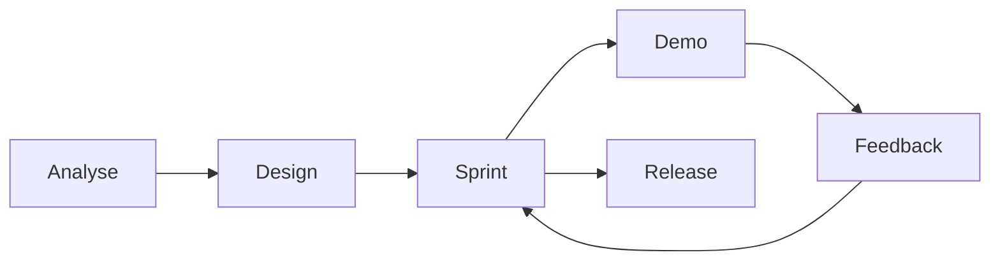
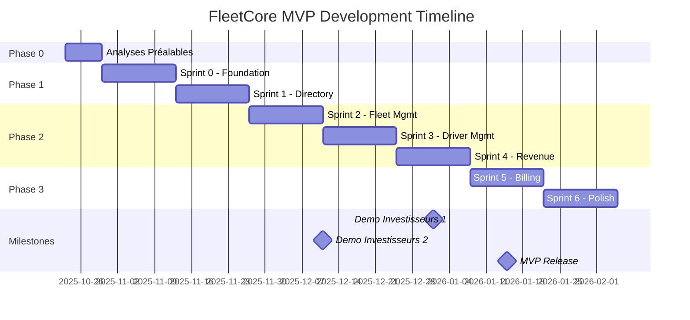

# MÉTHODOLOGIE DE CONSTRUCTION DU PLAN DE DÉVELOPPEMENT MVP FLEETCORE

**Document:** Méthodologie et Roadmap de Construction du Plan  
**Date:** 22 Octobre 2025  
**Version:** 1.0  
**Objectif:** Définir la méthodologie complète pour construire le plan de développement MVP FleetCore V2

---

## 📋 TABLE DES MATIÈRES

1. [Synthèse Exécutive](#1-synthèse-exécutive)
2. [Analyse de la Situation](#2-analyse-de-la-situation)
3. [Méthodologie Recommandée](#3-méthodologie-recommandée)
4. [Phase 0: Analyses Préalables](#4-phase-0-analyses-préalables)
5. [Phase 1: Architecture & Migration](#5-phase-1-architecture--migration)
6. [Phase 2: Construction des Processus](#6-phase-2-construction-des-processus)
7. [Phase 3: Finalisation du Plan](#7-phase-3-finalisation-du-plan)
8. [Roadmap Détaillée](#8-roadmap-détaillée)
9. [Livrables & Templates](#9-livrables--templates)
10. [Risques & Mitigations](#10-risques--mitigations)

---

## 1. SYNTHÈSE EXÉCUTIVE

### 1.1 Contexte
- **Migration majeure:** V1 (56 tables) → V2 (95 tables)
- **État actuel:** 27 APIs/146, Frontend basique, 0 tests
- **Équipe:** 3 personnes (Architecte + Claude Code + Claude)
- **Durée estimée:** 12-16 semaines pour MVP fonctionnel
- **Impératif:** Démos investisseurs régulières

### 1.2 Approche Clé
**AGILE END-TO-END:** Livrer des processus métier complets et démontrables toutes les 2 semaines, pas des couches techniques isolées.

### 1.3 Principes Directeurs
1. **Value-First:** Chaque sprint livre de la valeur business visible
2. **Demo-Ready:** Toujours avoir quelque chose à montrer
3. **Migration Progressive:** V1→V2 par domaine, pas big bang
4. **Interdépendances Maîtrisées:** Ordre de développement respectant les dépendances
5. **Qualité Intégrée:** Tests et documentation au fur et à mesure

---

## 2. ANALYSE DE LA SITUATION

### 2.1 État Actuel (AS-IS)

```yaml
Infrastructure:
  Database: 
    - 56 tables Prisma déployées (V1)
    - Migration V2 requise (+39 tables)
  Backend:
    - 27 APIs construites / 146+ nécessaires
    - 0 service layer structuré
    - 0 tests unitaires/intégration
  Frontend:
    - 3 pages marketing basiques
    - 0 dashboards opérationnels
    - UX/UI minimal à refondre
  Intégrations:
    - Clerk ✅ (Auth)
    - Supabase ✅ (DB)
    - Sentry ✅ (Monitoring)
    - Upstash ✅ (Cache)
    - Stripe ❌ (À configurer)
    - Resend ❌ (À activer)
  DevOps:
    - GitHub → Vercel auto-deploy ✅
    - Environnements: Dev/Staging/Prod ❌
```

### 2.2 Cible (TO-BE)

```yaml
MVP Fonctionnel V2:
  Processus Core:
    - Fleet Management complet
    - Driver Management avec onboarding
    - Revenue Pipeline automatisé
    - Billing SaaS multi-tenant
  Technique:
    - 95 tables migrées et optimisées
    - 80+ APIs critiques
    - Service layer complet
    - Tests 60% coverage minimum
  UX/UI:
    - Dashboard Fleet Manager
    - Portal Driver
    - Admin Panel
    - Mobile responsive
  Intégrations:
    - Toutes actives et testées
    - Webhooks configurés
    - Import/Export fonctionnel
```

### 2.3 Gap Analysis

| Domaine | Existant | Cible MVP | Gap | Priorité |
|---------|----------|-----------|-----|----------|
| **Tables DB** | 56 | 95 | +39 | 🔴 Critique |
| **APIs Backend** | 27 | 80+ | +53 | 🔴 Critique |
| **Service Layer** | 0 | 12 | +12 | 🔴 Critique |
| **UI Pages** | 3 | 25+ | +22 | 🟠 Haute |
| **Tests** | 0% | 60% | +60% | 🟡 Moyenne |
| **Documentation** | 10% | 80% | +70% | 🟡 Moyenne |

---

## 3. MÉTHODOLOGIE RECOMMANDÉE

### 3.1 Framework: LEAN-AGILE ADAPTÉ



### 3.2 Structure des Sprints

**Sprint Type: VERTICAL SLICE (2 semaines)**
```
Semaine 1:
- Jour 1-2: Design & Planning
- Jour 3-7: Backend (Migration + APIs + Services)

Semaine 2:
- Jour 8-10: Frontend (UI/UX)
- Jour 11-12: Intégration & Tests
- Jour 13: Demo Prep
- Jour 14: Demo & Retrospective
```

### 3.3 Processus Métier Prioritaires

**Ordre de développement basé sur:**
1. **Dépendances techniques** (Directory → Fleet → Driver → Revenue)
2. **Valeur business** (Ce qui génère revenus en premier)
3. **Complexité** (Simple → Complexe)
4. **Démo-abilité** (Visuellement impactant)

```
Sprint 1-2: Foundation + Directory
Sprint 3-4: Fleet Management
Sprint 5-6: Driver Management
Sprint 7-8: Revenue Pipeline
Sprint 9-10: Billing & Finance
Sprint 11-12: Polish & Production
```

---

## 4. PHASE 0: ANALYSES PRÉALABLES (1 semaine)

### 4.1 Activités Requises

#### A. Analyse des Dépendances

**Livrable: Matrice de Dépendances Complète**
```markdown
## Matrice de Dépendances FleetCore V2

### Niveau 1 - Aucune dépendance (peuvent démarrer immédiatement)
- [ ] Directory (5 tables)
- [ ] Documents (4 tables)
- [ ] Administration (8 tables)

### Niveau 2 - Dépend du Niveau 1
- [ ] Fleet (6 tables) → Dépend de Directory
- [ ] Drivers (7 tables) → Dépend de Directory + Documents

### Niveau 3 - Dépend du Niveau 2
- [ ] Assignments → Dépend de Fleet + Drivers
- [ ] Scheduling (4 tables) → Dépend de Drivers
- [ ] Trips (6 tables) → Dépend de Assignments

### Niveau 4 - Dépend du Niveau 3
- [ ] Revenue (3 tables) → Dépend de Trips
- [ ] Finance (7 tables) → Dépend de Revenue

### Niveau 5 - Peut être parallélisé
- [ ] Billing SaaS (6 tables) → Indépendant
- [ ] CRM (3 tables) → Indépendant
- [ ] Support (3 tables) → Indépendant
```

#### B. Mapping V1→V2

**Livrable: Plan de Migration Détaillé**
```typescript
interface MigrationPlan {
  domain: string;
  tables: {
    existing: string[];      // Tables V1 à migrer
    new: string[];           // Nouvelles tables V2
    modified: {              // Tables à enrichir
      table: string;
      additions: string[];   // Nouveaux champs
      modifications: string[]; // Champs à modifier
    }[];
  };
  dataTransformation: {
    source: string;
    target: string;
    script: string;          // Script SQL/JS de transformation
  }[];
  rollbackPlan: string;      // Procédure de rollback
  estimatedDuration: number; // En heures
}
```

#### C. Architecture Technique

**Livrable: Architecture Decision Records (ADRs)**
```markdown
## ADR-001: Service Layer Architecture

### Contexte
Besoin d'une couche service pour logique métier complexe

### Décision
- Pattern: Repository + Service + Controller
- Structure: /lib/services/[domain]/
- Transaction: Wrapper Prisma avec retry logic
- Error Handling: Custom error classes héritant AppError

### Conséquences
+ Séparation des responsabilités
+ Testabilité améliorée
+ Réutilisabilité du code
- Complexité initiale accrue
```

#### D. User Stories & Acceptance Criteria

**Livrable: Backlog Produit Priorisé**
```gherkin
Feature: Fleet Vehicle Management

  As a Fleet Manager
  I want to manage my vehicle fleet
  So that I can optimize vehicle utilization

  Scenario: Add new vehicle to fleet
    Given I am logged in as Fleet Manager
    When I add a vehicle with valid information
    Then the vehicle should be created with status "pending"
    And required documents should be auto-generated
    And I should receive a confirmation email

  Acceptance Criteria:
    - [ ] Vehicle form validates VIN format
    - [ ] Country regulations auto-applied
    - [ ] Documents checklist generated
    - [ ] Email sent within 1 minute
```

### 4.2 Outils d'Analyse

#### Analyse des Relations
```sql
-- Script pour extraire toutes les foreign keys
SELECT 
    tc.table_name,
    kcu.column_name,
    ccu.table_name AS foreign_table_name,
    ccu.column_name AS foreign_column_name
FROM information_schema.table_constraints AS tc
JOIN information_schema.key_column_usage AS kcu
    ON tc.constraint_name = kcu.constraint_name
JOIN information_schema.constraint_column_usage AS ccu
    ON ccu.constraint_name = tc.constraint_name
WHERE tc.constraint_type = 'FOREIGN KEY'
ORDER BY tc.table_name;
```

#### Analyse de Volumétrie
```sql
-- Estimation des volumes de données
SELECT 
    schemaname,
    tablename,
    pg_size_pretty(pg_total_relation_size(schemaname||'.'||tablename)) AS size,
    n_live_tup AS row_estimate
FROM pg_stat_user_tables
ORDER BY pg_total_relation_size(schemaname||'.'||tablename) DESC;
```

---

## 5. PHASE 1: ARCHITECTURE & MIGRATION

### 5.1 Sprint 0: Foundation (1 semaine)

#### Objectifs
- [ ] Setup environnements (Dev/Staging/Prod)
- [ ] Migration framework V1→V2
- [ ] Service layer base
- [ ] CI/CD pipeline complet

#### Activités Détaillées

**1. Environment Setup**
```yaml
Environnements:
  Development:
    - URL: dev.fleetcore.app
    - DB: Supabase Dev Project
    - Auth: Clerk Dev Instance
    - Stripe: Test Mode
    
  Staging:
    - URL: staging.fleetcore.app
    - DB: Supabase Staging
    - Auth: Clerk Staging
    - Stripe: Test Mode
    - Data: Copie anonymisée prod
    
  Production:
    - URL: app.fleetcore.app
    - DB: Supabase Prod
    - Auth: Clerk Prod
    - Stripe: Live Mode
    - Monitoring: Sentry + Uptime
```

**2. Migration Framework**
```typescript
// lib/migration/v1-to-v2.ts
export class MigrationManager {
  async migrateDomain(domain: string): Promise<void> {
    // 1. Backup V1 data
    await this.backupDomain(domain);
    
    // 2. Create V2 tables
    await this.createV2Tables(domain);
    
    // 3. Transform & migrate data
    await this.transformData(domain);
    
    // 4. Validate migration
    await this.validateMigration(domain);
    
    // 5. Switch traffic to V2
    await this.switchToV2(domain);
  }
}
```

**3. Service Layer Base**
```typescript
// lib/core/base.service.ts
export abstract class BaseService {
  protected prisma: PrismaClient;
  
  async executeInTransaction<T>(
    fn: (tx: PrismaTransaction) => Promise<T>
  ): Promise<T> {
    return this.prisma.$transaction(fn, {
      maxWait: 5000,
      timeout: 10000,
      isolationLevel: 'ReadCommitted'
    });
  }
  
  protected handleError(error: unknown): never {
    if (error instanceof PrismaClientKnownRequestError) {
      throw new DatabaseError(error.message, error.code);
    }
    throw error;
  }
}
```

### 5.2 Processus de Migration par Domaine

#### Template de Migration
```sql
-- Migration Template: Domain X

-- Step 1: Create new tables
CREATE TABLE IF NOT EXISTS new_table_v2 (...);

-- Step 2: Migrate data with transformations
INSERT INTO new_table_v2 (...)
SELECT 
  -- Transformations here
FROM old_table_v1
WHERE ...;

-- Step 3: Add new indexes
CREATE INDEX CONCURRENTLY ...;

-- Step 4: Update foreign keys
ALTER TABLE ... ADD CONSTRAINT ...;

-- Step 5: Validation queries
-- Count check
SELECT COUNT(*) FROM old_table_v1;
SELECT COUNT(*) FROM new_table_v2;

-- Data integrity check
SELECT ... FROM new_table_v2 
WHERE ... IS NULL OR ... NOT IN (...);
```

---

## 6. PHASE 2: CONSTRUCTION DES PROCESSUS

### 6.1 Sprint Planning Template

```markdown
## Sprint N: [Process Name]

### Objectif Business
Livrer le processus [X] de bout en bout permettant [valeur métier]

### User Stories (Ordre de priorité)
1. **[US-001]** En tant que [role], je veux [action] pour [bénéfice]
   - Estimation: [X] points
   - Dépendances: [Liste]
   
### Définition de "Done"
- [ ] Migration V2 complète pour les tables concernées
- [ ] APIs REST fonctionnelles avec validation
- [ ] Service layer avec logique métier
- [ ] UI/UX responsive et accessible
- [ ] Tests unitaires (>80% coverage)
- [ ] Tests d'intégration end-to-end
- [ ] Documentation API (OpenAPI)
- [ ] Demo script préparé

### Découpage Technique
```

#### Jour 1-2: Design & Planning
```yaml
Activités:
  - Design Review: 2h
    - Validation architecture
    - Review dépendances
    - Identification risques
    
  - Technical Planning: 4h
    - Découpage en tâches
    - Estimation en heures
    - Attribution Claude Code vs Manuel
    
  - Data Modeling: 2h
    - Finalisation schéma V2
    - Scripts migration
    - Seed data pour démo
```

#### Jour 3-7: Backend Development
```yaml
Ordre d'exécution:
  1. Database Migration:
     - Run migration scripts
     - Validate data integrity
     - Create indexes
     
  2. Repository Layer:
     - BaseRepository implementation
     - Domain repositories
     - Custom queries
     
  3. Service Layer:
     - Business logic implementation
     - Transaction management
     - Error handling
     
  4. API Routes:
     - REST endpoints
     - Request validation (Zod)
     - Response formatting
     
  5. Integration Tests:
     - API endpoint tests
     - Service layer tests
     - Database transaction tests
```

#### Jour 8-10: Frontend Development
```yaml
Composants:
  1. UI Components:
     - Reusable components (shadcn/ui)
     - Form components with validation
     - Data tables with sorting/filtering
     
  2. Pages:
     - List views with pagination
     - Detail views
     - Create/Edit forms
     - Dashboard widgets
     
  3. State Management:
     - React Query for server state
     - Zustand for client state
     - Optimistic updates
     
  4. Responsive Design:
     - Mobile-first approach
     - Tablet breakpoints
     - Desktop optimization
```

#### Jour 11-12: Integration & Testing
```yaml
Testing Checklist:
  - [ ] Unit tests: Services & Utils
  - [ ] Integration tests: API endpoints
  - [ ] E2E tests: Critical user flows
  - [ ] Performance tests: Load testing
  - [ ] Security tests: Auth & permissions
  - [ ] Accessibility tests: WCAG 2.1 AA
  - [ ] Cross-browser testing
  - [ ] Mobile testing (responsive)
```

#### Jour 13: Demo Preparation
```yaml
Demo Package:
  1. Demo Script:
     - Scenario business réaliste
     - Data set préparé
     - Talking points
     
  2. Demo Environment:
     - Dedicated demo tenant
     - Clean data state
     - Backup/restore capability
     
  3. Materials:
     - Slides (5-10 max)
     - Architecture diagram
     - Metrics dashboard
     - ROI calculation
```

#### Jour 14: Demo & Retrospective
```yaml
Demo Format (1h):
  - Context (5 min)
  - Live Demo (30 min)
  - Technical Deep Dive (15 min)
  - Q&A (10 min)

Retrospective (1h):
  - What went well?
  - What could improve?
  - Action items
  - Velocity metrics
  - Update roadmap
```

### 6.2 Sprints Détaillés par Processus

#### Sprints 1-2: Foundation + Directory

**Processus:** Setup + Référentiels
```typescript
// Valeur Business Livrée
- Environnements configurés
- Référentiels pays/véhicules
- Multi-tenant fonctionnel
- Import données référentielles

// APIs Livrées (10)
GET /api/v1/directory/makes
GET /api/v1/directory/models  
GET /api/v1/directory/vehicle-classes
GET /api/v1/directory/platforms
GET /api/v1/directory/regulations
GET /api/v1/directory/countries
POST /api/v1/admin/tenants
GET /api/v1/admin/tenants
POST /api/v1/admin/members
POST /api/v1/admin/roles

// UI Livrée
- Admin: Gestion référentiels
- Admin: Gestion tenants
- Admin: Import CSV référentiels
```

#### Sprints 3-4: Fleet Management

**Processus:** Gestion Véhicules Complet
```typescript
// Valeur Business Livrée
- CRUD véhicules complet
- Documents véhicules
- Maintenance tracking
- Expenses management
- Insurance management
- KPIs et reporting

// APIs Livrées (20)
// ... Vehicle CRUD (5)
POST /api/v1/vehicles
GET /api/v1/vehicles
GET /api/v1/vehicles/:id
PATCH /api/v1/vehicles/:id
DELETE /api/v1/vehicles/:id

// ... Maintenance (3)
POST /api/v1/vehicles/:id/maintenance
GET /api/v1/vehicles/:id/maintenance
PATCH /api/v1/maintenance/:id

// ... Expenses (3)
POST /api/v1/vehicles/:id/expenses
GET /api/v1/vehicles/:id/expenses
PATCH /api/v1/expenses/:id

// ... Insurance (3)
POST /api/v1/vehicles/:id/insurance
GET /api/v1/vehicles/:id/insurance
PATCH /api/v1/insurance/:id

// ... Documents (3)
POST /api/v1/vehicles/:id/documents
GET /api/v1/vehicles/:id/documents
DELETE /api/v1/documents/:id

// ... Reports (3)
GET /api/v1/vehicles/kpis
GET /api/v1/vehicles/availability
GET /api/v1/reports/fleet

// UI Livrée
- Dashboard Fleet Manager
- Vehicle List + Filters
- Vehicle Details Page
- Maintenance Calendar
- Expense Tracking
- Document Management
- KPI Dashboard
```

#### Sprints 5-6: Driver Management

**Processus:** Gestion Conducteurs & Onboarding
```typescript
// Valeur Business Livrée
- Onboarding conducteurs digital
- Gestion documents conducteurs
- Cooperation terms (6 modèles)
- Performance tracking
- Training management
- Request management

// APIs Livrées (25)
// ... Driver CRUD (5)
// ... Documents (4)
// ... Cooperation Terms (4)
// ... Performance (3)
// ... Requests (3)
// ... Training (3)
// ... Blacklist (3)

// UI Livrée
- Driver Portal
- Onboarding Wizard
- Document Upload
- Performance Dashboard
- Training Center
- Request Management
```

#### Sprints 7-8: Revenue Pipeline

**Processus:** Import → Calcul → Distribution Revenus
```typescript
// Valeur Business Livrée
- Import Uber/Bolt automatisé
- Calcul commissions multi-niveaux
- Revenue sharing automatique
- Reconciliation financière
- Reporting revenus temps réel

// APIs Livrées (15)
// ... Platform Integration (5)
POST /api/v1/revenue/import
GET /api/v1/revenue/imports
POST /api/v1/revenue/parse
POST /api/v1/revenue/calculate
GET /api/v1/revenue/status

// ... Driver Revenues (5)
GET /api/v1/drivers/:id/revenues
GET /api/v1/revenue/summary
POST /api/v1/revenue/validate
POST /api/v1/revenue/distribute
GET /api/v1/revenue/reports

// ... Reconciliation (5)
POST /api/v1/reconciliation/start
GET /api/v1/reconciliation/status
POST /api/v1/reconciliation/resolve
GET /api/v1/reconciliation/differences
GET /api/v1/reconciliation/history

// UI Livrée
- Revenue Dashboard
- Import Center
- Reconciliation Tool
- Payout Management
- Revenue Analytics
```

#### Sprints 9-10: Billing & Finance

**Processus:** Facturation SaaS + Finance
```typescript
// Valeur Business Livrée
- Billing SaaS multi-tenant
- Gestion plans/subscriptions
- Usage-based billing
- Payment processing (Stripe)
- Financial accounts management
- WPS payroll (UAE)

// APIs Livrées (20)
// ... Billing Plans (5)
// ... Subscriptions (5)
// ... Invoices (5)
// ... Payments (5)

// UI Livrée
- Billing Portal
- Subscription Management
- Invoice Center
- Payment Methods
- Financial Dashboard
- Payroll Management
```

#### Sprints 11-12: Polish & Production

**Processus:** Finalisation MVP
```typescript
// Focus Areas
- Performance optimization
- Security hardening
- Mobile optimization
- Documentation complète
- Tests de charge
- Monitoring setup
- Support system
- CRM basique

// Deliverables
- 80% test coverage
- API documentation complète
- User documentation
- Deployment guide
- Operations runbook
- Demo environment stable
```

---

## 7. PHASE 3: FINALISATION DU PLAN

### 7.1 Structure du Plan Final

```markdown
# PLAN DE DÉVELOPPEMENT MVP FLEETCORE V2

## Executive Summary
- Vision & Objectifs
- Timeline & Milestones
- Budget & Resources
- Success Metrics

## Architecture
- Technical Stack
- System Architecture
- Data Architecture
- Security Architecture
- Integration Architecture

## Roadmap Détaillée
- Phase 1: Foundation (Weeks 1-2)
- Phase 2: Core Business (Weeks 3-8)
- Phase 3: Revenue Engine (Weeks 9-10)
- Phase 4: Billing & Finance (Weeks 11-12)
- Phase 5: Production Ready (Weeks 13-14)

## Par Sprint
Pour chaque sprint:
- Objectifs business
- User stories
- Technical tasks
- Dependencies
- Risks
- Success criteria
- Demo script

## Métriques de Succès
- Velocity tracking
- Quality metrics
- Business KPIs
- Technical debt

## Risk Management
- Risk register
- Mitigation plans
- Contingency plans

## Annexes
- Détail des APIs
- Schémas de données
- Wireframes
- Processus métier
```

### 7.2 Templates de Documentation

#### API Documentation Template
```yaml
endpoint: POST /api/v1/vehicles
description: Create a new vehicle in the fleet
authentication: Bearer token required
authorization: Role: fleet_manager or admin

request:
  content-type: application/json
  body:
    required:
      - make_id: uuid
      - model_id: uuid
      - license_plate: string
      - year: number
      - fuel_type: enum
    optional:
      - vin: string
      - color: string
      
response:
  200:
    description: Vehicle created successfully
    schema: Vehicle
  400:
    description: Validation error
    schema: ValidationError
  401:
    description: Unauthorized
  403:
    description: Forbidden
    
example:
  request: |
    {
      "make_id": "uuid",
      "model_id": "uuid",
      "license_plate": "DXB-A-12345",
      "year": 2023,
      "fuel_type": "petrol"
    }
  response: |
    {
      "id": "uuid",
      "status": "pending",
      "created_at": "2025-10-22T10:00:00Z"
    }
```

#### Test Plan Template
```markdown
## Test Plan: [Feature Name]

### Test Objectives
- Validate business logic correctness
- Ensure data integrity
- Verify performance requirements
- Confirm security controls

### Test Scope
In Scope:
- Unit tests: Service layer
- Integration tests: API endpoints
- E2E tests: Critical paths

Out of Scope:
- Load testing (separate plan)
- Penetration testing (phase 2)

### Test Cases
| ID | Description | Steps | Expected Result | Status |
|----|-------------|-------|-----------------|--------|
| TC001 | Create vehicle happy path | 1. POST valid data<br>2. Check response | 201 Created | ⏳ |
| TC002 | Duplicate license plate | 1. POST existing plate | 400 Error | ⏳ |

### Test Data
- Seed script location: /scripts/seed-test.ts
- Test accounts: See vault

### Exit Criteria
- All P1 tests passed
- >80% code coverage
- No P1/P2 bugs open
```

---

## 8. ROADMAP DÉTAILLÉE

### 8.1 Timeline Macro



### 8.2 Jalons Critiques

| Milestone | Date | Critères de Succès | Demo Content |
|-----------|------|-------------------|--------------|
| **M0: Foundation** | Sem 2 | Environnements OK, Migration framework | Architecture |
| **M1: First Process** | Sem 4 | Fleet CRUD complet + UI | Gestion véhicules |
| **M2: Core Business** | Sem 8 | Fleet + Driver + Assignments | Processus complet |
| **M3: Revenue Engine** | Sem 10 | Import + Calcul + Distribution | Pipeline revenus |
| **M4: MVP Complete** | Sem 14 | Tous processus core + Billing | Produit complet |
| **M5: Production** | Sem 16 | Tests + Docs + Déploiement | Go-live ready |

### 8.3 Métriques de Progression

```typescript
interface SprintMetrics {
  velocity: {
    planned: number;  // Story points planifiés
    completed: number; // Story points complétés
    trend: number;    // Évolution vs sprint précédent
  };
  quality: {
    bugs_found: number;
    bugs_fixed: number;
    test_coverage: number;
    code_review_time: number; // heures
  };
  delivery: {
    features_delivered: number;
    apis_completed: number;
    ui_pages_completed: number;
    demo_feedback_score: number; // 1-10
  };
}

// Objectifs par sprint
const sprintTargets = {
  velocity: { min: 20, target: 30, stretch: 40 },
  test_coverage: { min: 60, target: 80, stretch: 90 },
  demo_score: { min: 7, target: 8, stretch: 9 }
};
```

---

## 9. LIVRABLES & TEMPLATES

### 9.1 Liste des Livrables par Phase

#### Phase 0: Analyses
- [ ] Matrice de dépendances complète
- [ ] Plan de migration V1→V2
- [ ] Architecture Decision Records
- [ ] Backlog produit priorisé
- [ ] Risk assessment initial

#### Phase 1: Foundation
- [ ] Environnements configurés
- [ ] CI/CD pipeline
- [ ] Service layer architecture
- [ ] Migration toolkit
- [ ] Monitoring setup

#### Phase 2: Development
Par Sprint:
- [ ] Code source (GitHub)
- [ ] Tests automatisés
- [ ] Documentation API
- [ ] Demo package
- [ ] Sprint report

#### Phase 3: Finalisation
- [ ] MVP complet et testé
- [ ] Documentation complète
- [ ] Deployment guide
- [ ] Operations runbook
- [ ] Handover package

### 9.2 Templates Disponibles

```markdown
/templates/
├── sprint-planning.md
├── user-story.md
├── api-documentation.yaml
├── test-plan.md
├── demo-script.md
├── retrospective.md
├── architecture-decision-record.md
├── migration-checklist.md
├── deployment-checklist.md
└── incident-response.md
```

### 9.3 Documentation Standards

#### Code Documentation
```typescript
/**
 * Creates a new vehicle in the fleet
 * 
 * @param data - Vehicle creation data
 * @param userId - ID of the user creating the vehicle
 * @param tenantId - Tenant isolation
 * 
 * @returns Created vehicle with all relations
 * 
 * @throws {ValidationError} If data is invalid
 * @throws {ConflictError} If license plate already exists
 * @throws {ForbiddenError} If user lacks permissions
 * 
 * @example
 * const vehicle = await vehicleService.createVehicle({
 *   make_id: "uuid",
 *   model_id: "uuid",
 *   license_plate: "DXB-A-12345"
 * }, userId, tenantId);
 */
async createVehicle(
  data: CreateVehicleDto,
  userId: string,
  tenantId: string
): Promise<Vehicle> {
  // Implementation
}
```

#### Process Documentation
```markdown
## Process: Vehicle Onboarding

### Overview
End-to-end process for adding a new vehicle to the fleet.

### Actors
- Fleet Manager: Initiates process
- System: Validates and processes
- Driver: Assigned to vehicle

### Steps
1. **Fleet Manager** creates vehicle record
2. **System** validates against regulations
3. **System** generates required documents
4. **Fleet Manager** uploads documents
5. **System** verifies documents
6. **Fleet Manager** assigns driver
7. **Driver** completes handover
8. **System** activates vehicle

### Business Rules
- Vehicle age must comply with country regulations
- All required documents must be valid
- Driver must have valid license
- Insurance must be active

### Exception Flows
- Invalid vehicle age → Rejection with reason
- Missing documents → Pending status
- Invalid driver → Assignment blocked
```

---

## 10. RISQUES & MITIGATIONS

### 10.1 Registre des Risques

| ID | Risque | Probabilité | Impact | Mitigation | Contingence |
|----|--------|------------|--------|------------|-------------|
| R1 | **Migration data loss** | Faible | Critique | Backup complet + dry runs | Rollback procedure |
| R2 | **Scope creep** | Élevée | Élevé | Sprint boundaries strict | Change control board |
| R3 | **Technical debt** | Moyenne | Moyen | Refactoring sprints | Tech debt budget |
| R4 | **Integration failures** | Moyenne | Élevé | Early integration tests | Fallback mechanisms |
| R5 | **Performance issues** | Faible | Moyen | Load testing early | Optimization sprints |
| R6 | **Knowledge gap** | Moyenne | Moyen | Documentation continue | External consultants |
| R7 | **Investor demo failure** | Faible | Critique | Multiple dry runs | Backup demo env |

### 10.2 Plan de Mitigation Détaillé

#### R1: Migration Data Loss
```yaml
Prévention:
  - Backup complet avant chaque migration
  - Migration en read-only d'abord
  - Validation checksums avant/après
  - Dry runs sur staging

Détection:
  - Monitoring row counts
  - Data integrity checks
  - Business validation tests

Réponse:
  - Stop migration immédiatement
  - Analyse root cause
  - Rollback si nécessaire
  - Fix et retry

Récupération:
  - Restore from backup
  - Replay transactions
  - Reconciliation manuelle
  - Communication stakeholders
```

#### R2: Scope Creep
```yaml
Prévention:
  - Definition of Done claire
  - Sprint goals figés
  - Change requests formalisées
  - Backlog grooming régulier

Détection:
  - Velocity tracking
  - Sprint burndown anormal
  - Nouvelles demandes en sprint

Réponse:
  - Escalade Product Owner
  - Évaluation impact
  - Décision go/no-go
  - Ajustement roadmap si nécessaire

Récupération:
  - Re-priorisation backlog
  - Sprint supplémentaire si critique
  - Communication sponsors
```

### 10.3 Success Factors

#### Critical Success Factors (CSFs)
1. **Qualité Code:** Maintenir >70% coverage
2. **Velocity Stable:** 25-30 points/sprint
3. **Demo Success:** Score >7/10 chaque démo
4. **Zero Downtime:** Migrations sans interruption
5. **Documentation:** À jour en permanence

#### Key Performance Indicators (KPIs)

| KPI | Target | Mesure | Fréquence |
|-----|--------|--------|-----------|
| Sprint Velocity | 25-30 points | Story points completed | Par sprint |
| Test Coverage | >70% | Code coverage % | Continue |
| Bug Density | <5/KLOC | Bugs per 1000 lines | Par sprint |
| Demo Score | >7/10 | Stakeholder feedback | Par démo |
| Technical Debt | <20% | Debt ratio | Mensuel |
| API Response Time | <200ms p95 | Performance metrics | Continue |
| Documentation Coverage | >80% | Documented APIs/Total | Par sprint |

---

## 11. RECOMMANDATIONS FINALES

### 11.1 Quick Wins Semaine 1

1. **Setup Environments** (Jour 1)
   - Créer projets Supabase Dev/Staging
   - Configurer variables environnement
   - Tester pipeline deploy

2. **Migration POC** (Jour 2-3)
   - Migrer Directory (5 tables)
   - Valider approche
   - Documenter process

3. **First API** (Jour 4)
   - Implémenter /api/v1/directory/makes
   - Avec tests complets
   - Établir pattern

4. **First UI** (Jour 5)
   - Page liste véhicules
   - Avec pagination/filtres
   - Responsive design

### 11.2 Principes de Développement

```typescript
const developmentPrinciples = {
  architecture: {
    rule: "Domain-Driven Design",
    why: "Alignement business-tech"
  },
  testing: {
    rule: "Test-First Development",
    why: "Qualité garantie dès le départ"
  },
  documentation: {
    rule: "Docs-as-Code",
    why: "Documentation toujours à jour"
  },
  review: {
    rule: "4-eyes principle",
    why: "Qualité et partage connaissance"
  },
  deployment: {
    rule: "Progressive rollout",
    why: "Minimiser risques production"
  }
};
```

### 11.3 Communication Plan

#### Stakeholders
```yaml
Investisseurs:
  Fréquence: Bi-mensuelle
  Format: Demo live 1h
  Contenu: Features livrées + Roadmap
  
Management:
  Fréquence: Hebdomadaire
  Format: Status report
  Contenu: Progress + Risks + Decisions needed
  
Équipe:
  Fréquence: Quotidienne
  Format: Stand-up 15min
  Contenu: Yesterday + Today + Blockers
  
Utilisateurs Tests:
  Fréquence: Par sprint
  Format: Beta access + Feedback form
  Contenu: New features + Known issues
```

### 11.4 Checklist de Démarrage

#### Semaine 0: Préparation
- [ ] Valider ce document avec stakeholders
- [ ] Confirmer budget et ressources
- [ ] Setup environnements dev
- [ ] Recruter utilisateurs beta
- [ ] Planifier demos investisseurs

#### Semaine 1: Lancement
- [ ] Kick-off meeting équipe
- [ ] Setup outils (Jira, Slack, etc.)
- [ ] Premières analyses techniques
- [ ] Créer backlog initial
- [ ] Commencer Sprint 0

#### Points d'Attention
- **Ne pas:** Commencer par le backend seul
- **Ne pas:** Reporter les tests "pour plus tard"
- **Ne pas:** Ignorer la documentation
- **Toujours:** Avoir une démo prête
- **Toujours:** Mesurer la progression
- **Toujours:** Communiquer les blockers

---

## 12. CONCLUSION

### 12.1 Résumé Exécutif

Ce plan méthodologique fournit une approche structurée pour développer le MVP FleetCore V2 en 14-16 semaines avec:

- **56 → 95 tables** migrées progressivement
- **27 → 80+ APIs** développées par processus
- **3 → 25+ pages UI** livrées par sprint
- **0 → 60% test coverage** minimum
- **Démos bi-mensuelles** aux investisseurs

### 12.2 Facteurs Clés de Succès

1. **Approche Agile End-to-End:** Livrer de la valeur visible à chaque sprint
2. **Migration Progressive:** Minimiser les risques par migration domaine par domaine
3. **Quality Built-In:** Tests et documentation au fur et à mesure
4. **Demo-Driven:** Toujours prêt à montrer les progrès
5. **Communication Continue:** Transparence totale avec stakeholders

### 12.3 Next Steps Immédiats

1. **Valider** cette méthodologie avec l'équipe
2. **Planifier** Sprint 0 en détail
3. **Commencer** les analyses préalables
4. **Préparer** première démo investisseurs
5. **Lancer** le développement

### 12.4 Support & Contacts

```yaml
Architecture:
  Lead: [Architecte]
  Backup: Claude
  
Development:
  Lead: Claude Code
  Support: Claude (Prompts)
  
Product:
  Owner: [À définir]
  Stakeholders: [Investisseurs]
  
Operations:
  DevOps: [Architecte]
  Monitoring: Sentry Team
```

---

**Document généré le:** 22 Octobre 2025  
**Version:** 1.0  
**Statut:** À valider  
**Prochaine révision:** Post Sprint 0

---

## ANNEXES

### A. Glossaire

| Terme | Définition |
|-------|-----------|
| **MVP** | Minimum Viable Product - Version minimale commercialisable |
| **End-to-End** | Processus complet du début à la fin |
| **Sprint** | Itération de développement (2 semaines) |
| **Velocity** | Vitesse de l'équipe en story points |
| **Technical Debt** | Code à refactorer pour maintenir qualité |
| **WPS** | Wage Protection System (UAE) |
| **Multi-tenant** | Architecture isolant les données par client |
| **RBAC** | Role-Based Access Control |
| **KPI** | Key Performance Indicator |
| **CSF** | Critical Success Factor |

### B. Ressources & Références

#### Documentation Technique
- [Prisma Documentation](https://www.prisma.io/docs)
- [Next.js Documentation](https://nextjs.org/docs)
- [Supabase Documentation](https://supabase.com/docs)
- [Clerk Documentation](https://clerk.dev/docs)
- [Stripe Documentation](https://stripe.com/docs)

#### Best Practices
- [Twelve-Factor App](https://12factor.net)
- [Domain-Driven Design](https://martinfowler.com/bliki/DomainDrivenDesign.html)
- [Clean Architecture](https://blog.cleancoder.com/uncle-bob/2012/08/13/the-clean-architecture.html)
- [Agile Manifesto](https://agilemanifesto.org)

#### Outils Recommandés
- **Project Management:** Linear / Jira
- **Documentation:** Notion / Confluence
- **API Testing:** Postman / Insomnia
- **Monitoring:** Sentry + Datadog
- **Analytics:** Mixpanel / Amplitude
- **Communication:** Slack / Discord

### C. Estimation Budgétaire

```yaml
Coûts Infrastructure (Mensuel):
  Supabase: $25 x 3 env = $75
  Vercel: $20 (Pro plan)
  Clerk: $25 (Starter)
  Stripe: 2.9% + $0.30 per transaction
  Resend: $20 (10k emails)
  Sentry: $26 (Team plan)
  GitHub: $4 (Team)
  Total: ~$170/mois
  
Coûts Développement (One-time):
  MVP Development: 14-16 semaines
  Documentation: Inclus
  Tests: Inclus
  
ROI Estimé:
  Break-even: 10 clients x $100/mois
  Target Year 1: 100 clients
  Revenue Year 1: $120,000
```

### D. Matrice RACI

| Activité | Architecte | Claude Code | Claude | Stakeholders |
|----------|-----------|-------------|--------|--------------|
| **Architecture** | R | C | C | I |
| **Database Migration** | A | R | C | I |
| **Backend Dev** | C | R | C | I |
| **Frontend Dev** | C | R | A | C |
| **Testing** | A | R | R | I |
| **Documentation** | C | C | R | A |
| **Demo** | R | I | A | C |
| **Deployment** | R | I | C | A |

**Légende:**
- R = Responsible (Fait)
- A = Accountable (Responsable)
- C = Consulted (Consulté)
- I = Informed (Informé)

---

**FIN DU DOCUMENT**
