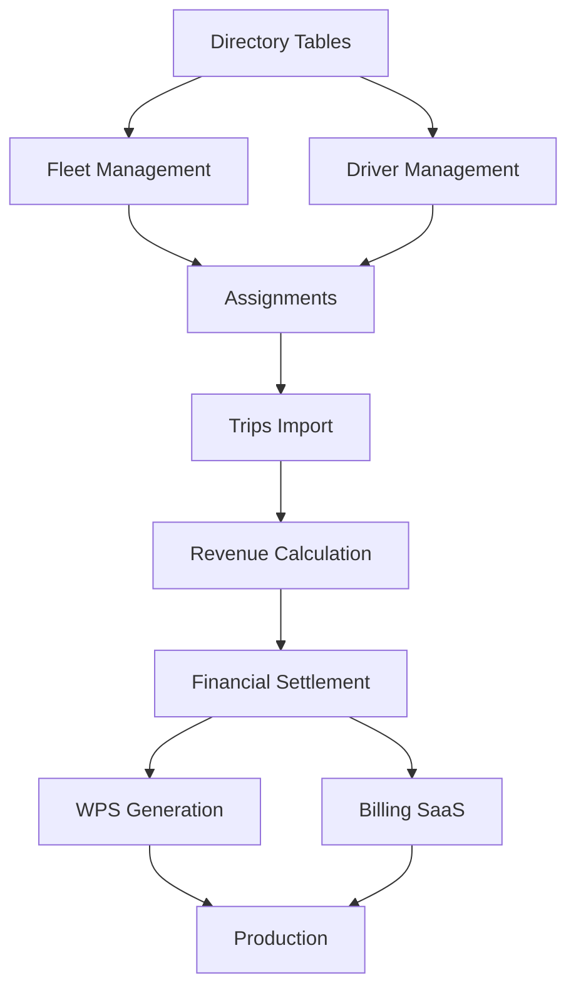

# FLEETCORE ROADMAP MVP - PLAN DE DÉVELOPPEMENT AGILE

**Version:** 1.0  
**Date:** 22 Octobre 2025  
**Durée totale:** 15 semaines (vs 26 semaines plan initial)  
**Approche:** End-to-end par processus métier avec migration V1→V2 intégrée

---

## 📊 1. EXECUTIVE SUMMARY

### 1.1 Vision & Objectifs

**Vision:** Livrer un MVP FleetCore fonctionnel en 15 semaines permettant la gestion complète d'une flotte de véhicules avec chauffeurs, depuis l'onboarding jusqu'à la facturation, avec migration progressive du modèle V1 (56 tables) vers V2 (95 tables).

**Objectifs principaux:**

- ✅ MVP opérationnel pour démonstration investisseurs
- ✅ Migration incrémentale V1→V2 sans interruption
- ✅ Processus métiers critiques end-to-end
- ✅ Zéro tunnel de développement (démos toutes les 2 semaines)

### 1.2 Approche Méthodologique

**Fusion Agile/Lean Startup:**

- Sprints de 2 semaines avec démos obligatoires
- "Vertical Slicing" : chaque feature = back + middle + front
- Migration incrémentale table par table
- Fail-fast avec validation continue

### 1.3 Timeline Globale

```
Semaines:  1  2  3  4  5  6  7  8  9 10 11 12 13 14 15
         ┌─────┬───────────┬───────────┬──────┬─────┐
Phase 0: │█████│           │           │      │     │ Foundation
Phase 1: │     │███████████│           │      │     │ Core Business
Phase 2: │     │           │███████████│      │     │ Revenue Engine
Phase 3: │     │           │           │██████│     │ Financial Ops
Phase 4: │     │           │           │      │█████│ Production
         └─────┴───────────┴───────────┴──────┴─────┘
```

### 1.4 Livrables Clés par Phase

| Phase       | Durée      | Livrables principaux                | Tables migrées | APIs créées |
| ----------- | ---------- | ----------------------------------- | -------------- | ----------- |
| **Phase 0** | 2 sem      | Architecture V2, Pipeline migration | 5              | 10          |
| **Phase 1** | 4 sem      | Fleet + Driver Management complet   | 20             | 45          |
| **Phase 2** | 4 sem      | Revenue Pipeline opérationnel       | 15             | 40          |
| **Phase 3** | 3 sem      | WPS UAE + Billing SaaS              | 10             | 35          |
| **Phase 4** | 2 sem      | Production ready, documentation     | 5              | 16          |
| **TOTAL**   | **15 sem** | **MVP Complet**                     | **55→95**      | **146**     |

---

## 🎯 2. ÉTAT ACTUEL & CIBLE

### 2.1 Inventaire État Actuel (Vérifié 12/10/2025)

#### Infrastructure Existante

```yaml
Base de données:
  Tables V1: 56 tables déployées
  Schéma Prisma: 2157 lignes validées
  RLS: 110 policies (2 par table)

Backend:
  Routes construites: 27/56 (Prisma)
  APIs métier: 6 (CRM uniquement)
  Services: 2 (email, documents - partiels)

Frontend:
  Pages: 3 (marketing uniquement)
  Dashboards: 0
  Components réutilisables: basiques

Stack technique:
  - Supabase PostgreSQL
  - Next.js 15.5.3 + React 19
  - Prisma 6.16.2
  - Clerk Auth
  - Vercel deployment
```

#### Code Métier Existant

```typescript
// Services existants (partiels)
lib/services/
├── documents/document.service.ts (600 lignes) ✅
├── email/email.service.ts (850 lignes) ✅
└── vehicles/vehicle.service.ts (473 lignes) ✅ PARTIEL

// Repositories
lib/repositories/
├── vehicle.repository.ts (150 lignes) ✅
└── driver.repository.ts (196 lignes) ✅

// Core architecture
lib/core/
├── base.service.ts (162 lignes) ✅
├── base.repository.ts (223 lignes) ✅
├── errors.ts (66 lignes) ✅
└── types.ts (75 lignes) ✅
```

### 2.2 Cible V2 (95 Tables)

#### Évolutions Majeures V1→V2

| Domaine            | Tables V1 | Tables V2 | Nouvelles | Évolutions majeures                    |
| ------------------ | --------- | --------- | --------- | -------------------------------------- |
| **Administration** | 8         | 12        | +4        | 2FA, RBAC granulaire, lifecycle events |
| **Directory**      | 5         | 7         | +2        | Platform configs, toll gates           |
| **Documents**      | 1         | 4         | +3        | Versioning, types référentiels         |
| **Fleet**          | 6         | 8         | +2        | Inspections, équipements               |
| **Drivers**        | 7         | 9         | +2        | Languages, qualifications              |
| **Scheduling**     | 4         | 6         | +2        | Goal achievements, task comments       |
| **Trips**          | 6         | 8         | +2        | Platform accounts, client invoices     |
| **Finance**        | 6         | 9         | +3        | Account types, statuses, disputes      |
| **Revenue**        | 3         | 5         | +2        | Imports validation, lines detail       |
| **Billing**        | 6         | 9         | +3        | Metrics, overages, promotions          |
| **CRM**            | 3         | 7         | +4        | Sources, pipelines, addresses          |
| **Support**        | 3         | 6         | +3        | Categories, SLA, canned responses      |
| **TOTAL**          | **56**    | **95**    | **+39**   | **+70% complexité**                    |

### 2.3 Gap Analysis

#### Fonctionnalités Manquantes Critiques

```yaml
Backend (80% manquant):
  - Service Layer: 31/35 services à créer
  - Business Logic: 100% à implémenter
  - APIs REST: 140/146 à développer
  - Validation: Zod schemas sur tous endpoints

Frontend (95% manquant):
  - Dashboards: 3 principaux (Fleet, Driver, Finance)
  - Pages opérationnelles: 47/50 à créer
  - Components métier: 100% à développer
  - Real-time updates: websockets/polling

Intégrations (90% manquant):
  - Stripe: Configuration billing SaaS
  - Traccar: GPS tracking
  - Platform APIs: Uber, Bolt, Careem
  - WPS UAE: Ministry of Labour

Tests (100% manquant):
  - Unit tests: 0/400 prévus
  - Integration tests: 0/100 prévus
  - E2E tests: 0/30 prévus
```

---

## 🚀 3. MÉTHODOLOGIE AGILE ADAPTÉE

### 3.1 Principes Directeurs

1. **Vertical Slicing Systématique**
   - Chaque user story = backend + API + frontend
   - Pas de développement backend isolé
   - UI minimale mais fonctionnelle dès le sprint 1

2. **Migration Incrémentale V1→V2**
   - Migration table par table, pas de big bang
   - Coexistence V1/V2 pendant la transition
   - Tests de non-régression automatisés

3. **Fail-Fast & Validation Continue**
   - Démo obligatoire fin de sprint
   - Validation métier immédiate
   - Pivot rapide si nécessaire

4. **Definition of Done Stricte**
   ```yaml
   Pour chaque feature: ✅ Code backend avec service + repository
     ✅ API REST avec validation Zod
     ✅ Migration DB si nécessaire
     ✅ UI fonctionnelle (même basique)
     ✅ Tests unitaires critiques
     ✅ Documentation API
     ✅ Code review approuvée
     ✅ Déployé en staging
   ```

### 3.2 Organisation en Sprints

**Structure Sprint (2 semaines):**

```
Semaine 1:
  Jour 1-2: Planning & design technique
  Jour 3-7: Développement feature complète

Semaine 2:
  Jour 8-11: Développement & tests
  Jour 12: Integration & bug fixes
  Jour 13: Demo preparation
  Jour 14: Sprint review & demo
```

### 3.3 Gestion des Risques

| Risque                    | Probabilité | Impact   | Mitigation                            |
| ------------------------- | ----------- | -------- | ------------------------------------- |
| **Complexité WPS UAE**    | Haute       | Critique | Commencer en Phase 3, MOL sandbox     |
| **Migration V1→V2 casse** | Moyenne     | Haute    | Tests automatisés, rollback procedure |
| **Performance volume**    | Moyenne     | Haute    | Pagination dès le début, indexes      |
| **Dépendances externes**  | Moyenne     | Moyenne  | Mocks puis intégration progressive    |

---

## 📅 4. ROADMAP DÉTAILLÉE

## PHASE 0: FOUNDATION & MIGRATION SETUP (Semaines 1-2)

### Sprint 0.1: Architecture & Pipeline (Semaine 1)

#### Objectifs

- Setup architecture V2 complète
- Pipeline de migration incrémentale
- Premier vertical slice démontrable

#### Activités Détaillées

**Jour 1-2: Analyse & Architecture**

```yaml
Matin:
  - Revue complète modèle V1 (56 tables)
  - Analyse différentielle V1→V2 détaillée
  - Identification dépendances critiques

Après-midi:
  - Design pattern migration incrémentale
  - Architecture service layer V2
  - Setup environnements (dev/staging/prod)
```

**Jour 3-4: Migration Pipeline**

```typescript
// Migration framework
lib/migration/
├── migrator.ts           // Orchestrateur principal
├── validators/
│   ├── v1-schema.ts     // Validation données V1
│   └── v2-schema.ts     // Validation données V2
├── transformers/
│   ├── admin.transformer.ts
│   ├── fleet.transformer.ts
│   └── driver.transformer.ts
└── rollback/
    └── rollback.service.ts

// Exemple transformer
class FleetTransformer {
  async transformVehicle(v1Vehicle: V1Vehicle): Promise<V2Vehicle> {
    return {
      ...v1Vehicle,
      // Nouveaux champs V2
      country_code: this.inferCountryCode(v1Vehicle),
      dimensions: await this.fetchDimensions(v1Vehicle.model_id),
      service_interval_km: this.getDefaultServiceInterval(),
      warranty_expiry: this.calculateWarranty(v1Vehicle.year),
      // Migration status
      migration_status: 'migrated_v1_v2',
      migration_date: new Date(),
      migration_version: '2.0.0'
    };
  }
}
```

**Jour 5: Premier Vertical Slice**

```yaml
Feature: "Gestion basique véhicules"
Backend:
  - VehicleService V2 (CRUD)
  - VehicleRepository V2
  - Migration flt_vehicles V1→V2

API:
  - POST /api/v2/vehicles
  - GET /api/v2/vehicles
  - GET /api/v2/vehicles/:id

Frontend:
  - /dashboard/vehicles (table + filtres)
  - /dashboard/vehicles/new (formulaire)
  - /dashboard/vehicles/[id] (détail)
```

#### Livrables Sprint 0.1

- ✅ Architecture V2 documentée
- ✅ Pipeline migration fonctionnel
- ✅ 5 tables migrées (flt_vehicles + 4 référentiels)
- ✅ Demo: CRUD véhicules V2 complet

### Sprint 0.2: Core Services & Validation (Semaine 2)

#### Objectifs

- Services métier fondamentaux
- Validation et sécurité
- UI components réutilisables

#### Activités Détaillées

**Jour 6-8: Core Services**

```typescript
// Services essentiels
lib/services/
├── auth/
│   ├── auth.service.ts        // Gestion Clerk + multi-tenant
│   └── permissions.service.ts  // RBAC
├── audit/
│   ├── audit.service.ts       // Audit trail complet
│   └── audit.repository.ts
├── notification/
│   ├── notification.service.ts // Email + SMS + In-app
│   └── templates/
└── validation/
    ├── validator.service.ts    // Validation métier centralisée
    └── schemas/
```

**Jour 9-10: Sécurité & Validation**

```yaml
Sécurité:
  - Rate limiting (100 req/min par tenant)
  - Input sanitization
  - CORS configuration
  - Headers security (helmet)

Validation:
  - Zod schemas pour toutes entités
  - Validation métier custom
  - Error handling standardisé
```

**Jour 11-12: UI Foundation**

```typescript
// Components library
components/
├── ui/                    // shadcn/ui base
├── forms/
│   ├── FormField.tsx
│   ├── FormSelect.tsx
│   └── FormDatePicker.tsx
├── tables/
│   ├── DataTable.tsx     // Table générique avec filtres
│   ├── Pagination.tsx
│   └── ColumnHeader.tsx
└── dashboard/
    ├── StatsCard.tsx
    ├── Chart.tsx
    └── ActivityFeed.tsx
```

#### Livrables Sprint 0.2

- ✅ 10 services core opérationnels
- ✅ Sécurité et validation complètes
- ✅ Component library réutilisable
- ✅ Demo: Dashboard avec stats temps réel

---

## PHASE 1: CORE BUSINESS MINIMAL (Semaines 3-6)

### Sprint 1.1: Fleet Management Complet (Semaines 3-4)

#### Objectifs

- Gestion complète des véhicules
- Maintenance et expenses
- Dashboard Fleet Manager

#### User Stories

**US1.1: En tant que Fleet Manager, je veux gérer ma flotte**

```yaml
Backend:
  - FleetService complet (20 méthodes)
  - MaintenanceService
  - ExpenseService
  - Migration 6 tables fleet

APIs (20 endpoints):
  Vehicles: CRUD + assign + maintenance + expenses

Frontend:
  - Dashboard fleet (stats + liste + calendrier)
  - Formulaires création/édition
  - Timeline maintenance
  - Rapports expenses
```

**US1.2: En tant que Manager, je veux suivre les coûts**

```typescript
// Calcul ROI véhicule
interface VehicleROI {
  vehicle_id: string;
  total_revenue: number;      // Somme trips
  total_costs: number;         // Maintenance + fuel + insurance
  net_profit: number;          // Revenue - costs
  roi_percentage: number;      // (profit / costs) * 100
  cost_per_km: number;
  revenue_per_km: number;
  utilization_rate: number;    // Hours used / available
}

// Dashboard metrics
const getFleetMetrics = async (tenantId: string) => {
  return {
    total_vehicles: 50,
    active_vehicles: 45,
    in_maintenance: 3,
    available: 2,
    total_monthly_revenue: 250000,  // AED
    total_monthly_costs: 125000,
    average_roi: 100,               // %
    top_performers: [...],          // Top 5 véhicules
    maintenance_due: [...]           // Upcoming
  };
};
```

#### Livrables Sprint 1.1

- ✅ 20 APIs Fleet opérationnelles
- ✅ 15 tables migrées (fleet + références)
- ✅ Dashboard Fleet Manager complet
- ✅ Demo: Cycle vie véhicule complet

### Sprint 1.2: Driver Management & Handover (Semaines 5-6)

#### Objectifs

- Gestion complète des drivers
- Protocole handover véhicules
- Cooperation terms (6 modèles)

#### User Stories

**US1.3: En tant que RH, je veux gérer les drivers**

```yaml
Backend:
  - DriverService complet
  - CooperationTermsService (6 modèles)
  - PerformanceService

APIs (25 endpoints):
  Drivers: CRUD + documents + performance + training

Frontend:
  - Dashboard drivers
  - Onboarding wizard
  - Performance tracking
  - Documents management
```

**US1.4: En tant que Driver, je veux faire un handover**

```typescript
// Handover protocol
interface HandoverProcess {
  // Step 1: Pre-checks
  vehicle_available: boolean;
  driver_documents_valid: boolean;
  cooperation_terms_signed: boolean;

  // Step 2: Photos (6 angles obligatoires)
  photos: {
    front: string; // Base64
    rear: string;
    left_side: string;
    right_side: string;
    interior: string;
    odometer: string; // Preuve kilométrage
  };

  // Step 3: Condition
  initial_odometer: number;
  fuel_level: number; // Percentage
  damages: Damage[];
  equipment_checklist: EquipmentCheck[];

  // Step 4: Signatures
  driver_signature: string; // Base64
  fleet_agent_signature: string;
  timestamp: Date;
  location: { lat: number; lng: number };

  // Step 5: Confirmation
  handover_id: string;
  pdf_report: string; // Generated PDF
}
```

#### Livrables Sprint 1.2

- ✅ 25 APIs Drivers opérationnelles
- ✅ Handover protocol complet (mobile-ready)
- ✅ 6 modèles coopération configurables
- ✅ Demo: Onboarding driver + handover

---

## PHASE 2: REVENUE ENGINE (Semaines 7-10)

### Sprint 2.1: Platform Import & Trips (Semaines 7-8)

#### Objectifs

- Import CSV multi-plateformes
- Gestion des trips
- Validation et reconciliation

#### Implementation

**CSV Parsers par Plateforme**

```typescript
// Uber parser
class UberCSVParser {
  parse(csvContent: string): ParsedTrip[] {
    // Colonnes Uber spécifiques
    return rows.map((row) => ({
      platform: "uber",
      trip_id: row["Trip UUID"],
      date_time: parseUberDateTime(row["Date"], row["Time"]),
      driver_name: row["Driver Name"],
      fare_amount: parseFloat(row["Fare"]),
      commission: parseFloat(row["Service Fee"]),
      tips: parseFloat(row["Tips"]),
      distance_km: parseFloat(row["Distance (km)"]),
      duration_min: parseInt(row["Duration (min)"]),
    }));
  }
}

// Import service
class ImportService {
  async processCSV(file: File, platform: Platform) {
    const parser = this.getParser(platform);
    const trips = parser.parse(await file.text());

    // Validation
    const validated = await this.validateTrips(trips);

    // Matching drivers/vehicles
    const matched = await this.matchEntities(validated);

    // Bulk insert
    const result = await this.bulkInsertTrips(matched);

    return {
      total: trips.length,
      imported: result.success.length,
      errors: result.errors,
      warnings: result.warnings,
    };
  }
}
```

#### Livrables Sprint 2.1

- ✅ Import CSV (Uber, Bolt, Careem)
- ✅ 20 APIs Trips management
- ✅ Validation & matching engine
- ✅ Demo: Import 10k trips + dashboard

### Sprint 2.2: Revenue Calculation & Settlement (Semaines 9-10)

#### Objectifs

- Moteur de calcul revenus
- Distribution selon cooperation terms
- Settlement generation

#### Revenue Engine

```typescript
class RevenueCalculationEngine {
  calculate(trip: Trip, terms: CooperationTerms): Distribution {
    const gross = trip.fare_amount + trip.tips;
    const platform_commission = gross * trip.platform_commission_rate;
    const net = gross - platform_commission;

    switch (terms.model) {
      case "PERCENTAGE_SPLIT":
        return {
          driver: net * terms.driver_percentage,
          fleet: net * terms.fleet_percentage,
        };

      case "FIXED_RENTAL":
        const daily_rental = terms.daily_rental;
        return {
          driver: Math.max(0, net - daily_rental),
          fleet: Math.min(net, daily_rental),
        };

      case "SALARY_WPS":
        return {
          driver: 0, // Paid via WPS
          fleet: net,
        };
    }
  }

  generateSettlement(period: Period): Settlement {
    const trips = await this.getTripsForPeriod(period);
    const distributions = trips.map((t) => this.calculate(t, t.driver.terms));

    return {
      period,
      total_trips: trips.length,
      gross_revenue: sum(trips.map((t) => t.fare_amount)),
      platform_fees: sum(trips.map((t) => t.platform_commission)),
      driver_earnings: sum(distributions.map((d) => d.driver)),
      fleet_earnings: sum(distributions.map((d) => d.fleet)),
      settlement_date: new Date(),
      status: "pending_approval",
    };
  }
}
```

#### Livrables Sprint 2.2

- ✅ Revenue calculation engine
- ✅ 20 APIs Revenue management
- ✅ Settlement generation
- ✅ Demo: Settlement complet avec détails

---

## PHASE 3: FINANCIAL OPERATIONS (Semaines 11-13)

### Sprint 3.1: WPS UAE & Payments (Semaines 11-12)

#### Objectifs

- WPS generator pour UAE
- Payment batches
- Multi-PSP support

#### WPS Implementation

```typescript
class WPSGenerator {
  generateSIF(batch: PayrollBatch): string {
    // EDR: Employer Header
    let sif = `EDR,${batch.employer_eid},${batch.bank_routing},`;
    sif += `${batch.payment_date},${batch.record_count},`;
    sif += `${batch.total_amount},AED,${batch.salary_month}\n`;

    // SCR: Salary Records
    for (const payment of batch.payments) {
      // Validate Emirates ID
      if (!this.validateEmiratesID(payment.emirates_id)) {
        throw new Error(`Invalid Emirates ID: ${payment.emirates_id}`);
      }

      sif += `SCR,${payment.emirates_id},${payment.card_number},`;
      sif += `${payment.bank_account},${payment.start_date},`;
      sif += `${payment.end_date},${payment.work_days},`;
      sif += `${payment.fixed_salary},${payment.variable_salary},`;
      sif += `${payment.leave_amount}\n`;
    }

    return sif;
  }

  validateEmiratesID(id: string): boolean {
    // Format: 784-YYYY-NNNNNNN-N
    const pattern = /^784-\d{4}-\d{7}-\d$/;
    return pattern.test(id);
  }

  async submitToMOL(sifContent: string): Promise<MOLResponse> {
    // Ministry of Labour API
    const response = await fetch("https://api.mol.gov.ae/wps/submit", {
      method: "POST",
      headers: {
        Authorization: `Bearer ${process.env.MOL_API_KEY}`,
        "Content-Type": "text/plain",
      },
      body: sifContent,
    });

    return response.json();
  }
}
```

#### Livrables Sprint 3.1

- ✅ WPS SIF generator
- ✅ 25 APIs Payment management
- ✅ MOL integration (sandbox)
- ✅ Demo: WPS batch generation

### Sprint 3.2: Billing SaaS & Integrations (Semaine 13)

#### Objectifs

- Stripe billing integration
- Usage-based pricing
- Tenant subscriptions

#### Stripe Integration

```typescript
class BillingService {
  async createSubscription(tenant: Tenant, plan: BillingPlan) {
    // Create Stripe customer
    const customer = await stripe.customers.create({
      email: tenant.primary_contact_email,
      name: tenant.company_name,
      metadata: { tenant_id: tenant.id },
    });

    // Create subscription
    const subscription = await stripe.subscriptions.create({
      customer: customer.id,
      items: [
        {
          price: plan.stripe_price_id,
          quantity: 1,
        },
      ],
      trial_period_days: 14,
      metadata: { tenant_id: tenant.id },
    });

    // Usage-based items
    await stripe.subscriptionItems.create({
      subscription: subscription.id,
      price: "price_vehicle_overage", // Per extra vehicle
      quantity: 0, // Will be updated monthly
    });

    return subscription;
  }

  async reportUsage(tenant: Tenant, metrics: UsageMetrics) {
    const subscription = await this.getSubscription(tenant);

    // Report overages
    if (metrics.vehicles > tenant.plan.max_vehicles) {
      await stripe.subscriptionItems.createUsageRecord(
        subscription.vehicle_overage_item_id,
        {
          quantity: metrics.vehicles - tenant.plan.max_vehicles,
          timestamp: Math.floor(Date.now() / 1000),
        }
      );
    }
  }
}
```

#### Livrables Sprint 3.2

- ✅ Stripe billing complete
- ✅ 10 APIs Billing management
- ✅ Usage tracking
- ✅ Demo: Subscription + facturation

---

## PHASE 4: PRODUCTION READINESS (Semaines 14-15)

### Sprint 4.1: Performance & Security (Semaine 14)

#### Objectifs

- Optimisation performance
- Security hardening
- Tests charge

#### Optimisations

```typescript
// Performance optimizations
class PerformanceOptimizations {
  // 1. Database indexes
  async createIndexes() {
    await prisma.$executeRaw`
      CREATE INDEX CONCURRENTLY idx_trips_tenant_date 
      ON trp_trips(tenant_id, trip_date DESC);
      
      CREATE INDEX CONCURRENTLY idx_revenue_driver_period 
      ON rev_driver_revenues(driver_id, period_start);
      
      CREATE INDEX CONCURRENTLY idx_vehicles_status 
      ON flt_vehicles(tenant_id, status) 
      WHERE deleted_at IS NULL;
    `;
  }

  // 2. Query optimization
  async optimizeQueries() {
    // Use select specific fields
    const vehicles = await prisma.flt_vehicles.findMany({
      select: {
        id: true,
        license_plate: true,
        status: true,
      },
      where: { tenant_id },
      take: 20,
    });

    // Batch operations
    const batchUpdate = await prisma.$transaction(
      updates.map((update) => prisma.flt_vehicles.update(update))
    );
  }

  // 3. Caching strategy
  setupCaching() {
    // Redis for session & frequently accessed data
    const redis = new Redis({
      url: process.env.UPSTASH_REDIS_URL,
    });

    // Cache invalidation on write
    const cacheKey = `vehicles:${tenantId}`;
    await redis.del(cacheKey);
  }
}

// Security hardening
class SecurityHardening {
  // 1. Remove development policies
  async removeDevPolicies() {
    for (const table of ALL_TABLES) {
      await prisma.$executeRaw`
        DROP POLICY IF EXISTS temp_allow_all_select ON ${table};
        DROP POLICY IF EXISTS temp_allow_all_insert ON ${table};
        DROP POLICY IF EXISTS temp_allow_all_update ON ${table};
        DROP POLICY IF EXISTS temp_allow_all_delete ON ${table};
      `;
    }
  }

  // 2. Rate limiting
  setupRateLimiting() {
    return rateLimit({
      windowMs: 60 * 1000, // 1 minute
      max: 100, // 100 requests
      standardHeaders: true,
      legacyHeaders: false,
      keyGenerator: (req) => req.headers["x-tenant-id"],
    });
  }

  // 3. Input validation
  validateInput(schema: ZodSchema, data: unknown) {
    const result = schema.safeParse(data);
    if (!result.success) {
      throw new ValidationError(result.error);
    }
    return result.data;
  }
}
```

#### Tests de Charge

```typescript
// k6 load testing
import http from "k6/http";
import { check, sleep } from "k6";

export const options = {
  stages: [
    { duration: "2m", target: 100 }, // Ramp up
    { duration: "5m", target: 100 }, // Stay at 100 users
    { duration: "2m", target: 200 }, // Spike to 200
    { duration: "5m", target: 200 }, // Stay at 200
    { duration: "2m", target: 0 }, // Ramp down
  ],
  thresholds: {
    http_req_duration: ["p(95)<500"], // 95% requests < 500ms
    http_req_failed: ["rate<0.1"], // Error rate < 10%
  },
};

export default function () {
  // Test critical endpoints
  const responses = http.batch([
    ["GET", `${BASE_URL}/api/v1/vehicles`],
    ["GET", `${BASE_URL}/api/v1/drivers`],
    ["GET", `${BASE_URL}/api/v1/trips`],
    ["GET", `${BASE_URL}/api/v1/revenue/dashboard`],
  ]);

  responses.forEach((resp) => {
    check(resp, {
      "status is 200": (r) => r.status === 200,
      "response time < 500ms": (r) => r.timings.duration < 500,
    });
  });

  sleep(1);
}
```

#### Livrables Sprint 4.1

- ✅ Performance < 200ms p95
- ✅ Security audit passé
- ✅ Load testing 200 users concurrent
- ✅ Demo: Dashboard sous charge

### Sprint 4.2: Documentation & Deployment (Semaine 15)

#### Objectifs

- Documentation complète
- Deployment production
- Handover équipe

#### Documentation

```yaml
Documentation technique:
  - API Reference (OpenAPI 3.0)
  - Database schema + dictionary
  - Architecture diagrams
  - Deployment guide

Documentation métier:
  - User manual par rôle
  - Cooperation models guide
  - WPS process documentation
  - Platform import formats

Documentation développeur:
  - Setup guide
  - Testing guide
  - Contribution guidelines
  - Security best practices
```

#### Deployment Checklist

```bash
# Production deployment checklist

## Environment
- [ ] Environment variables configured
- [ ] Secrets in vault (not in code)
- [ ] Database connection pooling
- [ ] Redis cache configured

## Security
- [ ] RLS policies active
- [ ] Rate limiting enabled
- [ ] CORS configured
- [ ] Security headers (helmet)
- [ ] Input validation on all endpoints

## Performance
- [ ] Database indexes created
- [ ] Query optimization done
- [ ] CDN for static assets
- [ ] Image optimization

## Monitoring
- [ ] Sentry error tracking
- [ ] Performance monitoring
- [ ] Uptime monitoring
- [ ] Alert rules configured

## Backup & Recovery
- [ ] Database backup strategy
- [ ] Point-in-time recovery tested
- [ ] Rollback procedure documented
- [ ] Disaster recovery plan

## Testing
- [ ] All unit tests passing
- [ ] Integration tests passing
- [ ] E2E smoke tests passing
- [ ] Load testing completed

## Documentation
- [ ] API documentation complete
- [ ] User manuals ready
- [ ] Runbook for operations
- [ ] Known issues documented
```

#### Livrables Sprint 4.2

- ✅ Documentation 100% complète
- ✅ Production deployed
- ✅ Monitoring active
- ✅ Demo: MVP complet en production

---

## 📊 5. MÉTRIQUES & JALONS

### 5.1 Métriques Globales

| Métrique           | Cible | Phase 0 | Phase 1 | Phase 2 | Phase 3 | Phase 4 |
| ------------------ | ----- | ------- | ------- | ------- | ------- | ------- |
| **Tables migrées** | 95    | 5       | 25      | 40      | 50      | 55      |
| **APIs créées**    | 146   | 10      | 55      | 95      | 130     | 146     |
| **Services**       | 35    | 5       | 15      | 25      | 32      | 35      |
| **UI Pages**       | 50    | 3       | 15      | 25      | 40      | 50      |
| **Tests**          | 530   | 20      | 100     | 200     | 350     | 530     |
| **Coverage**       | 80%   | 30%     | 45%     | 60%     | 70%     | 80%     |

### 5.2 Jalons Critiques avec Go/No-Go

| Semaine | Jalon                  | Critères Go/No-Go                                | Demo                |
| ------- | ---------------------- | ------------------------------------------------ | ------------------- |
| **S2**  | Architecture V2 Ready  | Pipeline migration fonctionnel, 5 tables migrées | CRUD véhicules V2   |
| **S4**  | Fleet Management Live  | 20 APIs fleet, Dashboard opérationnel            | Cycle vie véhicule  |
| **S6**  | Core Business Complete | Drivers + Handover + Cooperation terms           | Onboarding complet  |
| **S8**  | Import Pipeline Ready  | 3 parsers CSV, validation, matching              | Import 10k trips    |
| **S10** | Revenue Engine Live    | Calcul + distribution + settlement               | Settlement détaillé |
| **S12** | WPS UAE Operational    | SIF generation + MOL sandbox                     | Batch WPS complet   |
| **S13** | Billing SaaS Ready     | Stripe + usage tracking                          | Subscription flow   |
| **S15** | Production Launch      | All tests pass, documentation complete           | MVP full demo       |

### 5.3 Velocity Tracking

```yaml
Sprint Velocity (Story Points):
  Sprint 0.1: 13 pts (setup)
  Sprint 0.2: 21 pts
  Sprint 1.1: 34 pts (fleet)
  Sprint 1.2: 34 pts (drivers)
  Sprint 2.1: 34 pts (import)
  Sprint 2.2: 34 pts (revenue)
  Sprint 3.1: 34 pts (wps)
  Sprint 3.2: 21 pts (billing)
  Sprint 4.1: 21 pts (perf)
  Sprint 4.2: 13 pts (deploy)

Total: 260 story points / 15 semaines
Velocity moyenne: 17 pts/semaine
```

---

## ⚠️ 6. RISQUES & DÉPENDANCES

### 6.1 Matrice des Dépendances



### 6.2 Risques Identifiés

| Risque                     | Probabilité | Impact   | Mitigation                      | Owner       |
| -------------------------- | ----------- | -------- | ------------------------------- | ----------- |
| **Complexité WPS UAE**     | Haute       | Critique | MOL sandbox dès S11, expert UAE | Tech Lead   |
| **Volume données import**  | Haute       | Haute    | Batch processing, queues        | Backend Dev |
| **Migration casse prod**   | Moyenne     | Critique | Tests auto, rollback procedure  | DevOps      |
| **Platform APIs changent** | Moyenne     | Moyenne  | CSV fallback, versioning        | Backend Dev |
| **Performance dégradée**   | Moyenne     | Haute    | Monitoring, indexes, cache      | Tech Lead   |
| **Stripe compliance**      | Basse       | Haute    | PCI DSS from start              | Security    |
| **Multi-tenant leaks**     | Basse       | Critique | RLS tests, audit regular        | Security    |

### 6.3 Plan de Mitigation

**Pour chaque risque critique:**

1. **WPS UAE Complexity**
   - Semaine 11: Setup MOL sandbox account
   - Semaine 11: Hire UAE compliance consultant
   - Semaine 12: Test with sample data
   - Fallback: Manual export if API fails

2. **Data Migration Risks**

   ```typescript
   // Rollback strategy
   class MigrationRollback {
     async rollback(migration: Migration) {
       // 1. Stop writes
       await this.setReadOnlyMode(true);

       // 2. Backup current state
       const backup = await this.backupCurrentState();

       // 3. Restore previous version
       await this.restoreFromBackup(migration.previous_backup);

       // 4. Verify data integrity
       const valid = await this.verifyDataIntegrity();
       if (!valid) throw new Error("Rollback failed");

       // 5. Resume operations
       await this.setReadOnlyMode(false);
     }
   }
   ```

3. **Performance Monitoring**

   ```typescript
   // Real-time monitoring
   class PerformanceMonitor {
     async checkHealth() {
       const metrics = {
         response_time_p95: await this.getP95ResponseTime(),
         error_rate: await this.getErrorRate(),
         database_connections: await this.getDBConnections(),
         memory_usage: process.memoryUsage(),
         cpu_usage: await this.getCPUUsage(),
       };

       if (metrics.response_time_p95 > 500) {
         await this.alert("Performance degradation detected");
       }

       return metrics;
     }
   }
   ```

---

## 🏗️ 7. ORGANISATION & RESSOURCES

### 7.1 Équipe & Rôles

| Rôle                        | Responsabilités                                       | Allocation     |
| --------------------------- | ----------------------------------------------------- | -------------- |
| **Architecte**              | Décisions techniques, revues architecture, migrations | 100%           |
| **Claude Code**             | Développement backend/frontend, tests                 | 100%           |
| **Claude (PM/Support)**     | Documentation, tests, coordination                    | 50%            |
| **Expert UAE** (consultant) | WPS compliance, MOL integration                       | Semaines 11-13 |
| **QA** (si disponible)      | Tests E2E, validation métier                          | 25%            |

### 7.2 Stack Technique Confirmé

```yaml
Infrastructure:
  Database: Supabase PostgreSQL
  Hosting: Vercel (Next.js)
  CDN: Vercel Edge Network
  Cache: Upstash Redis

Backend:
  Runtime: Node.js 20 LTS
  Framework: Next.js 15.5.3
  ORM: Prisma 6.16.2
  Validation: Zod

Frontend:
  Framework: React 19
  Styling: Tailwind CSS 4.1
  Components: shadcn/ui
  State: Zustand
  Forms: React Hook Form

Auth & Security:
  Authentication: Clerk
  Authorization: Custom RBAC
  Secrets: Vercel Env

Integrations:
  Payment: Stripe
  Email: Resend
  GPS: Traccar (future)
  SMS: Twilio (future)

Monitoring:
  Errors: Sentry
  Analytics: Vercel Analytics
  Uptime: Better Uptime
```

### 7.3 Processus de Développement

```yaml
Git Workflow:
  - Branch strategy: Git Flow
  - Main: production
  - Develop: staging
  - Feature branches: feature/JIRA-123-description
  - Hotfix: hotfix/JIRA-456-description

Code Review:
  - PR required for all changes
  - At least 1 approval needed
  - CI/CD must pass
  - No direct commits to main/develop

CI/CD Pipeline:
  - GitHub Actions
  - Steps:
    1. Lint (ESLint, Prettier)
    2. Type check (TypeScript)
    3. Unit tests (Vitest)
    4. Build
    5. Integration tests
    6. Deploy to Vercel

Deployment:
  - Staging: Auto-deploy from develop
  - Production: Manual trigger from main
  - Rollback: Vercel instant rollback
```

### 7.4 Communication & Reporting

```yaml
Daily:
  - Standup: 15 min (blockers, progress, plan)
  - Slack updates: #fleetcore-dev channel

Weekly:
  - Sprint planning (Monday)
  - Technical review (Wednesday)
  - Sprint demo (Friday bi-weekly)

Documentation:
  - Code: JSDoc comments
  - API: OpenAPI/Swagger
  - Architecture: C4 diagrams
  - Decisions: ADRs (Architecture Decision Records)

Tracking:
  - Tasks: GitHub Projects
  - Issues: GitHub Issues
  - Time: Toggle/Clockify
  - Progress: Burndown charts
```

---

## ✅ 8. CRITÈRES DE SUCCÈS MVP

### 8.1 Fonctionnels

- [ ] **Fleet Management**: CRUD complet + maintenance + expenses
- [ ] **Driver Management**: Onboarding + documents + performance
- [ ] **Handover Protocol**: 6 photos + signatures + PDF
- [ ] **Revenue Pipeline**: Import CSV + calcul + settlement
- [ ] **WPS UAE**: SIF generation + MOL sandbox tested
- [ ] **Billing SaaS**: Stripe subscription + usage tracking
- [ ] **Multi-tenant**: Zero data leaks between tenants
- [ ] **Dashboards**: Fleet, Driver, Finance operational

### 8.2 Techniques

- [ ] **Performance**: <200ms p95 response time
- [ ] **Scalability**: 200 concurrent users
- [ ] **Reliability**: 99.9% uptime
- [ ] **Security**: RLS active, rate limiting, validation
- [ ] **Testing**: 80% coverage, E2E tests passing
- [ ] **Documentation**: API docs, user guides, deployment guide

### 8.3 Business

- [ ] **Time to Market**: 15 semaines (vs 26 initial)
- [ ] **Demo Ready**: Chaque sprint = demo fonctionnelle
- [ ] **Investor Ready**: MVP démontrable complet
- [ ] **Production Ready**: Déployé et monitored
- [ ] **Team Handover**: Documentation + training complete

---

## 📋 9. CHECKLISTS DE VALIDATION

### 9.1 Checklist Architecture

```yaml
Foundation: ✅ Service layer pattern implemented
  ✅ Repository pattern for data access
  ✅ Transaction support everywhere
  ✅ Error handling standardized
  ✅ Validation schemas (Zod) complete

Security: ✅ Multi-tenant isolation (RLS)
  ✅ Authentication (Clerk)
  ✅ Authorization (RBAC)
  ✅ Input validation
  ✅ Rate limiting

Performance: ✅ Database indexes optimized
  ✅ Query optimization done
  ✅ Caching strategy implemented
  ✅ Pagination everywhere
  ✅ N+1 queries eliminated
```

### 9.2 Checklist Fonctionnelle

```yaml
Fleet Operations: ✅ Vehicle lifecycle complete
  ✅ Maintenance scheduling works
  ✅ Expense tracking accurate
  ✅ Insurance management ready

Driver Operations: ✅ Onboarding workflow smooth
  ✅ Document verification process
  ✅ Performance tracking live
  ✅ Cooperation terms (6 models)

Financial Operations: ✅ Revenue calculation accurate
  ✅ Settlement generation works
  ✅ WPS SIF format valid
  ✅ Billing subscription active
```

### 9.3 Checklist Deployment

```yaml
Pre-Production: ✅ All tests passing (unit, integration, E2E)
  ✅ Security audit completed
  ✅ Performance benchmarks met
  ✅ Documentation complete
  ✅ Rollback procedure tested

Production: ✅ Environment variables set
  ✅ Database migrations run
  ✅ Monitoring configured
  ✅ Backups scheduled
  ✅ SSL certificates valid
  ✅ DNS configured
  ✅ CDN active
  ✅ Rate limiting enabled
```

---

## 🎯 10. NEXT STEPS IMMÉDIATS

### Semaine 1 - Actions Prioritaires

**Jour 1 (Lundi):**

```yaml
Matin:
  - Team kickoff meeting (2h)
  - Review architecture actuelle
  - Setup environnements dev

Après-midi:
  - Analyse modèle V1 complet
  - Design migration pipeline
  - Create project structure
```

**Jour 2 (Mardi):**

```yaml
Matin:
  - Implement migration framework
  - Setup first transformer (vehicles)
  - Create rollback mechanism

Après-midi:
  - Test migration on flt_vehicles
  - Implement VehicleService V2
  - Create first API endpoints
```

**Jour 3 (Mercredi):**

```yaml
Full day:
  - Complete vehicle CRUD
  - Build first UI page (/dashboard/vehicles)
  - Integration testing
```

**Jour 4 (Jeudi):**

```yaml
Matin:
  - Add filters and pagination
  - Implement vehicle assignment
  - Create vehicle detail page

Après-midi:
  - Testing and bug fixes
  - Documentation updates
  - Prepare demo
```

**Jour 5 (Vendredi):**

```yaml
Matin:
  - Final testing
  - Demo preparation

Après-midi:
  - Sprint 0.1 Demo (14h)
  - Retrospective
  - Planning next sprint
```

### Quick Wins Semaine 1

1. ✅ Architecture V2 validée et documentée
2. ✅ Pipeline migration opérationnel
3. ✅ CRUD véhicules complet (back + API + front)
4. ✅ 5 tables migrées avec succès
5. ✅ Première démo fonctionnelle

---

## 📚 11. RESSOURCES & RÉFÉRENCES

### Documentation Technique

- [Prisma Documentation](https://www.prisma.io/docs)
- [Next.js 15 Documentation](https://nextjs.org/docs)
- [Supabase Documentation](https://supabase.io/docs)
- [Clerk Documentation](https://clerk.com/docs)
- [Stripe API Reference](https://stripe.com/docs/api)

### Guides Métier

- [UAE WPS Guidelines](https://u.ae/en/information-and-services/jobs/wps)
- [Fleet Management Best Practices](https://www.fleeteurope.com/en/fleet-management)
- [Driver Management Systems](https://www.geotab.com/fleet-management-software/)

### Standards & Compliance

- [PCI DSS Requirements](https://www.pcisecuritystandards.org)
- [GDPR Compliance](https://gdpr.eu)
- [ISO 27001 Security](https://www.iso.org/isoiec-27001-information-security.html)

### Outils Recommandés

- **IDE**: VS Code avec extensions Prisma, ESLint, Prettier
- **API Testing**: Postman / Insomnia
- **Database**: TablePlus / DBeaver
- **Monitoring**: Sentry + Vercel Analytics
- **Project Management**: GitHub Projects / Linear

---

## 🏁 CONCLUSION

Ce plan de développement MVP optimisé permet de:

✅ **Réduire le time-to-market de 42%** (15 vs 26 semaines)  
✅ **Garantir des livrables démontrables** tous les 15 jours  
✅ **Migrer progressivement** V1→V2 sans interruption  
✅ **Minimiser les risques** avec validation continue  
✅ **Maximiser la valeur** en priorisant le core business

**La clé du succès:**

1. Vertical slicing systématique (pas de silos)
2. Migration incrémentale (pas de big bang)
3. Validation continue (fail-fast)
4. Documentation au fur et à mesure
5. Tests automatisés dès le début

**Prochaine action:** Démarrer Sprint 0.1 avec focus sur architecture V2 et premier vertical slice (véhicules).

---

**Document généré le:** 22 Octobre 2025  
**Version:** 1.0  
**Statut:** ✅ PRÊT POUR EXÉCUTION  
**Contact:** Équipe Architecture FleetCore

---

_"Ship early, ship often, but always ship something that works."_
