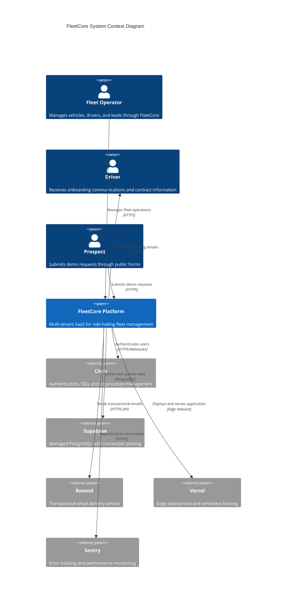
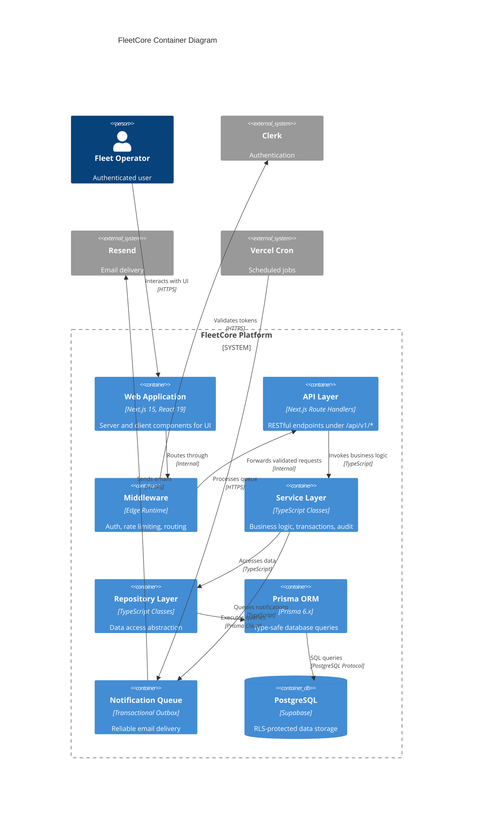
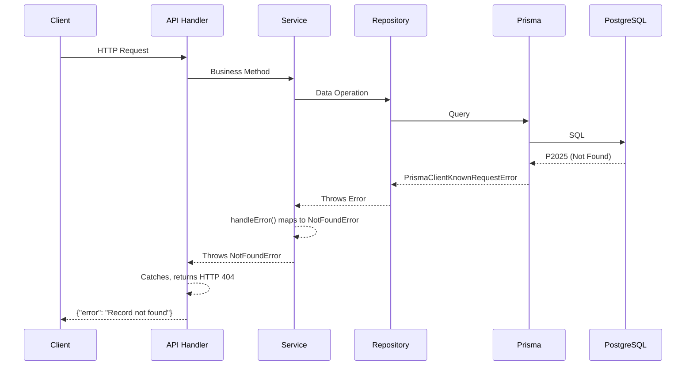
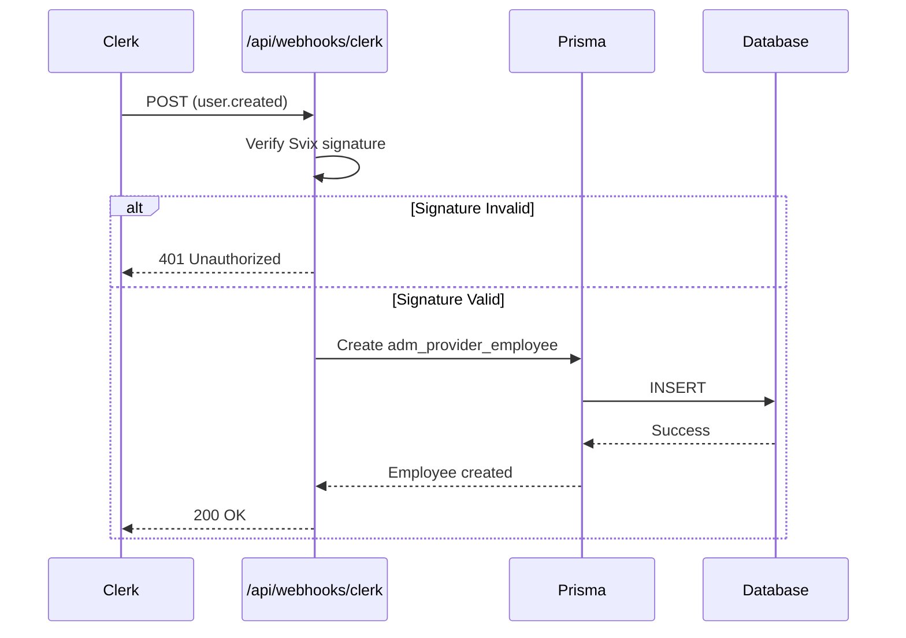

# System Overview

> **Document Type:** Architecture Overview
> **Version:** 1.2
> **Last Updated:** December 2025

---

## Introduction

FleetCore occupies a specific position within the ride-hailing ecosystem, serving as the operational backbone for fleet operators who manage vehicles across platforms like Uber, Bolt, and Careem. Understanding this position requires examining how FleetCore interacts with its surrounding systems and how its internal components collaborate to deliver value.

The platform is not a monolithic application but rather a carefully orchestrated collection of services, each responsible for a specific domain. This document presents the system architecture through the C4 model lens, progressively zooming from the highest-level context down to the container-level implementation details.

---

## System Context

The following diagram illustrates FleetCore's position within its broader ecosystem. Fleet operators interact with the platform through web browsers, while FleetCore itself relies on several external services to deliver its functionality.



Each external system serves a distinct purpose in FleetCore's operation. Clerk handles the complexity of authentication, including social login providers, multi-factor authentication, and organization-based access control. Supabase provides PostgreSQL hosting with connection pooling through PgBouncer, essential for serverless deployments. Resend delivers emails with high deliverability rates and webhook callbacks for delivery status. Vercel's edge network ensures low-latency responses globally, particularly important for FleetCore's target markets spanning the UAE, France, and broader MENA region.

---

## Container Architecture

Zooming into the FleetCore platform reveals a layered architecture built on Next.js 15 with the App Router pattern.



The Service Layer, anchored by the `BaseService` abstract class in `lib/core/base.service.ts`, orchestrates business operations with transactions, error mapping, and audit logging. The Repository Layer provides data access abstraction through `BaseRepository` in `lib/core/base.repository.ts`, implementing sort field whitelisting for SQL injection protection.

---

## Caching Architecture

FleetCore currently operates without a dedicated caching layer. This architectural decision reflects the current scale of operations and the consistency requirements of CRM data.

**Current State:**

- No Redis or Upstash cache deployed
- Database queries execute against PostgreSQL on every request
- Supabase connection pooling (PgBouncer) mitigates connection overhead
- Prisma query caching disabled to ensure data freshness

**Rationale:** CRM data changes frequently through user interactions. Stale lead or opportunity data could result in duplicate outreach or missed follow-ups. The current user base does not generate load that would benefit from caching.

**Future Consideration:** When FleetCore scales beyond 1000 concurrent users, introducing Upstash Redis for:

- Session data caching (reduce Clerk API calls)
- CRM settings caching with 5-minute TTL
- Rate limiting state (replacing in-memory Map)
- API response caching for read-heavy dashboards

---

## Rate Limiting

FleetCore implements in-memory rate limiting in the middleware at `middleware.ts`.

**Implementation Details:**

- **Storage:** In-memory Map (not distributed)
- **Limit:** 100 requests per 60-second sliding window
- **Granularity:** Per user ID for CRM routes, per tenant ID for client API routes
- **Response:** HTTP 429 with message "Rate limit exceeded. Try again later."

```typescript
// From middleware.ts
const rateLimitStore = new Map<string, { count: number; resetTime: number }>();
const RATE_LIMIT = 100;
const RATE_LIMIT_WINDOW = 60 * 1000; // 1 minute
```

**Limitations:**

- Not distributed: Each Vercel function instance has its own Map
- No `X-RateLimit-*` headers returned to clients
- No differentiated tiers (all authenticated users share the same limit)
- Probabilistic cleanup (1% chance per request) rather than scheduled

**Future Enhancement:** Migrate to Upstash Redis for distributed rate limiting with proper headers and per-endpoint granularity.

---

## Request Flow

Consider a fleet operator retrieving their lead pipeline. The request flows through multiple layers with authentication and authorization at each boundary.

The request begins at the browser. The Next.js middleware intercepts it, validating the Clerk session token and extracting organization membership. For CRM routes, the middleware verifies the user belongs to the FleetCore Admin organization with an appropriate role (`org:adm_admin` or `org:adm_commercial`).

With authentication confirmed, the handler calls `getCurrentProviderId()` from `lib/utils/provider-context.ts`, querying `adm_provider_employees` to determine which FleetCore division the user belongs to. This provider ID filters all subsequent queries.

The service validates parameters using `validateSortBy()` from `lib/core/validation.ts`, then calls the repository. The `buildProviderFilter()` function generates WHERE clause restrictions. Prisma translates to SQL and executes against PostgreSQL, where RLS policies provide defense in depth.

---

## Error Propagation

Errors propagate up through layers with increasing abstraction until reaching the user as appropriate HTTP responses.



**Error Mapping in BaseService:**
| Prisma Code | Application Error | HTTP Status |
|-------------|-------------------|-------------|
| P2002 | ConflictError | 409 |
| P2025 | NotFoundError | 404 |
| P2003 | ValidationError | 400 |
| Other | AppError | 500 |

Throughout this flow, Pino logger records contextual information at each layer, and Sentry captures stack traces for unhandled exceptions.

---

## Asynchronous Operations

FleetCore processes three types of asynchronous operations: webhooks, scheduled jobs, and queued notifications.

### Webhook Flow



Webhook handlers at `app/api/webhooks/` verify cryptographic signatures before processing. Clerk webhooks use Svix verification; Resend webhooks use HMAC validation.

### Scheduled Jobs (CRON)

Vercel CRON triggers endpoints in `app/api/cron/` with `CRON_SECRET` header validation:

| Schedule      | Endpoint                          | Purpose                                |
| ------------- | --------------------------------- | -------------------------------------- |
| Daily 8:00 AM | `/api/cron/opportunities/rotting` | Detect stale pipeline opportunities    |
| Daily 6:00 AM | `/api/cron/fleet/maintenance`     | Notify drivers of upcoming maintenance |
| Daily 6:00 AM | `/api/cron/fleet/insurance`       | Alert on expiring insurance policies   |
| Daily 6:00 AM | `/api/cron/fleet/inspections`     | Remind about vehicle inspections       |
| Every minute  | `/api/cron/notifications/process` | Process notification queue             |

### Notification Queue (Transactional Outbox)

The `NotificationQueueService` in `lib/services/notification/queue.service.ts` implements the Transactional Outbox pattern:

1. Business logic calls `queueNotification()` within the same database transaction
2. If transaction succeeds, notification record persists in `adm_notification_queue`
3. CRON worker processes pending notifications with exponential backoff retries
4. Idempotency keys prevent duplicate sends

---

## Multi-Tenant Isolation Model

FleetCore implements two-level isolation for different data access patterns.

### Provider Isolation (CRM Layer)

Separates data between FleetCore's regional divisions (UAE, France, etc.). The `provider_id` column appears on `crm_leads`, `crm_opportunities`, and `adm_provider_employees`. Sales teams see only their division's commercial data.

### Tenant Isolation (Operations Layer)

Separates data between FleetCore's customers (fleet operators). The `tenant_id` column appears on `flt_vehicles`, `rid_drivers`, and operational tables. Fleet Operator A cannot see Fleet Operator B's data.

**Implementation:** `lib/utils/provider-context.ts` exports:

- `getCurrentProviderId()`: Extracts provider from authenticated user
- `buildProviderFilter()`: Generates WHERE clause for standard tables
- `buildHybridProviderFilter()`: Handles `is_system` + `provider_id` tables

---

## Monitoring and Observability

### Sentry Integration

Sentry captures errors and traces across server, edge, and client environments. Configuration in `sentry.server.config.ts` and `sentry.edge.config.ts`:

```typescript
Sentry.init({
  dsn: "https://...",
  tracesSampleRate: 1, // 100% of traces captured
  enableLogs: true,
  debug: false,
});
```

**Current Limitations:**

- No custom alerting rules configured (uses Sentry defaults)
- No PagerDuty/Slack integration for critical alerts
- No custom performance metrics beyond automatic tracing

### Logging Strategy

Pino logger (`lib/logger.ts`) provides structured JSON logging:

```typescript
export const logger = pino({
  level: process.env.LOG_LEVEL || "info",
  redact: {
    paths: ["password", "token", "apiKey", "secret", "authorization", "cookie"],
    censor: "[REDACTED]",
  },
});
```

**Log Levels:** trace, debug, info, warn, error, fatal
**Sensitive Data:** Automatically redacted in log output
**Format:** JSON for log aggregation compatibility

### Health Checks

FleetCore does not currently expose a dedicated `/api/health` endpoint. Health is monitored indirectly through:

- Vercel deployment status
- Sentry error rate
- CRON job success/failure logs

**Future Enhancement:** Implement `/api/health` with dependency checks (database, Clerk, Resend).

---

## Resilience and Failure Modes

FleetCore's resilience characteristics vary by external dependency.

### Clerk Unavailability

If Clerk is unreachable for 30+ minutes:

- **Impact:** All authenticated operations fail (401 errors)
- **Mitigation:** None currently; users must wait for Clerk recovery
- **User Experience:** Login fails; authenticated pages show error

### Supabase Unavailability

If PostgreSQL is unreachable:

- **Impact:** All data operations fail (500 errors)
- **Mitigation:** Supabase provides 99.9% SLA with automatic failover
- **User Experience:** All pages show database error

### Resend Unavailability

If Resend is unreachable:

- **Impact:** Emails not sent immediately
- **Mitigation:** Notification queue retries with exponential backoff (2, 4, 8 minutes)
- **User Experience:** Email delivery delayed but not lost

**Circuit Breaker Pattern:** Not currently implemented. Future enhancement for external service calls.

---

## Security Boundaries

### Row-Level Security (RLS)

PostgreSQL RLS policies enforce isolation at the database level:

```sql
-- Example policy for crm_leads
CREATE POLICY "crm_leads_provider_isolation" ON crm_leads
  FOR ALL
  USING (
    provider_id = current_setting('app.current_provider_id')::uuid
    OR current_setting('app.is_admin')::boolean = true
  );
```

The application sets `app.current_provider_id` via Supabase connection configuration. Admin users with global access have `app.is_admin = true`.

### API Versioning

All protected endpoints use `/api/v1/` prefix. Current versioning policy:

- V1 is the only active version
- No formal deprecation timeline established
- Breaking changes would introduce V2 with migration period

---

## Conclusion

FleetCore's architecture balances simplicity with enterprise requirements. The layered approach separates concerns cleanly, the dual isolation model addresses real business needs, and the asynchronous patterns ensure reliability. Areas explicitly noted as "not implemented" represent conscious trade-offs at current scale rather than oversights.

---

_For detailed technology justifications, see [02_technical_stack.md](./02_technical_stack.md)._
