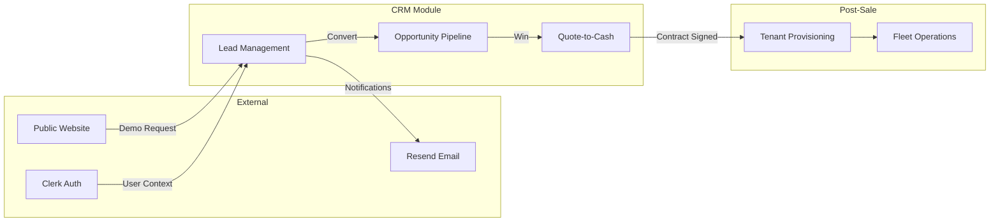
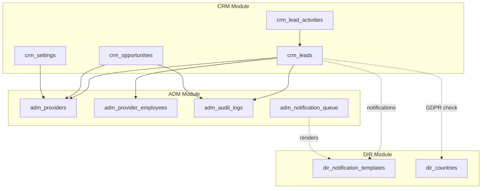

# CRM Module Introduction

> **Module:** Customer Relationship Management
> **Version:** 1.0
> **Last Updated:** December 2025

---

## Module Purpose

The CRM module manages FleetCore's complete pre-sale lifecycle, from initial lead capture through contract signature. It provides sales teams with tools for lead qualification, opportunity tracking, and pipeline management across FleetCore's regional divisions.

The module serves as the bridge between marketing activities (lead generation) and operational systems (fleet management), ensuring a structured handoff when leads convert to paying customers.

---

## Business Context

FleetCore operates as a B2B fleet management platform serving ride-hailing operators across multiple markets (UAE, France, and expanding). The CRM module addresses several business needs:

**Lead Qualification:** Not all demo requests have equal potential. The scoring algorithm automatically ranks leads by fit (fleet size, market) and engagement (behavior, responsiveness), allowing sales reps to prioritize high-value prospects.

**Regional Isolation:** FleetCore UAE and FleetCore France operate as separate business units with distinct sales teams. The provider isolation model ensures each team sees only their market's leads while enabling global reporting for leadership.

**Pipeline Visibility:** Sales managers need real-time visibility into deal progression. The opportunity pipeline with rotting detection surfaces stalled deals before they become lost opportunities.

---

## Core Capabilities

### Lead Management

- **Automated Capture:** Demo requests from the public website create leads automatically
- **Lead Scoring:** Fit score (0-60) + Engagement score (0-100) = Qualification score
- **Automatic Assignment:** Round-robin assignment with geographic and fleet-size prioritization
- **Stage Progression:** Top of Funnel → Marketing Qualified → Sales Qualified → Opportunity

### Opportunity Management

- **5-Stage Pipeline:** Qualification → Demo → Proposal → Negotiation → Contract Sent
- **Auto-Probability:** Each stage has default win probability (20% → 90%)
- **Deal Rotting:** Alerts when opportunities exceed max days in stage
- **Win/Loss Tracking:** Capture reasons and competitor information

### Quote-to-Cash (Preview)

The CRM module includes infrastructure for the complete Quote-to-Cash workflow:

- `crm_quotes` / `crm_quote_items` - Quote generation
- `crm_orders` - Order management
- `crm_agreements` - Contract documents

**Status:** These entities are implemented at the database level but business workflows are currently under active development. Full documentation will be added upon stabilization.

For current implementation status, see `lib/services/crm/order.service.ts`.

---

## Integration Points

**Inbound:**

- Public website demo request form
- Clerk authentication context (user, organization, provider)
- Manual lead entry by sales reps

**Outbound:**

- Email notifications via Resend (lead assignment, stage changes)
- Tenant provisioning upon contract signature
- Audit logs for compliance tracking

---

## Key Terminology

| Term                    | Definition                                                                |
| ----------------------- | ------------------------------------------------------------------------- |
| **Lead**                | A potential customer who has expressed interest (demo request, referral)  |
| **Opportunity**         | A qualified sales engagement with defined value and timeline              |
| **Provider**            | A FleetCore regional division (UAE, France) - used for CRM data isolation |
| **Tenant**              | A paying customer organization - created after contract signature         |
| **Fit Score**           | How well the lead matches FleetCore's ideal customer profile (0-60)       |
| **Engagement Score**    | How actively the lead has engaged with FleetCore (0-100)                  |
| **Qualification Score** | Combined score determining lead stage (0-100)                             |
| **Deal Rotting**        | An opportunity that has exceeded its maximum time in current stage        |

---

## Provider Isolation in CRM

CRM data is isolated by `provider_id`, separating FleetCore's regional divisions (UAE, France, etc.). This differs from tenant isolation used in operational modules.

For the complete rationale, see [ADR-003: Provider vs Tenant Isolation](../../../02_ARCHITECTURE/DECISIONS/ADR-003-provider-tenant-isolation.md).

**In CRM context:**

- All CRM tables include `provider_id` column
- Sales reps see only their provider's leads
- CEO/Admin can access all providers (global scope)
- System settings can be provider-specific or global

---

## Module Dependencies

The CRM module integrates with other FleetCore modules for shared infrastructure:

### Dependency Details

| Dependency    | Direction | Purpose                                                                                     |
| ------------- | --------- | ------------------------------------------------------------------------------------------- |
| **CRM → ADM** | Required  | Provider context for isolation, employee assignment for leads, audit logging for compliance |
| **CRM → DIR** | Required  | Notification templates for emails, country reference for GDPR flags                         |
| **CRM → FLT** | None      | CRM is pre-sale; no dependency on fleet operations                                          |
| **CRM → RID** | None      | CRM is pre-sale; no dependency on rideshare operations                                      |
| **CRM → BIL** | None      | Billing is post-sale; no direct CRM dependency                                              |

**Key Foreign Keys:**

- `crm_leads.provider_id` → `adm_providers.id`
- `crm_leads.assigned_to` → `adm_provider_employees.id`
- `crm_opportunities.provider_id` → `adm_providers.id`
- `crm_settings.provider_id` → `adm_providers.id`

**Note:** The CRM module is deliberately isolated from post-sale modules (FLT, RID, BIL). The handoff occurs when an Opportunity is marked as Won, triggering tenant provisioning in the ADM module.

---

## Current Status

| Component                     | Status         | Notes                                      |
| ----------------------------- | -------------- | ------------------------------------------ |
| Lead Management               | ✅ Stable      | Full lifecycle implemented                 |
| Lead Scoring                  | ✅ Stable      | Fit + Engagement + Qualification algorithm |
| Lead Assignment               | ✅ Stable      | 4-priority algorithm with fallback         |
| Opportunity Pipeline          | ✅ Stable      | 5 stages with rotting detection            |
| Lead → Opportunity Conversion | ✅ Stable      | Transactional with audit logging           |
| Quote Generation              | 🚧 In Progress | Tables exist, workflows pending            |
| Order Management              | 🚧 In Progress | Basic CRUD, full flow pending              |
| Agreement Lifecycle           | 🚧 In Progress | Schema ready, business logic pending       |

---

_Next: [Process Flow Overview](./02_process_flow_overview.md)_
