# CRM Process Flow Overview

> **Module:** Customer Relationship Management
> **Version:** 1.0
> **Last Updated:** December 2025

---

## Lead Lifecycle

Leads progress through two parallel tracking systems: **status** (workflow state) and **stage** (qualification level).

### Lead Status (Workflow State)


| Status      | Description                         | Typical Duration |
| ----------- | ----------------------------------- | ---------------- |
| `new`       | Lead created, not yet contacted     | < 24 hours       |
| `working`   | Sales rep actively engaging         | 1-4 weeks        |
| `qualified` | Lead stage is Sales Qualified (SQL) | 1-2 weeks        |
| `converted` | Opportunity created from lead       | Terminal         |
| `lost`      | Lead rejected or unresponsive       | Terminal         |

### Lead Stage (Qualification Level)

Lead stage is determined automatically by the qualification score:

```mermaid
flowchart LR
    TOF[Top of Funnel<br>score < 40]
    MQL[Marketing Qualified<br>40 ≤ score < 70]
    SQL[Sales Qualified<br>score ≥ 70]
    OPP[Opportunity<br>converted]

    TOF -->|Score increases| MQL
    MQL -->|Score increases| SQL
    SQL -->|Convert action| OPP
    MQL -->|Score decreases| TOF
    SQL -->|Score decreases| MQL
```



| Stage                 | Score Range | Meaning                           |
| --------------------- | ----------- | --------------------------------- |
| `top_of_funnel`       | 0-39        | Early interest, needs nurturing   |
| `marketing_qualified` | 40-69       | Shows promise, warrants attention |
| `sales_qualified`     | 70-100      | Ready for active sales engagement |
| `opportunity`         | N/A         | Converted to opportunity record   |

**Key Insight:** Status is manually updated by sales reps. Stage is automatically calculated from scoring but can be manually overridden via qualification action.

---

## Lead Creation Flow

When a demo request arrives or a lead is manually created, the system executes this orchestration:


**Source:** `lib/services/crm/lead-creation.service.ts`

---

## Opportunity Pipeline

When a Sales Qualified Lead converts, it enters the opportunity pipeline:


### Stage Details

| Stage           | Default Probability | Max Days | Color  | Next Action       |
| --------------- | ------------------- | -------- | ------ | ----------------- |
| `qualification` | 20%                 | 14       | Blue   | Schedule demo     |
| `demo`          | 40%                 | 10       | Purple | Send proposal     |
| `proposal`      | 60%                 | 14       | Yellow | Begin negotiation |
| `negotiation`   | 80%                 | 10       | Orange | Send contract     |
| `contract_sent` | 90%                 | 7        | Green  | Await signature   |

**Source:** `lib/config/opportunity-stages.ts`

### Stage Transitions

Stage transitions are controlled but flexible:

```typescript
// Valid transitions: forward or backward by 1 step, or same
isValidStageTransition("qualification", "demo"); // true (forward)
isValidStageTransition("demo", "qualification"); // true (backward)
isValidStageTransition("qualification", "proposal"); // false (skip)
```

---

## Deal Rotting Detection

Opportunities that exceed their max days in stage are flagged as "rotting":


**Rotting Calculation:**

```typescript
const daysInStage = daysSince(opportunity.stage_entered_at);
const maxDays = opportunity.max_days_in_stage ?? stageConfig.maxDays;
const isRotting = daysInStage > maxDays;
```

**Source:** `lib/services/crm/opportunity-rotting.service.ts`

---

## Lead to Opportunity Conversion

The conversion from SQL lead to opportunity is a transactional operation:


**Business Rules:**

- Only `sales_qualified` leads can convert
- Conversion creates opportunity with `qualification` stage
- Lead status auto-syncs to `qualified`
- Original lead data preserved in opportunity metadata

**Source:** `lib/actions/crm/convert.actions.ts`

---

## Quote-to-Cash Flow (Preview)

The complete Quote-to-Cash workflow is currently under development:


**Status:** Database schema implemented. Business workflow documentation pending stabilization.

---

## Key Metrics

| Metric                   | Definition                           | Target   | Tracking                |
| ------------------------ | ------------------------------------ | -------- | ----------------------- |
| **Lead Conversion Rate** | % leads converted to opportunities   | >15%     | Pipeline analytics      |
| **Lead Response Time**   | Hours from creation to first contact | <24h     | SLA enforced via status |
| **Sales Cycle Length**   | Days from lead to won opportunity    | <45 days | Stage timestamps        |
| **Win Rate**             | % opportunities closed as won        | >25%     | Pipeline analytics      |
| **Pipeline Velocity**    | Value × Win Rate / Cycle Time        | Growing  | Forecast model          |
| **Rotting Rate**         | % opportunities exceeding max_days   | <10%     | Daily CRON detection    |

**Note:** Actual metrics are tracked via CRM analytics. Targets are configurable per provider in `crm_settings` table.

### Metric Calculation Points

```
Lead Conversion Rate = (Leads with status='converted') / (Total Leads) × 100
Lead Response Time = (status_updated_at where status='working') - created_at
Sales Cycle Length = (opportunity.closed_at) - (lead.created_at)
Win Rate = (Opportunities with status='won') / (Total Closed Opportunities) × 100
Pipeline Velocity = (Σ expected_value × probability_percent) / avg_cycle_length
```

---

## Responsibility Swimlane

The CRM workflow involves three actor types with distinct responsibilities:

```mermaid
flowchart TB
    subgraph System["🤖 System (Automated)"]
        S1[Calculate Scores]
        S2[Assign Lead]
        S3[Detect Rotting]
        S4[Send Notifications]
        S5[Generate Lead Code]
    end

    subgraph SalesRep["👤 Sales Rep (Manual)"]
        R1[Contact Lead]
        R2[Update Status]
        R3[Qualify Lead]
        R4[Convert to Opportunity]
        R5[Progress Pipeline Stage]
        R6[Close Won/Lost]
    end

    subgraph Manager["👔 Manager (Oversight)"]
        M1[Reassign Leads]
        M2[Review Rotting Alerts]
        M3[Approve Discounts]
        M4[Override Stage]
    end

    S5 --> S1
    S1 --> S2
    S2 --> S4
    S4 --> R1
    R1 --> R2
    R2 --> S1
    R3 --> R4
    R4 --> R5
    R5 --> S3
    S3 --> M2
    M2 --> M1
    R6 --> S4
```



### Responsibility Matrix

| Actor         | Responsibilities                                                                                                       |
| ------------- | ---------------------------------------------------------------------------------------------------------------------- |
| **System**    | Lead code generation, score calculation, automatic assignment, rotting detection, notification dispatch, audit logging |
| **Sales Rep** | First contact, status updates, lead qualification, opportunity conversion, pipeline progression, deal closure          |
| **Manager**   | Lead reassignment, rotting resolution, discount approval, stage overrides, team performance review                     |

### Automation vs Manual Decisions

| Action               | Automated                       | Manual Override                |
| -------------------- | ------------------------------- | ------------------------------ |
| Lead scoring         | ✅ On creation & recalculation  | ✅ Manual qualification action |
| Lead assignment      | ✅ Based on rules               | ✅ Manager reassignment        |
| Stage determination  | ✅ Based on score thresholds    | ✅ Manual stage change         |
| Priority setting     | ✅ Based on qualification score | ✅ Manual priority adjustment  |
| Rotting detection    | ✅ Daily CRON                   | N/A                            |
| Notifications        | ✅ Event-triggered              | N/A                            |
| Status transitions   | ❌                              | ✅ Sales rep updates           |
| Pipeline progression | ❌                              | ✅ Sales rep advances          |
| Won/Lost decision    | ❌                              | ✅ Sales rep closes            |

---

## Notification Triggers

| Event                     | Template                    | Recipient             |
| ------------------------- | --------------------------- | --------------------- |
| Lead assigned             | `sales_rep_assignment`      | Assigned sales rep    |
| Lead stage upgrade to SQL | `lead_stage_upgrade`        | Assigned sales rep    |
| Opportunity rotting       | `opportunity_rotting_alert` | Opportunity owner     |
| Lead confirmation         | `lead_confirmation`         | Lead (external email) |

**Source:** `lib/services/notification/queue.service.ts`

---

_Next: [User Roles and Permissions](./03_user_roles_permissions.md)_
