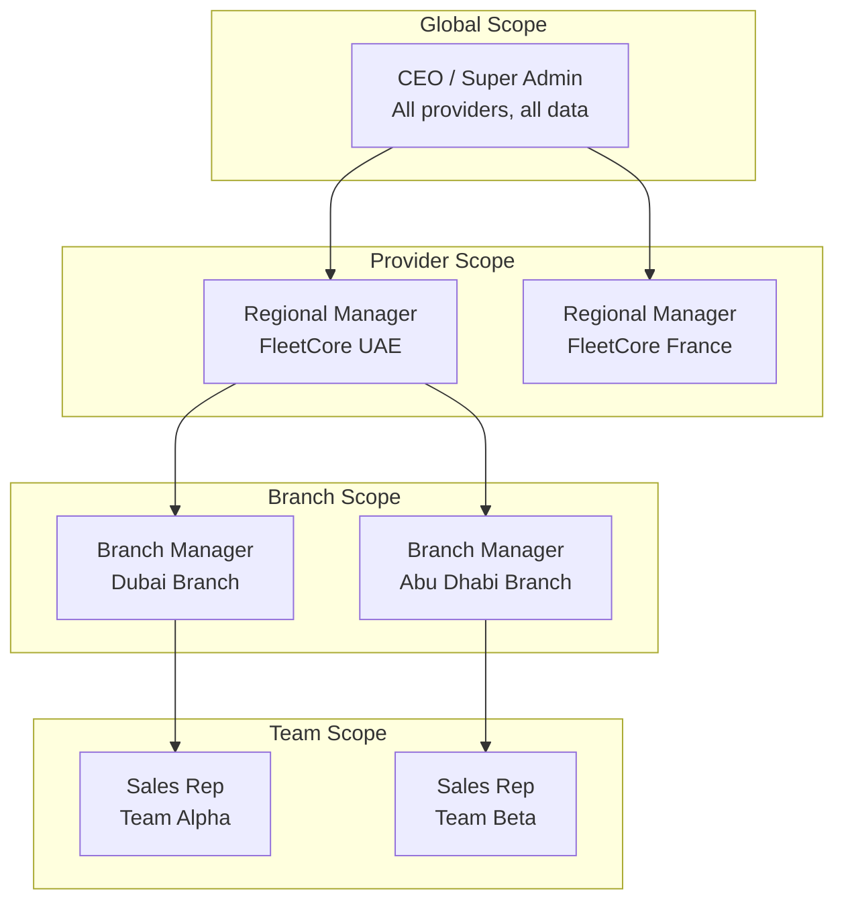
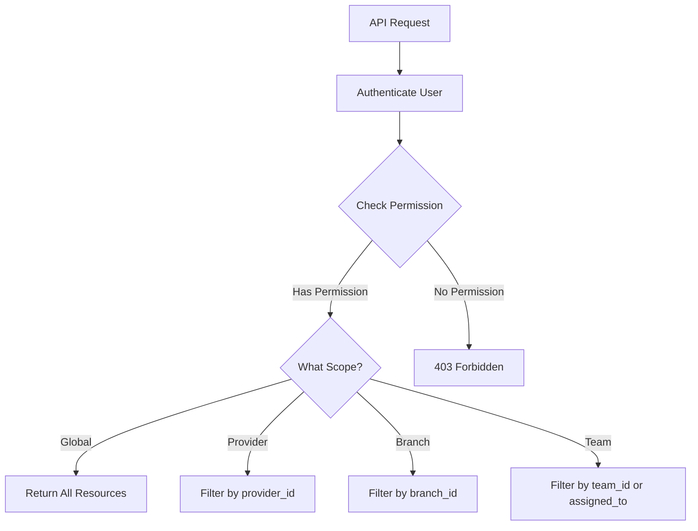

# CRM Roles and Permissions

> **Module:** Customer Relationship Management
> **Version:** 1.0
> **Last Updated:** December 2025

---

## Role Hierarchy

FleetCore CRM implements a hierarchical access model where higher-level roles inherit visibility from lower levels:



**Key Principle:** Data visibility flows downward. A Regional Manager sees all leads in their provider. A Sales Rep sees only leads assigned to them or their team.

---

## Permission Model

FleetCore uses a generic RBAC system defined in `lib/middleware/rbac.middleware.ts`. CRM-specific roles are configured at runtime through permission assignments rather than hardcoded role definitions.

### Permission Format

Permissions follow the `resource.action` pattern:

```typescript
// Examples
"leads.create"; // Create new leads
"leads.read"; // View lead details
"leads.update"; // Edit lead information
"leads.delete"; // Soft-delete leads
"leads.qualify"; // Manually qualify leads
"leads.convert"; // Convert lead to opportunity
"opportunities.read"; // View opportunities
"opportunities.update"; // Edit opportunity details
"opportunities.close"; // Mark won/lost
```

### Permission Verification

```typescript
// lib/middleware/rbac.middleware.ts

const result = await requirePermission(
  userId, // Member UUID
  tenantId, // Tenant UUID (admin org for CRM)
  "leads.create"
);

// Result includes scope information
// result.scopeType: "global" | "branch" | "team"
// result.scopeId: UUID of authorized scope (null for global)
```

---

## Scope-Based Access

Each permission can be granted at different scope levels, controlling which resources the user can access:

### Scope Types

| Scope      | Access Level                             | Use Case         |
| ---------- | ---------------------------------------- | ---------------- |
| `global`   | All resources across all providers       | CEO, Super Admin |
| `provider` | All resources within a specific provider | Regional Manager |
| `branch`   | Resources belonging to a specific branch | Branch Manager   |
| `team`     | Resources assigned to a specific team    | Sales Rep        |

### Scope Resolution Flow



### Implementation Example

```typescript
// Typical CRM query with scope filtering

async function getLeads(userId: string, tenantId: string) {
  // 1. Check permission and get scope
  const rbacResult = await requirePermission(userId, tenantId, "leads.read");

  // 2. Build query filter based on scope
  let whereClause: Prisma.crm_leadsWhereInput = {};

  switch (rbacResult.scopeType) {
    case "global":
      // No filter - see all leads
      break;
    case "branch":
      whereClause.branch_id = rbacResult.scopeId;
      break;
    case "team":
      whereClause.OR = [
        { team_id: rbacResult.scopeId },
        { assigned_to: userId },
      ];
      break;
  }

  // 3. Execute filtered query
  return prisma.crm_leads.findMany({ where: whereClause });
}
```

---

## CRM-Specific Permissions

### Lead Permissions

| Permission      | Description                      | Typical Roles         |
| --------------- | -------------------------------- | --------------------- |
| `leads.create`  | Create new leads manually        | Sales Rep, Manager    |
| `leads.read`    | View lead list and details       | All CRM users         |
| `leads.update`  | Edit lead information            | Assigned rep, Manager |
| `leads.delete`  | Soft-delete leads                | Manager, Admin        |
| `leads.qualify` | Manually set lead stage          | Sales Rep, Manager    |
| `leads.convert` | Convert SQL to opportunity       | Sales Rep, Manager    |
| `leads.assign`  | Reassign leads to other reps     | Manager               |
| `leads.bulk`    | Bulk operations (import, update) | Admin                 |

### Opportunity Permissions

| Permission              | Description                 | Typical Roles         |
| ----------------------- | --------------------------- | --------------------- |
| `opportunities.read`    | View pipeline and details   | All CRM users         |
| `opportunities.update`  | Edit opportunity data       | Assigned rep, Manager |
| `opportunities.advance` | Move to next pipeline stage | Sales Rep, Manager    |
| `opportunities.close`   | Mark as won or lost         | Sales Rep, Manager    |
| `opportunities.delete`  | Soft-delete opportunities   | Admin                 |

### Configuration Permissions

| Permission            | Description               | Typical Roles  |
| --------------------- | ------------------------- | -------------- |
| `crm_settings.read`   | View CRM configuration    | Manager, Admin |
| `crm_settings.update` | Modify scoring thresholds | Admin          |
| `reports.crm`         | Access CRM analytics      | Manager, Admin |

---

## Typical Role Configurations

While roles are database-configured, these are typical configurations:

### Sales Representative

```json
{
  "leads": {
    "create": true,
    "read": true,
    "update": true,
    "qualify": true,
    "convert": true
  },
  "opportunities": {
    "read": true,
    "update": true,
    "advance": true,
    "close": true
  }
}
// Scope: team
```

### Sales Manager

```json
{
  "leads": {
    "create": true,
    "read": true,
    "update": true,
    "delete": true,
    "qualify": true,
    "convert": true,
    "assign": true
  },
  "opportunities": {
    "read": true,
    "update": true,
    "advance": true,
    "close": true,
    "delete": true
  },
  "reports": { "crm": true }
}
// Scope: branch
```

### CRM Administrator

```json
{
  "leads": { "*": true },
  "opportunities": { "*": true },
  "crm_settings": { "read": true, "update": true },
  "reports": { "crm": true }
}
// Scope: provider
```

**Note:** Actual role definitions are stored in the database (`adm_roles` table) and may vary by provider. The configurations above represent recommended defaults.

---

## Temporal Role Validity

Roles can have time-based constraints:

```typescript
// adm_member_roles table fields
{
  member_id: "uuid",
  role_id: "uuid",
  scope_type: "branch",
  scope_id: "branch-uuid",
  valid_from: "2025-01-01T00:00:00Z",  // Role becomes active
  valid_until: "2025-12-31T23:59:59Z"  // Role expires
}
```

**Use Cases:**

- Temporary access during vacation coverage
- Probationary period with limited permissions
- Seasonal sales staff with fixed-term access

The RBAC middleware automatically filters expired roles:

```typescript
// From rbac.middleware.ts
where: {
  member_id: userId,
  OR: [
    { valid_from: null },
    { valid_from: { lte: now } }
  ],
  AND: [{
    OR: [
      { valid_until: null },
      { valid_until: { gte: now } }
    ]
  }]
}
```

---

## Provider Isolation

CRM data isolation operates at the provider level, not tenant level. This is a critical distinction:

| Concept      | Isolation By  | Use Case                                   |
| ------------ | ------------- | ------------------------------------------ |
| **Provider** | `provider_id` | FleetCore internal divisions (UAE, France) |
| **Tenant**   | `tenant_id`   | Fleet operator customers (post-sale)       |

### Provider Filter Functions

```typescript
// lib/utils/provider-context.ts

// For CRM tables (provider-isolated)
buildProviderFilter(providerId: string | null)
// Returns: { provider_id: "uuid" } or {} for global scope

// For settings tables (system + custom)
buildHybridProviderFilter(providerId: string | null)
// Returns: { OR: [{ is_system: true }, { provider_id: "uuid" }] }
```

### Access Patterns

| User Type        | Provider Access | Data Visibility    |
| ---------------- | --------------- | ------------------ |
| Super Admin      | All providers   | Global CRM view    |
| Regional Manager | Single provider | All division data  |
| Sales Rep        | Single provider | Team/assigned only |

For the complete rationale behind this isolation model, see [ADR-003: Provider vs Tenant Isolation](../../../02_ARCHITECTURE/DECISIONS/ADR-003-provider-tenant-isolation.md).

---

## Error Handling

When permission checks fail, the middleware throws specific errors:

```typescript
// Permission denied
throw new ForbiddenError(
  `Permission denied: ${permission}. User does not have required access.`
);

// Invalid permission format
throw new ValidationError(
  "Invalid permission format. Expected 'resource.action'"
);

// Resource not in authorized scope
throw new ForbiddenError(
  `Resource not accessible: ${table}/${id} is not in your authorized ${scopeType}.`
);
```

**Source:** `lib/middleware/rbac.middleware.ts`

---

_Back to: [Module Index](../00_module_index.md)_
