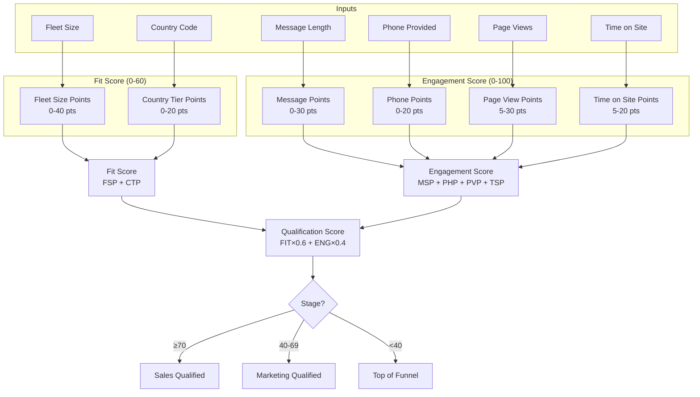
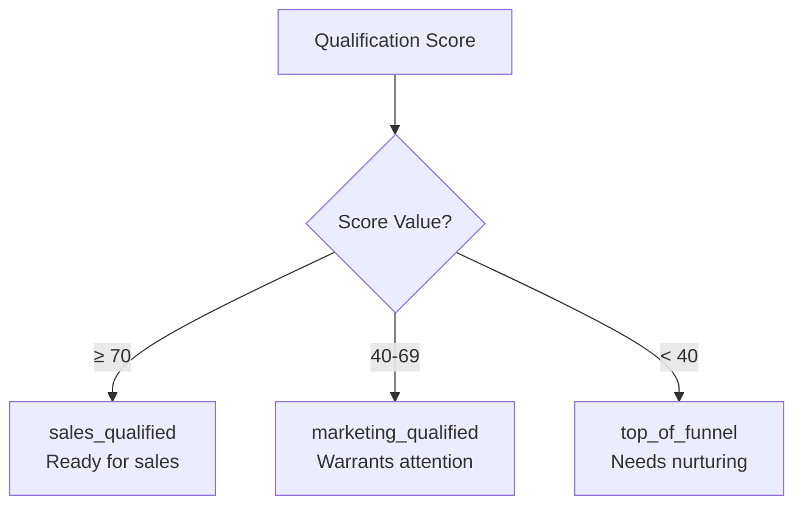
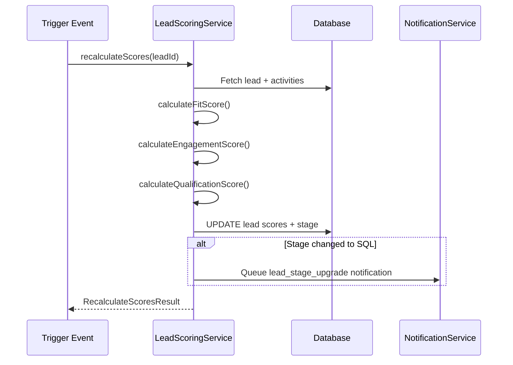

# Lead Scoring Algorithm

> **Module:** CRM / Lead Management
> **Version:** 1.0
> **Last Updated:** December 2025

---

## Overview

FleetCore's lead scoring system automatically qualifies leads using a two-component algorithm that combines **fit score** (how well the lead matches FleetCore's ideal customer profile) with **engagement score** (how actively the lead has engaged). This eliminates subjective prioritization and ensures sales reps focus on the highest-potential leads.

---

## Scoring Architecture



### Master Formula

```
qualification_score = (fit_score × 0.6) + (engagement_score × 0.4)
```

| Score Type          | Range | Weight | Purpose                        |
| ------------------- | ----- | ------ | ------------------------------ |
| Fit Score           | 0-60  | 60%    | Target customer profile match  |
| Engagement Score    | 0-100 | 40%    | Prospect behavior and interest |
| Qualification Score | 0-100 | 100%   | Final stage determination      |

**Source:** `lib/services/crm/lead-scoring.service.ts:9-11`

---

## Fit Score (0-60 points)

Fit score evaluates whether the lead matches FleetCore's ideal customer profile based on two factors: fleet size and geographic market.

### Fleet Size Points (0-40)

Fleet size is the primary indicator of potential contract value. Larger fleets mean larger contracts.

| Fleet Size | Points | Rationale                             |
| ---------- | ------ | ------------------------------------- |
| `500+`     | 40     | Enterprise customer, highest priority |
| `101-500`  | 35     | Mid-market, strong potential          |
| `51-100`   | 30     | Growing fleet, good fit               |
| `11-50`    | 20     | Small fleet, moderate potential       |
| `1-10`     | 5      | Micro fleet, nurture track            |
| `unknown`  | 10     | Default when not specified            |

**Source:** `lib/repositories/crm/settings.repository.ts:617-624` (seed config)

### Country Tier Points (0-20)

Country scoring reflects strategic market priority and operational presence.

| Tier   | Countries                      | Points | Rationale                              |
| ------ | ------------------------------ | ------ | -------------------------------------- |
| Tier 1 | AE, SA, QA                     | 20     | Primary markets, FleetCore operational |
| Tier 2 | FR                             | 18     | Key European market                    |
| Tier 3 | KW, BH, OM                     | 15     | Secondary MENA markets                 |
| Tier 4 | DE, IT, ES, BE, NL, PT, +18 EU | 12     | EU expansion targets                   |
| Tier 5 | All others                     | 5      | International prospects                |

**Non-Operational Countries:** If a lead comes from a country where FleetCore is not yet operational, the system assigns 5 points and flags the lead as an `expansion_opportunity` in metadata.

**Source:** `lib/repositories/crm/settings.repository.ts:625-661` (seed config)

### Fit Score Calculation Example

```typescript
// Lead: 200 vehicles in France
Fleet Size: "101-500" → 35 points
Country: "FR" (Tier 2) → 18 points
─────────────────────────────────
Fit Score: 53 points
```

---

## Engagement Score (0-100 points)

Engagement score measures the lead's demonstrated interest through behavioral signals captured during the demo request process.

### Message Length Points (0-30)

Detailed messages indicate serious intent and help sales reps understand needs.

| Threshold   | Character Count | Points | Interpretation             |
| ----------- | --------------- | ------ | -------------------------- |
| Detailed    | > 200 chars     | 30     | Strong intent, clear needs |
| Substantial | > 100 chars     | 20     | Good interest              |
| Minimal     | > 20 chars      | 10     | Basic interest             |
| None        | ≤ 20 chars      | 0      | Low engagement             |

**Source:** `lib/repositories/crm/settings.repository.ts:662-667` (seed config)

### Phone Provided Points (0-20)

Willingness to share phone number indicates readiness for contact.

| Condition      | Points |
| -------------- | ------ |
| Phone provided | 20     |
| No phone       | 0      |

**Source:** `lib/repositories/crm/settings.repository.ts:668`

### Page Views Points (5-30)

Number of pages visited on the website before submitting the demo request.

| Engagement Level | Page Views | Points |
| ---------------- | ---------- | ------ |
| Very Engaged     | > 10 pages | 30     |
| Interested       | > 5 pages  | 20     |
| Curious          | > 2 pages  | 10     |
| Normal           | ≤ 2 pages  | 5      |

**Source:** `lib/repositories/crm/settings.repository.ts:669-674`

### Time on Site Points (5-20)

Total time spent on website (in seconds) before submission.

| Reading Depth | Time (seconds)  | Points |
| ------------- | --------------- | ------ |
| Deep Read     | > 600 (10+ min) | 20     |
| Moderate      | > 300 (5+ min)  | 15     |
| Brief         | > 120 (2+ min)  | 10     |
| Quick         | ≤ 120           | 5      |

**Source:** `lib/repositories/crm/settings.repository.ts:675-680`

### Engagement Score Calculation Example

```typescript
// Lead: 250-char message, phone provided, 8 page views, 5 min on site
Message: 250 chars (> 200) → 30 points
Phone: provided → 20 points
Page Views: 8 (> 5, ≤ 10) → 20 points
Time on Site: 300s (5 min) → 15 points
─────────────────────────────────────────
Engagement Score: 85 points
```

---

## Stage Determination

The qualification score determines the lead's stage using configurable thresholds:



| Stage                 | Score Range | Description                                |
| --------------------- | ----------- | ------------------------------------------ |
| `sales_qualified`     | ≥ 70        | Ideal customer profile, engage immediately |
| `marketing_qualified` | 40-69       | Good potential, requires nurturing         |
| `top_of_funnel`       | < 40        | Early stage, educational content           |

**Source:** `lib/repositories/crm/settings.repository.ts:681-685`

### Complete Scoring Example

```typescript
// Lead: CEO of 300-vehicle fleet in UAE, detailed message, all engagement signals

// Fit Score
Fleet Size: "101-500" → 35 points
Country: "AE" (Tier 1) → 20 points
Fit Score Total: 55 points

// Engagement Score
Message: 300 chars → 30 points
Phone: provided → 20 points
Page Views: 12 → 30 points
Time on Site: 8 min → 20 points
Engagement Score Total: 100 points

// Qualification Score
qualification_score = (55 × 0.6) + (100 × 0.4)
                    = 33 + 40
                    = 73

// Stage: sales_qualified (73 ≥ 70)
```

---

## Score Recalculation

Scores are recalculated in several scenarios to keep qualification current.

### Recalculation Triggers

| Trigger           | When                      | Method                                       |
| ----------------- | ------------------------- | -------------------------------------------- |
| Lead creation     | On INSERT                 | `LeadCreationService.createLead()`           |
| Manual request    | User clicks "Recalculate" | `LeadScoringService.recalculateScores()`     |
| Activity tracked  | New activity logged       | `LeadScoringService.recalculateScores()`     |
| Score degradation | CRON job (inactive leads) | `LeadScoringService.degradeInactiveScores()` |

### Recalculation Process



**Source:** `lib/services/crm/lead-scoring.service.ts:511-644`

---

## Score Degradation (Cold Leads)

Leads that remain inactive lose engagement points over time, potentially dropping to lower stages.

### Degradation Configuration

Score decay is controlled by `crm_settings.score_decay`:

```typescript
interface ScoreDecayConfig {
  enabled: boolean; // Master switch
  inactivity_threshold_days: number; // Days before decay starts (e.g., 30)
  decay_type: "percentage" | "fixed"; // How to calculate decay
  decay_value: number; // Percentage or fixed amount
  minimum_score: number; // Floor (e.g., 0)
  apply_to: "engagement_score" | "both";
}
```

**Source:** `lib/services/crm/lead-scoring.service.ts:149-162`

### Degradation Process

1. **CRON Job:** Runs on schedule (configurable, typically daily)
2. **Identify Inactive:** Leads where `last_activity_at` or `created_at` exceeds threshold
3. **Calculate Decay:** Apply percentage or fixed reduction to engagement score
4. **Recalculate Stage:** New qualification score may change stage
5. **Update Database:** Persist new scores and stage

```typescript
// Example: 20% decay for 45-day inactive lead
Previous Engagement: 85 points
Decay: 85 × 0.20 = 17 points
New Engagement: 68 points

// Recalculate qualification
Previous: (55 × 0.6) + (85 × 0.4) = 67 → MQL
New: (55 × 0.6) + (68 × 0.4) = 60.2 → MQL (still)
```

**Source:** `lib/services/crm/lead-scoring.service.ts:662-816`

### Tiered Decay Rules

Advanced configuration supports tiered decay based on inactivity duration:

```typescript
decay_rules: [
  { days_inactive: 30, decay_percentage: 10, description: "1 month" },
  { days_inactive: 60, decay_percentage: 20, description: "2 months" },
  { days_inactive: 90, decay_percentage: 30, description: "3 months" },
];
```

---

## Configuration

All scoring parameters are stored in `crm_settings` table, not hardcoded.

### Accessing Configuration

```typescript
// From lib/services/crm/lead-scoring.service.ts:227-240

private async loadConfig(): Promise<ScoringConfig> {
  const config = await this.settingsRepo.getSettingValue<ScoringConfig>(
    "lead_scoring_config"
  );

  if (!config) {
    throw new Error(
      "Lead scoring configuration not found in crm_settings. " +
      "Run seed script: pnpm tsx scripts/seed-crm-settings.ts"
    );
  }

  return config;
}
```

### Modifying Thresholds

To adjust scoring thresholds:

1. Access CRM Settings in admin UI
2. Locate `lead_scoring_config` setting
3. Modify desired values (fleet points, country tiers, etc.)
4. Save changes (takes effect immediately)

**Important:** Changes affect new calculations only. Existing leads retain their scores until recalculated.

---

## Score Breakdown Transparency

For audit and debugging, each lead stores the complete scoring breakdown in the `scoring` JSONB field:

```json
{
  "fit": {
    "fleet_points": 35,
    "country_points": 20,
    "total": 55
  },
  "engagement": {
    "message_points": 30,
    "phone_points": 20,
    "page_views_points": 20,
    "time_on_site_points": 15,
    "total": 85
  },
  "qualification": {
    "formula": "(fit × 0.6) + (engagement × 0.4)",
    "fit_weight": 0.6,
    "engagement_weight": 0.4,
    "total": 67,
    "stage": "marketing_qualified"
  }
}
```

This breakdown is visible in the lead detail view, allowing sales reps to understand why a lead received its score.

---

## Related Documentation

- [ADR-007: Lead Scoring Algorithm](../../../02_ARCHITECTURE/DECISIONS/ADR-007-lead-scoring-algorithm.md)
- [ADR-006: JSONB Dynamic Configuration](../../../02_ARCHITECTURE/DECISIONS/ADR-006-jsonb-configuration.md)

---

_Next: [Lead Assignment](./03_lead_assignment.md)_
