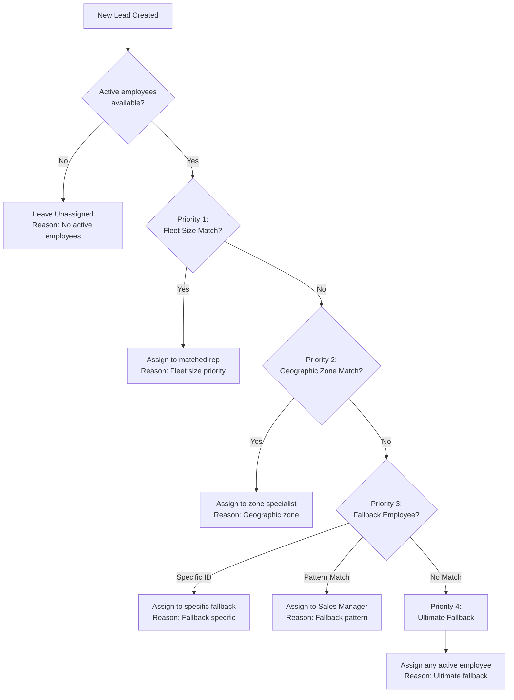

# Lead Assignment Algorithm

> **Module:** CRM / Lead Management
> **Version:** 1.0
> **Last Updated:** December 2025

---

## Overview

When a new lead enters the system, it must be assigned to a sales representative for follow-up. FleetCore's assignment algorithm ensures leads are routed to the most appropriate rep based on fleet size priority, geographic specialization, and fair distribution. The goal is to achieve first contact within 24 hours of lead creation.

---

## Assignment Flow



**Source:** `lib/services/crm/lead-assignment.service.ts:143-273`

---

## Priority 1: Fleet Size Rules

Large fleet leads are valuable and require experienced sales representatives. The algorithm matches fleet size to rep seniority.

### Fleet Size → Rep Mapping

| Fleet Size | Target Rep Title             | Priority |
| ---------- | ---------------------------- | -------- |
| `500+`     | Senior Account Manager       | 1        |
| `101-500`  | Account Manager (not Senior) | 2        |

### How It Works

```typescript
// Configuration in crm_settings.lead_assignment_rules
fleet_size_priority: {
  "500+": {
    title_patterns: ["%Senior%Account%Manager%"],
    priority: 1,
  },
  "101-500": {
    title_patterns: ["%Account%Manager%"],
    exclude_patterns: ["%Senior%"],  // Exclude Senior AMs
    priority: 2,
  },
}
```

When a lead has fleet size `500+`:

1. Filter employees whose title matches `%Senior%Account%Manager%`
2. If matches found → Select one via round-robin
3. If no matches → Fall through to Priority 2

**Source:** `lib/repositories/crm/settings.repository.ts:700-710`

---

## Priority 2: Geographic Zones

Leads are matched to sales reps who specialize in specific regions.

### Zone Configuration

| Zone          | Countries                              | Target Rep Title          |
| ------------- | -------------------------------------- | ------------------------- |
| UAE           | AE                                     | `%UAE%`, `%Emirates%`     |
| KSA           | SA                                     | `%KSA%`, `%Saudi%`        |
| France        | FR                                     | `%France%`                |
| MENA          | KW, BH, OM, QA, JO, LB, EG, MA, TN, DZ | `%MENA%`, `%Middle East%` |
| EU            | DE, IT, ES, BE, NL, +21 countries      | `%EU%`, `%Europe%`        |
| International | (catch-all)                            | `%International%`         |

### How It Works

```typescript
// From lib/services/crm/lead-assignment.service.ts:204-229

for (const [zoneName, zoneRule] of Object.entries(config.geographic_zones)) {
  if (zoneRule.countries.includes(countryUpper)) {
    const eligible = this.filterByTitlePatterns(
      availableEmployees,
      zoneRule.title_patterns
    );

    if (eligible.length > 0) {
      const selected = this.selectRoundRobin(eligible);
      return {
        assigned_to: selected.id,
        assignment_reason: `Geographic zone: ${zoneName} (${lead.country_code})`,
        matched_rule: zoneName,
        eligible_employees: eligible.length,
      };
    }
  }
}
```

**Source:** `lib/repositories/crm/settings.repository.ts:711-780`

---

## Priority 3: Fallback Pattern

If neither fleet size nor geographic rules match, the algorithm falls back to a configurable pattern.

### Fallback Options

**Option A: Specific Employee ID**

```typescript
fallback: {
  employee_id: "uuid-of-specific-employee",  // Named fallback person
  title_pattern: "%Sales%Manager%"
}
```

**Option B: Title Pattern Only**

```typescript
fallback: {
  employee_id: null,
  title_pattern: "%Sales%Manager%"  // Any Sales Manager
}
```

### How It Works

1. If `employee_id` is set → Check if that employee is active
2. If not available → Filter by `title_pattern`
3. Select via round-robin from matches

**Source:** `lib/services/crm/lead-assignment.service.ts:231-262`

---

## Priority 4: Ultimate Fallback

When no rules match and no fallback pattern finds a candidate, the algorithm assigns to any active employee.

```typescript
// From lib/services/crm/lead-assignment.service.ts:264-272

// PRIORITY 4: Ultimate fallback - any active employee
const selected = this.selectRoundRobin(availableEmployees);
return {
  assigned_to: selected.id,
  assignment_reason:
    "Ultimate fallback: No rule matched, selected active employee",
  matched_rule: "ultimate_fallback",
  eligible_employees: availableEmployees.length,
};
```

This ensures every lead gets assigned, even if configuration is incomplete.

---

## Pattern Matching

The assignment algorithm uses SQL LIKE-style patterns converted to JavaScript RegExp.

### Pattern Syntax

| Pattern | Meaning          | Example                             |
| ------- | ---------------- | ----------------------------------- |
| `%`     | Any characters   | `%Manager%` matches "Sales Manager" |
| `_`     | Single character | `A_E` matches "ADE", "ARE", "AUE"   |

### Pattern to RegExp Conversion

```typescript
// From lib/services/crm/lead-assignment.service.ts:356-366

private patternToRegex(pattern: string): RegExp {
  // Escape special regex characters except % and _
  let escaped = pattern.replace(/[.*+?^${}()|[\]\\]/g, "\\$&");

  // Convert SQL LIKE wildcards to RegExp
  escaped = escaped.replace(/%/g, ".*");  // % → .* (any characters)
  escaped = escaped.replace(/_/g, ".");   // _ → . (single character)

  // Case-insensitive matching
  return new RegExp(`^${escaped}$`, "i");
}
```

### Include/Exclude Patterns

Patterns support both inclusion and exclusion:

```typescript
// Filter for Account Managers but NOT Senior Account Managers
{
  title_patterns: ["%Account%Manager%"],      // Must match
  exclude_patterns: ["%Senior%"]               // Must NOT match
}
```

**Source:** `lib/services/crm/lead-assignment.service.ts:304-336`

---

## Round-Robin Selection

When multiple employees match a rule, the algorithm uses deterministic round-robin selection.

### Current Implementation

```typescript
// From lib/services/crm/lead-assignment.service.ts:389-398

private selectRoundRobin(employees: EligibleEmployee[]): EligibleEmployee {
  if (employees.length === 0) {
    throw new Error("Cannot select from empty employee list");
  }

  // Sort by ID for deterministic selection
  const sorted = [...employees].sort((a, b) => a.id.localeCompare(b.id));

  // Select first employee after sorting
  return sorted[0];
}
```

**Limitation:** The current implementation always selects the first employee (by ID) from eligible candidates. True round-robin with rotation tracking is planned but not yet implemented.

### Fair Distribution

Over time, fair distribution is achieved through:

1. UUIDs are randomly generated → different employees "first" in different contexts
2. Lead volume naturally distributes across the team
3. Managers can manually reassign to balance workload

---

## Employee Eligibility

Not all employees can receive lead assignments. The system filters for eligible candidates.

### Eligibility Criteria

```typescript
// From lib/services/crm/lead-creation.service.ts:197-210

const activeEmployees = await prisma.adm_provider_employees.findMany({
  where: {
    status: "active",
    deleted_at: null,
  },
  select: {
    id: true,
    first_name: true,
    last_name: true,
    email: true,
    title: true,
    status: true,
  },
});
```

| Criterion    | Required Value            |
| ------------ | ------------------------- |
| `status`     | `"active"`                |
| `deleted_at` | `null` (not soft-deleted) |

**Note:** There is no explicit role check. Assignment is based on title patterns, which implicitly determine role.

---

## Reassignment

Leads can be reassigned by managers when the initial assignment needs adjustment.

### Who Can Reassign

- Sales Managers (branch scope)
- CRM Administrators (provider scope)
- CEO/Super Admin (global scope)

### Reassignment Process

1. Manager selects lead in UI
2. Chooses new assignee from dropdown
3. System updates `assigned_to` field
4. Audit log records the change
5. New assignee receives notification

**Note:** Reassignment does NOT trigger the assignment algorithm. It's a direct override to the specified employee.

---

## Assignment Result

The assignment service returns a detailed result for transparency and debugging:

```typescript
interface AssignmentResult {
  assigned_to: string | null; // Employee UUID or null
  assignment_reason: string; // Human-readable explanation
  matched_rule?: string; // Rule that matched (e.g., "500+", "UAE")
  eligible_employees?: number; // Count of candidates considered
}
```

### Example Results

**Fleet Size Match:**

```json
{
  "assigned_to": "emp-uuid-123",
  "assignment_reason": "Fleet size priority: 500+ → Senior Account Manager",
  "matched_rule": "500+",
  "eligible_employees": 3
}
```

**Geographic Zone Match:**

```json
{
  "assigned_to": "emp-uuid-456",
  "assignment_reason": "Geographic zone: UAE (AE) → %UAE%, %Emirates%",
  "matched_rule": "UAE",
  "eligible_employees": 2
}
```

**Ultimate Fallback:**

```json
{
  "assigned_to": "emp-uuid-789",
  "assignment_reason": "Ultimate fallback: No rule matched, selected active employee",
  "matched_rule": "ultimate_fallback",
  "eligible_employees": 15
}
```

---

## Configuration

Assignment rules are stored in `crm_settings` table under key `lead_assignment_rules`.

### Configuration Structure

```typescript
interface AssignmentRulesConfig {
  fleet_size_priority: Record<
    string,
    {
      title_patterns: string[];
      exclude_patterns?: string[];
      priority: number;
    }
  >;
  geographic_zones: Record<
    string,
    {
      countries: string[];
      title_patterns: string[];
      priority: number;
    }
  >;
  fallback: {
    employee_id: string | null;
    title_pattern: string;
  };
}
```

### Adding a New Zone

To add a new geographic zone:

1. Access CRM Settings in admin UI
2. Edit `lead_assignment_rules`
3. Add new zone to `geographic_zones`:

```json
{
  "ASIA": {
    "countries": ["SG", "MY", "TH", "ID", "PH"],
    "title_patterns": ["%Asia%", "%APAC%"],
    "priority": 16
  }
}
```

4. Ensure employees exist with matching titles
5. Save changes (takes effect immediately)

---

## Notifications

When a lead is assigned, the assigned sales rep receives a notification.

### Assignment Notification

| Event         | Template               | Recipient          |
| ------------- | ---------------------- | ------------------ |
| Lead assigned | `sales_rep_assignment` | Assigned sales rep |

The notification includes:

- Lead name and company
- Lead contact information
- Qualification score
- Assignment reason

**Source:** `lib/services/crm/lead-creation.service.ts:295-330`

---

_Next: [Lead Qualification](./04_lead_qualification.md)_
