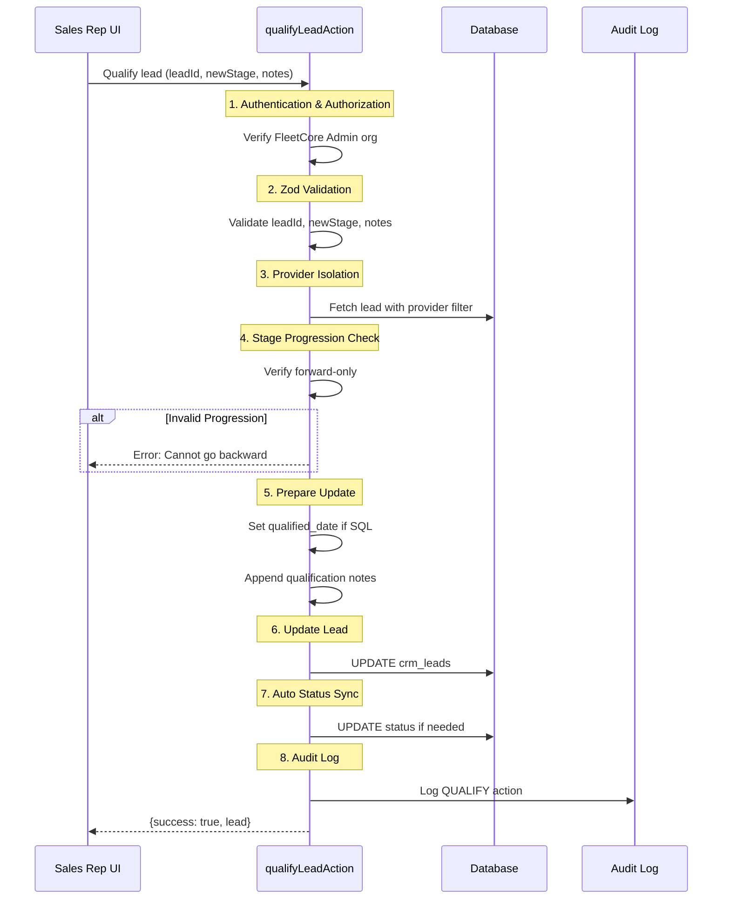

# Lead Qualification

> **Module:** CRM / Lead Management
> **Version:** 1.0
> **Last Updated:** December 2025

---

## Overview

Lead qualification in FleetCore operates through two complementary mechanisms: **automatic qualification** via the scoring algorithm, and **manual qualification** through sales rep intervention. Both mechanisms update the lead's stage, which determines readiness for sales engagement and eventually conversion to opportunity.

---

## Qualification Mechanisms

```mermaid
flowchart TD
    subgraph Automatic["🤖 Automatic Qualification"]
        SCORE[Score Recalculation] --> CHECK{Qualification<br>Score?}
        CHECK -->|≥ 70| SQL_AUTO[Stage → SQL]
        CHECK -->|40-69| MQL_AUTO[Stage → MQL]
        CHECK -->|< 40| TOF_AUTO[Stage → TOF]
    end

    subgraph Manual["👤 Manual Qualification"]
        ACTION[qualifyLeadAction] --> VALIDATE{Forward<br>Progression?}
        VALIDATE -->|Yes| UPDATE[Update Stage]
        VALIDATE -->|No| REJECT[Reject: Cannot<br>go backward]
    end

    SQL_AUTO --> SYNC[Auto Status Sync]
    UPDATE --> SYNC
    SYNC --> AUDIT[Audit Log]
```



| Mechanism     | Trigger             | Can Go Backward          | Status Sync |
| ------------- | ------------------- | ------------------------ | ----------- |
| **Automatic** | Score recalculation | Yes (score can decrease) | Yes         |
| **Manual**    | Sales rep action    | No (forward only)        | Yes         |

---

## Automatic Qualification

Automatic qualification occurs whenever lead scores are recalculated. The system compares the qualification score against configurable thresholds.

### Trigger Events

| Event             | When                      | Service                                      |
| ----------------- | ------------------------- | -------------------------------------------- |
| Lead creation     | On INSERT                 | `LeadCreationService.createLead()`           |
| Activity logged   | New engagement            | `LeadScoringService.recalculateScores()`     |
| Manual request    | User clicks recalculate   | `LeadScoringService.recalculateScores()`     |
| Score degradation | CRON job (inactive leads) | `LeadScoringService.degradeInactiveScores()` |

### Stage Determination

```typescript
// From lib/services/crm/lead-scoring.service.ts

const thresholds = config.stage_thresholds;

if (qualificationScore >= thresholds.sales_qualified) {
  return "sales_qualified"; // ≥ 70
} else if (qualificationScore >= thresholds.marketing_qualified) {
  return "marketing_qualified"; // 40-69
} else {
  return "top_of_funnel"; // < 40
}
```

**Important:** Automatic qualification CAN move leads backward if their score decreases (e.g., due to score degradation for inactive leads). This differs from manual qualification which only allows forward progression.

**Source:** `lib/services/crm/lead-scoring.service.ts:9-11`

---

## Manual Qualification

Sales representatives can manually qualify leads through the `qualifyLeadAction` server action. This is useful when the rep has additional context that the scoring algorithm cannot capture.

### Qualification Flow



**Source:** `lib/actions/crm/qualify.actions.ts:59-228`

### Forward-Only Progression

Manual qualification enforces strict forward-only progression. Once a lead advances, it cannot be moved backward manually.

```typescript
// From lib/actions/crm/qualify.actions.ts:28-33

const STAGE_ORDER = [
  "top_of_funnel",
  "marketing_qualified",
  "sales_qualified",
  "opportunity",
] as const;

// Validation (lines 116-124)
const currentIndex = STAGE_ORDER.indexOf(currentStage);
const newIndex = STAGE_ORDER.indexOf(newStage);

if (newIndex <= currentIndex) {
  return {
    success: false,
    error: "Cannot move to previous or same stage",
  };
}
```

### Valid Manual Transitions

| From                  | To                    | Allowed       |
| --------------------- | --------------------- | ------------- |
| `top_of_funnel`       | `marketing_qualified` | ✅ Yes        |
| `top_of_funnel`       | `sales_qualified`     | ✅ Yes (skip) |
| `marketing_qualified` | `sales_qualified`     | ✅ Yes        |
| `sales_qualified`     | `marketing_qualified` | ❌ No         |
| `sales_qualified`     | `top_of_funnel`       | ❌ No         |
| `marketing_qualified` | `top_of_funnel`       | ❌ No         |

**Note:** Stage skipping (TOF → SQL) is allowed. The system only prevents backward movement.

---

## Status Auto-Sync

When stage changes, the system automatically synchronizes the lead status to maintain consistency.

### Auto-Sync Rules

```typescript
// From lib/actions/crm/qualify.actions.ts:132-139

// When MQL is reached and status is still "new"
if (newStage === "marketing_qualified" && currentLead.status === "new") {
  updateData.status = "working";
}

// When SQL is reached (regardless of current status)
if (newStage === "sales_qualified") {
  updateData.status = "qualified";
}
```

| New Stage             | Current Status | New Status    |
| --------------------- | -------------- | ------------- |
| `marketing_qualified` | `new`          | `working`     |
| `marketing_qualified` | `working`      | _(unchanged)_ |
| `sales_qualified`     | Any            | `qualified`   |

### Qualified Date

When a lead reaches `sales_qualified` for the first time, the `qualified_date` timestamp is set:

```typescript
// From lib/actions/crm/qualify.actions.ts:142-144

if (newStage === "sales_qualified" && !currentLead.qualified_date) {
  updateData.qualified_date = new Date();
}
```

This date is used for:

- SLA tracking (time from creation to qualification)
- Sales cycle analytics
- Conversion rate reporting

---

## Qualification Notes

Sales reps can add notes when qualifying leads. These notes are appended to a running log with timestamps.

### Note Format

```typescript
// From lib/actions/crm/qualify.actions.ts:147-154

if (notes) {
  const existingNotes = currentLead.qualification_notes || "";
  const timestamp = new Date().toISOString().split("T")[0]; // YYYY-MM-DD
  const newNote = `[${timestamp}] Stage → ${newStage}: ${notes}`;
  updateData.qualification_notes = existingNotes
    ? `${existingNotes}\n${newNote}`
    : newNote;
}
```

### Example Note Log

```
[2025-01-15] Stage → marketing_qualified: Initial call completed, CEO interested
[2025-01-22] Stage → sales_qualified: Budget confirmed, ready for proposal
```

### Best Practices

| Guideline                    | Example                                      |
| ---------------------------- | -------------------------------------------- |
| Document key decision points | "Budget confirmed at €50K/year"              |
| Note stakeholder information | "Decision maker: CFO Ahmed"                  |
| Record objections overcome   | "Addressed security concerns with SOC2 docs" |
| Capture timeline insights    | "Implementation needed Q2 2025"              |

---

## Validation Schema

The qualification action uses Zod for input validation:

```typescript
// From lib/actions/crm/qualify.actions.ts:38-42

const QualifySchema = z.object({
  leadId: z.string().uuid("Invalid lead ID"),
  newStage: z.enum(["marketing_qualified", "sales_qualified"]),
  notes: z.string().max(1000).optional(),
});
```

| Field      | Type   | Constraints                                | Required |
| ---------- | ------ | ------------------------------------------ | -------- |
| `leadId`   | UUID   | Valid UUID format                          | Yes      |
| `newStage` | Enum   | `marketing_qualified` or `sales_qualified` | Yes      |
| `notes`    | String | Max 1000 characters                        | No       |

**Note:** The `opportunity` stage is not a valid target for manual qualification. Leads reach `opportunity` stage only through the conversion action.

---

## Audit Trail

All qualification actions are logged to `adm_audit_logs` for compliance and debugging.

### Audit Entry Structure

```typescript
// From lib/actions/crm/qualify.actions.ts:177-189

await db.adm_audit_logs.create({
  data: {
    tenant_id: tenantUuid,
    member_id: memberUuid,
    entity: "crm_lead",
    entity_id: leadId,
    action: "QUALIFY",
    old_values: { lead_stage: currentStage },
    new_values: { lead_stage: newStage, notes },
    severity: "info",
    category: "operational",
  },
});
```

### Audit Fields

| Field        | Value             | Purpose                                 |
| ------------ | ----------------- | --------------------------------------- |
| `entity`     | `"crm_lead"`      | Identifies the entity type              |
| `action`     | `"QUALIFY"`       | Distinguishes from CREATE, UPDATE, etc. |
| `old_values` | Previous stage    | Enables change tracking                 |
| `new_values` | New stage + notes | Documents the change                    |
| `severity`   | `"info"`          | Standard operational event              |

---

## Authorization

Qualification actions require FleetCore Admin organization membership:

```typescript
// From lib/actions/crm/qualify.actions.ts:83-93

const ADMIN_ORG_ID = process.env.FLEETCORE_ADMIN_ORG_ID;

if (!ADMIN_ORG_ID || orgId !== ADMIN_ORG_ID) {
  return {
    success: false,
    error: `Forbidden: Admin access required`,
  };
}
```

### Who Can Qualify Leads

| Role              | Can Qualify | Notes                           |
| ----------------- | ----------- | ------------------------------- |
| Sales Rep         | ✅          | Standard qualification workflow |
| Sales Manager     | ✅          | Oversight and reassignment      |
| CRM Administrator | ✅          | Full access                     |
| External Users    | ❌          | No CRM access                   |

---

## Notifications

When a lead reaches `sales_qualified` stage, the assigned sales rep receives a notification.

### SQL Achievement Notification

| Event                     | Template             | Recipient          |
| ------------------------- | -------------------- | ------------------ |
| Stage → `sales_qualified` | `lead_stage_upgrade` | Assigned sales rep |

The notification includes:

- Lead name and company
- Qualification score
- Assigned rep information
- Link to lead detail page

**Note:** The notification is queued via `NotificationService` after successful qualification.

---

## Error Handling

### Common Errors

| Error                                   | Cause                                | Resolution                    |
| --------------------------------------- | ------------------------------------ | ----------------------------- |
| "Unauthorized"                          | No authenticated user                | Ensure user is logged in      |
| "Forbidden: Admin access required"      | User not in FleetCore Admin org      | Contact administrator         |
| "Invalid lead ID"                       | Malformed UUID                       | Check lead ID format          |
| "Lead not found"                        | Lead doesn't exist or wrong provider | Verify lead exists            |
| "Cannot move to previous or same stage" | Invalid progression                  | Only forward movement allowed |

### Error Logging

Errors are logged with full context for debugging:

```typescript
// From lib/actions/crm/qualify.actions.ts:214-226

logger.error({ error, leadId, prismaError }, "[qualifyLeadAction] Error");
```

---

## Related Documentation

- [Lead Lifecycle](./01_lead_lifecycle.md) - Status vs stage distinction
- [Lead Scoring](./02_lead_scoring.md) - Automatic qualification algorithm
- [Lead Conversion](./05_lead_conversion.md) - Converting SQL to opportunity

---

_Next: [Lead Conversion](./05_lead_conversion.md)_
