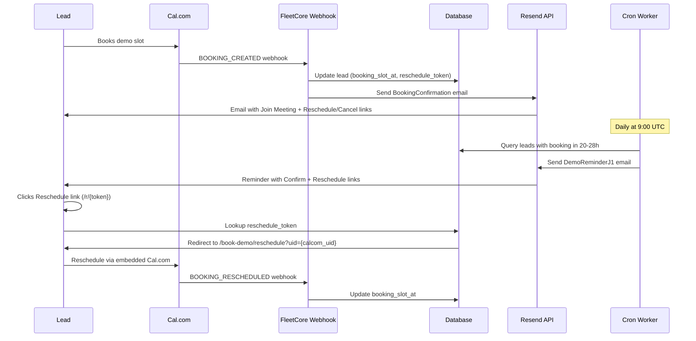

# Lead Notifications

> **Module:** CRM / Lead Management
> **Version:** 1.0
> **Last Updated:** January 2026

---

## Overview

FleetCore sends automated email notifications to leads throughout the demo booking lifecycle. These emails replace Cal.com's default notifications with FleetCore-branded versions that keep users on the FleetCore domain for reschedule/cancel actions.

---

## Notification Workflow



---

## Email Templates

### 1. BookingConfirmation

**Trigger:** Cal.com `BOOKING_CREATED` webhook

**Template:** `emails/templates/BookingConfirmation.tsx`

**Content:**

- FleetCore logo
- Success badge "Demo Confirmed"
- Booking details (date, time, duration, location)
- "Join Meeting" button (Google Meet link)
- "What to expect" section
- Reschedule/Cancel buttons (FleetCore URLs)

**Props:**
| Prop | Type | Description |
|------|------|-------------|
| `locale` | `EmailLocale` | en, fr, ar |
| `firstName` | `string` | Lead's first name |
| `bookingDate` | `string` | Formatted date (e.g., "Thursday, January 22, 2026") |
| `bookingTime` | `string` | Formatted time (e.g., "9:00 AM") |
| `timezone` | `string` | Timezone (e.g., "GMT+4") |
| `meetingUrl` | `string` | Google Meet link from Cal.com |
| `rescheduleUrl` | `string` | FleetCore short URL `/r/{token}` |
| `cancelUrl` | `string` | Same as rescheduleUrl |

**Source:** `app/api/crm/webhooks/calcom/route.ts:180-250`

---

### 2. DemoReminderJ1 (Anti-No-Show)

**Trigger:** Cron job daily at 9:00 UTC

**Template:** `emails/templates/DemoReminderJ1.tsx`

**Content:**

- FleetCore logo
- Reminder headline "Your demo is tomorrow"
- Booking details recap
- "Confirm Attendance" button
- Reschedule link

**Cron Endpoint:** `GET /api/cron/demo-reminders/j1`

**Window:** Leads with `booking_slot_at` between NOW+20h and NOW+28h

**Source:** `app/api/cron/demo-reminders/j1/route.ts`

---

### 3. RescheduleLink (On-Demand)

**Trigger:** Manual send from CRM admin

**Template:** Inline HTML (not React Email)

**Content:**

- FleetCore logo
- Message explaining modification request
- "Modify My Booking" button

**Endpoint:** `POST /api/crm/leads/send-reschedule-link`

**Source:** `app/api/crm/leads/send-reschedule-link/route.ts`

---

## Reschedule Token System

### Token Generation

```typescript
// lib/utils/token.ts
const ALPHABET =
  "abcdefghijklmnopqrstuvwxyzABCDEFGHIJKLMNOPQRSTUVWXYZ0123456789";

function generateShortToken(length = 6): string {
  let token = "";
  for (let i = 0; i < length; i++) {
    token += ALPHABET[Math.floor(Math.random() * ALPHABET.length)];
  }
  return token;
}
```

**Example:** `Xk9mP2`

### Token Storage

Stored in `crm_leads.reschedule_token` (VARCHAR 10)

### Short URL Flow

```
Email link: https://fleetcore.io/en/r/Xk9mP2
    ↓
Route: /[locale]/r/[token]/route.ts
    ↓
Lookup: SELECT booking_calcom_uid FROM crm_leads WHERE reschedule_token = 'Xk9mP2'
    ↓
Redirect: /en/book-demo/reschedule?uid={booking_calcom_uid}
    ↓
Page: Cal.com embed for reschedule/cancel
```

**Source:** `app/[locale]/(public)/r/[token]/route.ts`

**Why short URLs?** iOS Mail truncates long URLs. Short 6-char tokens ensure links work on all devices.

---

## Cal.com Webhook Configuration

### Endpoint

```
https://app.fleetcore.io/api/crm/webhooks/calcom
```

### Event Triggers

- `BOOKING_CREATED` → Update lead, send BookingConfirmation
- `BOOKING_RESCHEDULED` → Update booking_slot_at
- `BOOKING_CANCELLED` → Clear booking fields, reset status to "new"
- `BOOKING_REJECTED` → Same as cancelled

### Custom Payload Template

```json
{
  "triggerEvent": "{{triggerEvent}}",
  "uid": "{{uid}}",
  "startTime": "{{startTime}}",
  "endTime": "{{endTime}}",
  "attendees.0.email": "{{attendees.0.email}}",
  "attendees.0.name": "{{attendees.0.name}}",
  "metadata.videoCallUrl": "{{metadata.videoCallUrl}}"
}
```

### Security

- HMAC-SHA256 signature verification
- Header: `x-cal-signature-256`
- Secret: `CALCOM_WEBHOOK_SECRET` env var

**Source:** `lib/validators/calcom.validators.ts`

---

## Database Fields

### crm_leads

| Field                 | Type           | Description                     |
| --------------------- | -------------- | ------------------------------- |
| `booking_slot_at`     | `TIMESTAMPTZ`  | Scheduled demo datetime         |
| `booking_calcom_uid`  | `VARCHAR(100)` | Cal.com booking UID             |
| `reschedule_token`    | `VARCHAR(10)`  | Short token for /r/{token} URLs |
| `j1_reminder_sent_at` | `TIMESTAMPTZ`  | When J-1 reminder was sent      |
| `confirmation_token`  | `UUID`         | Token for confirm attendance    |

---

## Locale Detection

Email locale is determined by lead's country:

```typescript
const COUNTRY_LOCALE_MAP: Record<string, EmailLocale> = {
  FR: "fr",
  AE: "en", // UAE uses English for business
  SA: "ar",
  MA: "fr", // Morocco
  TN: "fr", // Tunisia
  DZ: "fr", // Algeria
  EG: "ar",
  // ... etc
};
```

**Default:** `en` if country not mapped

---

## Known Limitations

### Cal.com Free Plan

Cal.com's free plan does NOT allow disabling default confirmation emails. This means leads receive **two emails**:

1. Cal.com's default confirmation (with Cal.com branding)
2. FleetCore's BookingConfirmation (with FleetCore branding)

**Solutions:**

- Upgrade to Cal.com Teams ($15/month) - enables "Disable default emails" toggle
- Self-host Cal.com (open source) - full control over email settings

### Reschedule/Cancel Emails

Cal.com does NOT have a toggle to disable reschedule/cancel notification emails, even on paid plans. This is a known feature request (GitHub issue #13947).

---

## Environment Variables

| Variable                | Description                                     |
| ----------------------- | ----------------------------------------------- |
| `RESEND_API_KEY`        | Resend API key for sending emails               |
| `CALCOM_WEBHOOK_SECRET` | Secret for verifying Cal.com webhooks           |
| `CRON_SECRET`           | Secret for authenticating cron job calls        |
| `NEXT_PUBLIC_APP_URL`   | Base URL for email links (https://fleetcore.io) |

---

## File References

| File                                                  | Purpose                             |
| ----------------------------------------------------- | ----------------------------------- |
| `emails/templates/BookingConfirmation.tsx`            | Booking confirmation email template |
| `emails/templates/DemoReminderJ1.tsx`                 | J-1 reminder email template         |
| `lib/i18n/email-translations.ts`                      | Email translations (EN/FR/AR)       |
| `lib/utils/token.ts`                                  | Short token generation              |
| `app/api/crm/webhooks/calcom/route.ts`                | Cal.com webhook handler             |
| `app/api/cron/demo-reminders/j1/route.ts`             | J-1 reminder cron worker            |
| `app/api/crm/leads/send-reschedule-link/route.ts`     | Manual reschedule link sender       |
| `app/[locale]/(public)/r/[token]/route.ts`            | Short URL redirect                  |
| `app/[locale]/(public)/book-demo/reschedule/page.tsx` | Reschedule page                     |

---

_Previous: [Lead Conversion](./05_lead_conversion.md)_
