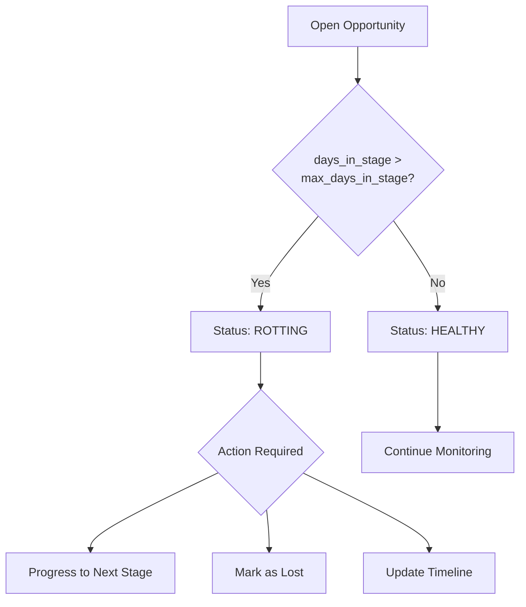
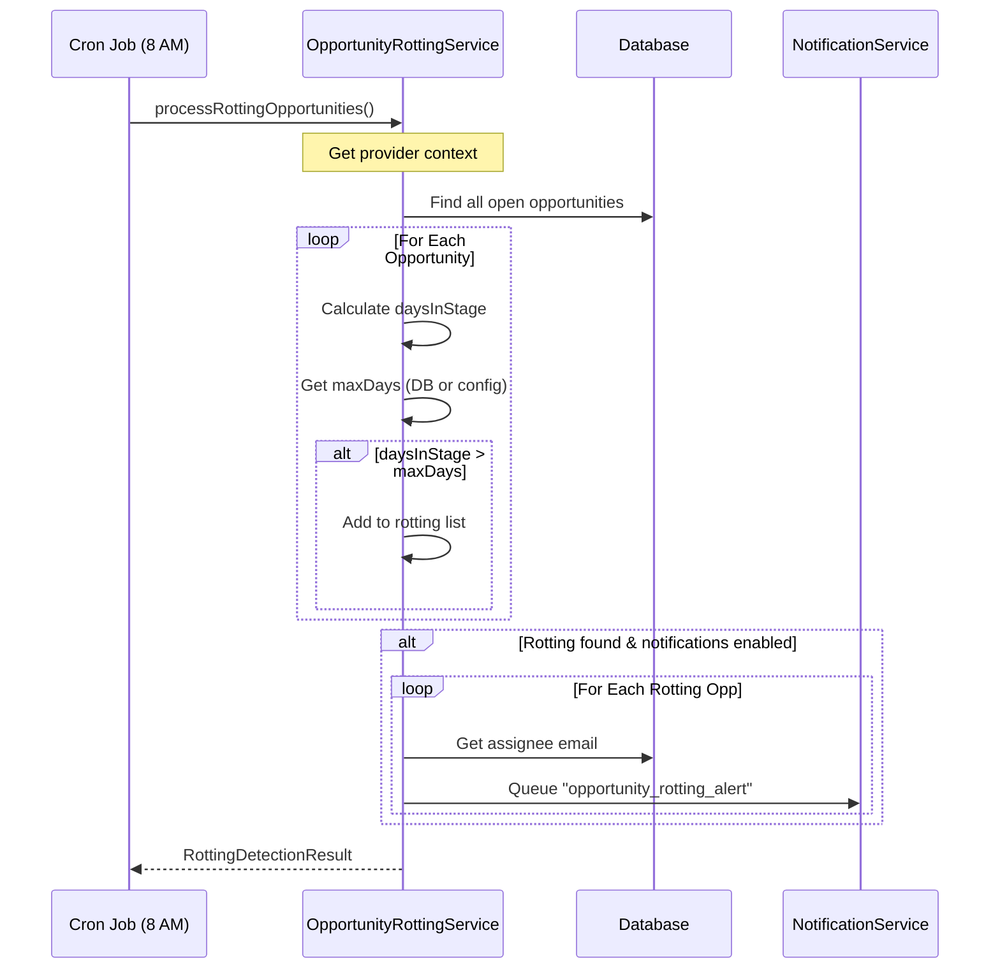

# Deal Rotting Detection

> **Module:** CRM / Opportunity Management
> **Version:** 1.0
> **Last Updated:** December 2025

---

## Overview

Deal rotting occurs when an opportunity stalls in a pipeline stage longer than the configured threshold. Stalled deals represent potential revenue loss and often indicate deals that require management attention or should be closed as lost. FleetCore's rotting detection system automatically identifies these opportunities and can notify the assigned owner to take action.

---

## The Rotting Concept



### Why Track Rotting?

| Problem                    | Impact                      |
| -------------------------- | --------------------------- |
| **Forgotten deals**        | Revenue slips away silently |
| **Stale pipeline**         | Forecasts become unreliable |
| **Lost momentum**          | Prospect interest cools     |
| **Resource misallocation** | Reps chase dead deals       |

By flagging rotting deals daily, sales managers can intervene early and either revive the deal or close it cleanly.

---

## Detection Algorithm

The rotting detection algorithm is straightforward: compare how long the opportunity has been in its current stage against the maximum allowed days.

### Formula

```typescript
// From lib/services/crm/opportunity-rotting.service.ts:104-109

const daysInStage = Math.floor(
  (now.getTime() - opp.stage_entered_at.getTime()) / (1000 * 60 * 60 * 24)
);

const isRotting = daysInStage > maxDays;
```

### Detection Logic



**Source:** `lib/services/crm/opportunity-rotting.service.ts:73-127`

### Max Days Per Stage

| Stage           | Default Max Days | Rationale                       |
| --------------- | ---------------- | ------------------------------- |
| `qualification` | 14               | Time to schedule discovery call |
| `demo`          | 10               | Demo should be prompt           |
| `proposal`      | 14               | Time to prepare proposal        |
| `negotiation`   | 10               | Active negotiation period       |
| `contract_sent` | 7                | Awaiting signature              |

**Source:** `lib/config/opportunity-stages.ts:41-87`

---

## Cron Job

Rotting detection runs as a scheduled cron job on Vercel.

### Configuration

| Setting          | Value                                 |
| ---------------- | ------------------------------------- |
| **Endpoint**     | `GET /api/cron/opportunities/rotting` |
| **Schedule**     | Daily at 8:00 AM UTC (`0 8 * * *`)    |
| **Security**     | Protected by `CRON_SECRET` header     |
| **Max Duration** | 60 seconds                            |

**Source:** `app/api/cron/opportunities/rotting/route.ts:1-102`

### Vercel Configuration

```json
// vercel.json
{
  "crons": [
    {
      "path": "/api/cron/opportunities/rotting",
      "schedule": "0 8 * * *"
    }
  ]
}
```

### Cron Response

```typescript
interface RottingDetectionResult {
  checked: number; // Total open opportunities examined
  rotting: number; // Count of rotting opportunities
  rottingIds: string[]; // UUIDs of rotting opportunities
  alertsCreated: number; // Notifications queued
  errors: string[]; // Any errors encountered
  durationMs: number; // Processing time
}
```

**Example Response:**

```json
{
  "success": true,
  "checked": 45,
  "rotting": 3,
  "rottingIds": ["uuid-1", "uuid-2", "uuid-3"],
  "alertsCreated": 3,
  "errors": [],
  "durationMs": 1234
}
```

---

## Notifications

When rotting opportunities are detected, the system can automatically notify the assigned owner.

### Notification Template

| Template Code               | Recipient          | Channel |
| --------------------------- | ------------------ | ------- |
| `opportunity_rotting_alert` | Assigned sales rep | Email   |

### Notification Variables

```typescript
// From lib/services/crm/opportunity-rotting.service.ts:198-208

const variables = {
  first_name: assignee.first_name || "Team member",
  opportunity_id: opp.id,
  opportunity_name: opp.opportunityName || "Unnamed opportunity",
  stage: opp.stage,
  days_in_stage: opp.daysInStage,
  days_overdue: opp.daysOverdue,
  expected_value: opp.expectedValue,
  max_days: opp.maxDays,
};
```

### Idempotency

To prevent duplicate notifications, each alert uses an idempotency key:

```typescript
idempotencyKey: `rotting_${opp.id}_${new Date().toISOString().split("T")[0]}`;
// Example: "rotting_abc123_2025-01-15"
```

This ensures each opportunity receives at most one rotting alert per day.

**Source:** `lib/services/crm/opportunity-rotting.service.ts:209`

---

## Configuration

### Notification Toggle

Rotting notifications can be enabled or disabled via `crm_settings`:

```typescript
// From lib/services/crm/opportunity-rotting.service.ts:324-361

// Setting: crm_settings.opportunity_stages.rotting
{
  "rotting": {
    "enabled": true,       // Master switch
    "alert_owner": true    // Notify assigned rep
  }
}
```

| Setting               | Default | Effect                           |
| --------------------- | ------- | -------------------------------- |
| `rotting.enabled`     | `true`  | Enable/disable rotting detection |
| `rotting.alert_owner` | `true`  | Enable/disable notifications     |

### Per-Opportunity Override

Each opportunity can have a custom `max_days_in_stage` value that overrides the stage default:

```sql
-- Prisma schema: crm_opportunities
max_days_in_stage  Int?  @default(14)
```

The detection algorithm checks:

1. Opportunity's `max_days_in_stage` field first
2. Falls back to stage config if null
3. Falls back to 14 days as ultimate default

**Source:** `lib/services/crm/opportunity-rotting.service.ts:99-101`

---

## Summary Statistics

The service provides a summary endpoint for dashboard display:

```typescript
// From lib/services/crm/opportunity-rotting.service.ts:263-314

interface RottingSummary {
  total: number; // Total open opportunities
  rotting: number; // Count of rotting
  byStage: Record<
    string,
    {
      total: number; // Opportunities in stage
      rotting: number; // Rotting in stage
    }
  >;
}
```

### Example Summary

```json
{
  "total": 45,
  "rotting": 3,
  "byStage": {
    "qualification": { "total": 12, "rotting": 1 },
    "demo": { "total": 10, "rotting": 0 },
    "proposal": { "total": 15, "rotting": 2 },
    "negotiation": { "total": 5, "rotting": 0 },
    "contract_sent": { "total": 3, "rotting": 0 }
  }
}
```

---

## Provider Isolation

Rotting detection respects multi-division data isolation:

| Context                 | Scope                             |
| ----------------------- | --------------------------------- |
| Regular employee        | Own division's opportunities only |
| CEO (providerId = null) | All opportunities                 |

**Source:** `lib/services/crm/opportunity-rotting.service.ts:74, 138`

---

## Healing Rotting Deals

When a deal is flagged as rotting, the sales rep has several options:

| Action              | Effect                                          |
| ------------------- | ----------------------------------------------- |
| **Progress stage**  | Resets `stage_entered_at`, deal becomes healthy |
| **Mark as lost**    | Closes deal, removes from rotting count         |
| **Update timeline** | Extend `max_days_in_stage` for this opportunity |
| **Take no action**  | Deal continues to appear in rotting alerts      |

---

## Related Documentation

- [Opportunity Pipeline](./01_opportunity_pipeline.md) - Stage configuration
- [Opportunity Closure](./03_opportunity_closure.md) - Closing stalled deals
- [CRM Settings](../04_CONFIGURATION/01_crm_settings.md) - Configuring rotting thresholds

---

_Next: [Opportunity Closure](./03_opportunity_closure.md)_
