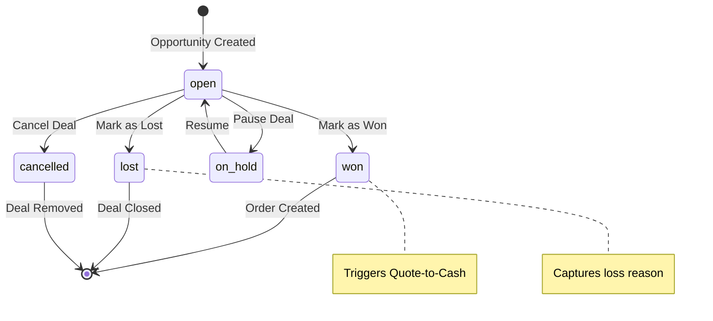
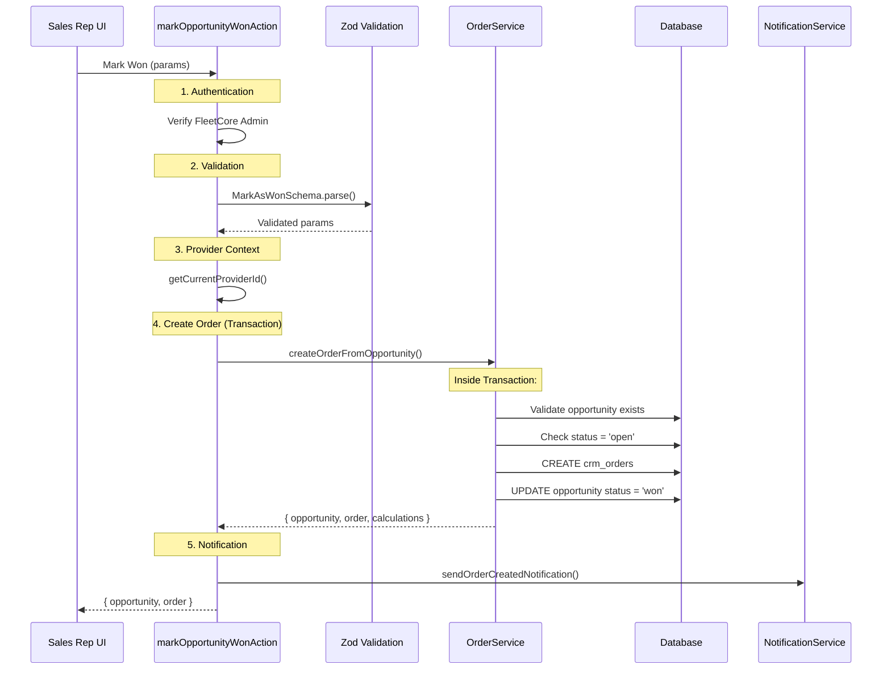
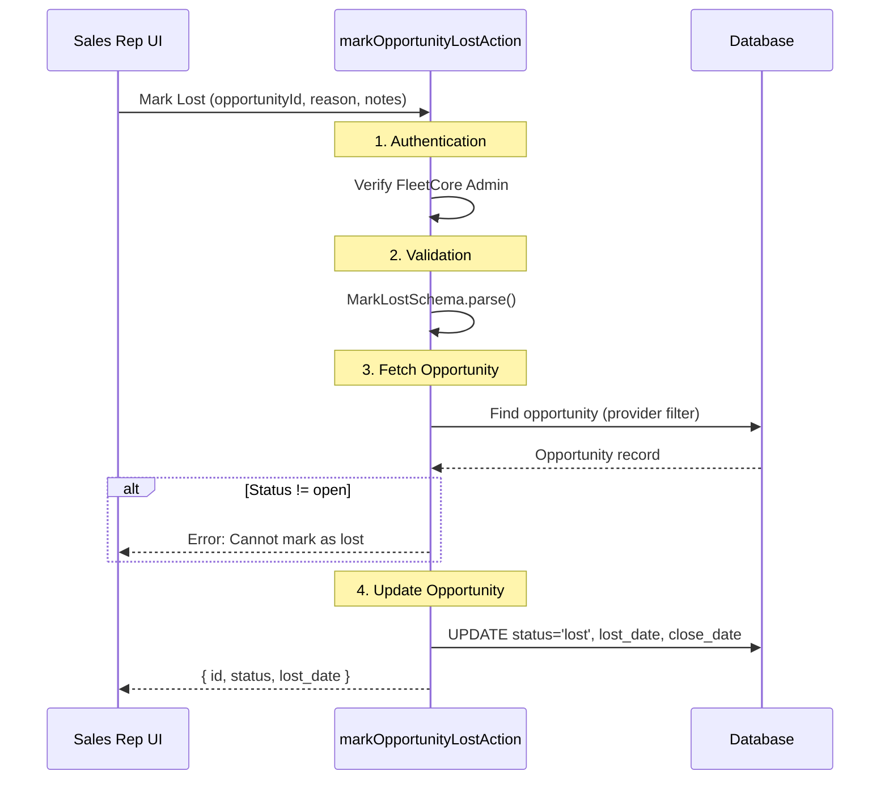

# Opportunity Closure

> **Module:** CRM / Opportunity Management
> **Version:** 1.0
> **Last Updated:** December 2025

---

## Overview

Opportunity closure marks the end of the sales pipeline journey. An opportunity closes in one of two primary outcomes: **won** (contract signed, order created) or **lost** (deal rejected or abandoned). The closure workflow differs significantly between these outcomes, with won deals triggering the Quote-to-Cash flow while lost deals capture learnings for future improvement.

---

## Terminal States



### Status Values

| Status      | Terminal? | Description                    |
| ----------- | --------- | ------------------------------ |
| `open`      | No        | Active deal in pipeline        |
| `won`       | Yes       | Contract signed, order created |
| `lost`      | Yes       | Deal rejected or abandoned     |
| `on_hold`   | No        | Temporarily paused             |
| `cancelled` | Yes       | Deal cancelled (not lost)      |

**Source:** `prisma/schema.prisma:5271-5277` (opportunity_status enum)

---

## Mark as Won Workflow

Marking an opportunity as won triggers the Quote-to-Cash flow, creating an order and linking it to the opportunity.

### Workflow Diagram



**Source:** `lib/actions/crm/opportunity.actions.ts:503-637`

### Required Fields

```typescript
// From lib/actions/crm/opportunity.actions.ts:72-96

const MarkAsWonSchema = z.object({
  opportunityId: z.string().uuid("Invalid opportunity ID"),
  totalValue: z.number().min(100, "Total value must be at least 100"),
  currency: z.string().length(3).default("EUR"),
  billingCycle: z.enum(BILLING_CYCLES),
  effectiveDate: z.coerce.date(),
  durationMonths: z.number().int().min(1).max(120),
  autoRenew: z.boolean().default(false),
  noticePeriodDays: z.number().int().min(0).max(365).default(30),
  notes: z.string().max(2000).optional(),
});
```

| Field              | Type    | Required | Validation                 |
| ------------------ | ------- | -------- | -------------------------- |
| `opportunityId`    | UUID    | Yes      | Valid UUID                 |
| `totalValue`       | Number  | Yes      | Min 100                    |
| `currency`         | String  | No       | 3-letter ISO (default EUR) |
| `billingCycle`     | Enum    | Yes      | monthly, quarterly, annual |
| `effectiveDate`    | Date    | Yes      | Contract start date        |
| `durationMonths`   | Number  | Yes      | 1-120 months               |
| `autoRenew`        | Boolean | No       | Default false              |
| `noticePeriodDays` | Number  | No       | 0-365, default 30          |
| `notes`            | String  | No       | Max 2000 chars             |

### Stage Requirements

There is **no minimum stage requirement** to mark as won. An opportunity can be marked as won from any pipeline stage. In practice, most deals close from `contract_sent`, but the system allows flexibility for deals that close quickly.

### What Happens on Won

| Action        | Field/Table               | Value                                 |
| ------------- | ------------------------- | ------------------------------------- |
| Create order  | `crm_orders`              | New record with contract details      |
| Update status | `opportunity.status`      | `"won"`                               |
| Set won date  | `opportunity.won_date`    | Current timestamp                     |
| Set won value | `opportunity.won_value`   | `totalValue` from input               |
| Link order    | `opportunity.contract_id` | New order UUID                        |
| Notification  | Email                     | `order_created_notification` template |

**Source:** `lib/actions/crm/opportunity.actions.ts:546-609`

---

## Mark as Lost Workflow

Marking an opportunity as lost closes the deal and captures the reason for loss.

### Workflow Diagram



**Source:** `lib/actions/crm/opportunity.actions.ts:653-756`

### Input Schema

```typescript
// From lib/actions/crm/opportunity.actions.ts:100-104

const MarkLostSchema = z.object({
  opportunityId: z.string().uuid("Invalid opportunity ID"),
  loss_reason: z.string().max(50).optional(),
  loss_notes: z.string().max(1000).optional(),
});
```

| Field           | Type   | Required | Description                     |
| --------------- | ------ | -------- | ------------------------------- |
| `opportunityId` | UUID   | Yes      | Opportunity to close            |
| `loss_reason`   | String | No       | Reason key (max 50 chars)       |
| `loss_notes`    | String | No       | Detailed notes (max 1000 chars) |

### What Happens on Lost

| Action         | Field                 | Value             |
| -------------- | --------------------- | ----------------- |
| Update status  | `status`              | `"lost"`          |
| Set lost date  | `lost_date`           | Current timestamp |
| Set close date | `close_date`          | Current timestamp |
| Store reason   | `loss_reason`         | Input string      |
| Store notes    | `metadata.loss_notes` | Input notes       |

**Note:** The `stage` field is **not changed** when marking as lost. This preserves the pipeline position where the deal was lost for analytics.

**Source:** `lib/actions/crm/opportunity.actions.ts:701-731`

---

## Loss Reasons

Loss reasons are stored as free-text strings in the `loss_reason` field. There is no separate `crm_opportunity_loss_reasons` table.

### Common Loss Reasons

| Reason Key          | Description                       |
| ------------------- | --------------------------------- |
| `price_too_high`    | Budget constraints                |
| `competitor_chosen` | Selected another vendor           |
| `no_budget`         | Project cancelled due to funding  |
| `timing_not_right`  | Delayed to future period          |
| `no_decision`       | Prospect went silent              |
| `technical_fit`     | Product did not meet requirements |

### Configuration

Loss reasons are configured in `crm_settings` under key `opportunity_loss_reasons`:

```json
{
  "opportunity_loss_reasons": [
    { "key": "price_too_high", "label_en": "Price Too High" },
    { "key": "competitor_chosen", "label_en": "Competitor Chosen" },
    { "key": "no_budget", "label_en": "No Budget" }
  ]
}
```

---

## Irreversibility

### Can You Reopen a Closed Opportunity?

Status changes to `won` or `lost` are **designed to be final**. The system enforces this:

```typescript
// From lib/actions/crm/opportunity.actions.ts:229-235

if (current.status !== "open") {
  return {
    success: false,
    error: `Cannot change stage: opportunity is ${current.status}`,
  };
}
```

### Reversal Options

| Scenario     | Possible? | Method        |
| ------------ | --------- | ------------- |
| Won to Open  | No        | Not supported |
| Lost to Open | No        | Not supported |
| Lost to Won  | No        | Not supported |
| Won to Lost  | No        | Not supported |

**If a mistake is made**, the recommended approach is:

1. Create a new opportunity from the original lead
2. Add a note explaining the correction
3. Keep the incorrectly closed opportunity for audit trail

---

## Post-Closure Notifications

### On Won

| Notification  | Recipient     | Template                     |
| ------------- | ------------- | ---------------------------- |
| Order created | Sales Manager | `order_created_notification` |

```typescript
// From lib/actions/crm/opportunity.actions.ts:577-586

sendOrderCreatedNotification(result.order.id).catch((err) => {
  logger.error(
    { err, orderId: result.order.id },
    "Failed to send notification"
  );
});
```

### On Lost

| Notification    | Recipient     | Status          |
| --------------- | ------------- | --------------- |
| Deal lost alert | Sales Manager | Not Implemented |

**Note:** Lost notifications are not currently implemented.

---

## What Happens to the Lead?

When an opportunity closes, the associated lead remains unchanged:

- `lead_stage` = `"opportunity"` (terminal)
- `status` = `"qualified"`
- `converted_date` = set
- `opportunity_id` = linked

**The lead does not return to nurturing** when an opportunity is lost. The `markOpportunityLostAction` does not modify the lead record at all.

**Note on Nurturing:** While `crm_settings` seed data includes a `nurturing` status in the planned lead workflow configuration, the actual `lead_status` enum in the database schema only contains: `new`, `qualified`, `converted`, `lost`, `working`. The nurturing workflow is **planned but not yet implemented** at the schema level.

If a prospect becomes active again after a lost opportunity, a new lead should be created rather than reactivating the old one.

**Source:** `prisma/schema.prisma:5154-5160` (lead_status enum)

---

## Closure Metrics

| Metric                   | Calculation                     |
| ------------------------ | ------------------------------- |
| **Win Rate**             | Won / (Won + Lost) x 100        |
| **Average Deal Size**    | Sum(won_value) / Count(won)     |
| **Loss Reason Analysis** | Count by loss_reason            |
| **Time to Close**        | won_date - created_at           |
| **Stage at Loss**        | Distribution of stage when lost |

---

## Related Documentation

- [Opportunity Pipeline](./01_opportunity_pipeline.md) - Pipeline stages
- [Deal Rotting](./02_deal_rotting.md) - Detecting stalled deals
- [Lead Conversion](../02_LEAD_MANAGEMENT/05_lead_conversion.md) - How opportunities are created

---

_End of Opportunity Management section_
