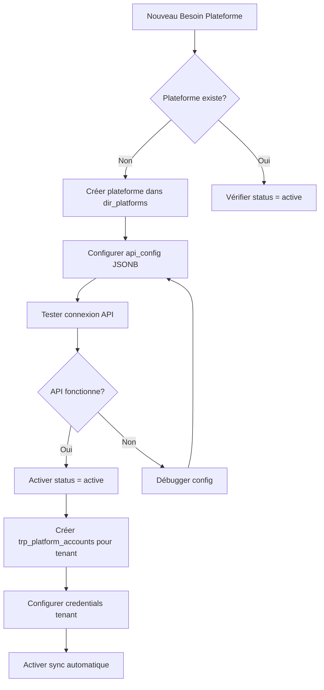

# GUIDE D'EXTENSION - Ajout de Nouvelles Plateformes

**Document de référence** : Comment ajouter de nouvelles plateformes de transport

---

## 📋 TABLE DES MATIÈRES

1. [Principe d'Extensibilité](#principe-dextensibilité)
2. [Ajout d'une Nouvelle Plateforme](#ajout-dune-nouvelle-plateforme)
3. [Exemples Concrets](#exemples-concrets)
4. [Configuration API](#configuration-api)
5. [Retour au sommaire principal](./README.md)

---

## PRINCIPE D'EXTENSIBILITÉ

### ✅ Architecture Sans Hardcode

La table `dir_platforms` est conçue pour supporter **TOUTES les plateformes** :
- ✅ **Pas d'enum plateforme** → Ajout dynamique sans migration schema
- ✅ **api_config JSONB** → Configuration API unique par plateforme
- ✅ **metadata JSONB** → Webhooks, rate limits, features extensibles
- ✅ **Soft delete** → Historique préservé si plateforme retirée

### Plateformes Initiales (Seed Data)

Les 4 plateformes principales du Middle East sont pré-configurées :
```
1. Uber    (UBER)   - Global leader
2. Careem  (CAREEM) - Middle East leader (acquired by Uber)
3. Bolt    (BOLT)   - Europe & Middle East
4. Yango   (YANGO)  - Russia & Middle East (Yandex)
```

**⚠️ IMPORTANT** : Ces plateformes sont des **exemples**. Le système supporte TOUTES les plateformes.

---

## AJOUT D'UNE NOUVELLE PLATEFORME

### Méthode 1 : Via SQL (Setup Initial)

```sql
-- Exemple: Ajouter InDrive (Russie/Amérique Latine)
INSERT INTO dir_platforms (
  code,
  name,
  provider_category,
  supported_countries,
  api_config,
  metadata,
  status
) VALUES (
  'INDRIVE',                          -- Code unique UPPERCASE
  'inDrive',                          -- Nom commercial
  'rideshare',                        -- Catégorie: rideshare, delivery, logistics
  '["RU", "MX", "BR", "CO", "PE"]'::JSONB,  -- ISO 3166 codes
  '{
    "base_url": "https://api.indrive.com/v1",
    "auth_type": "oauth2",
    "api_version": "1.0"
  }'::JSONB,
  '{
    "webhook_url": "https://api.indrive.com/webhooks",
    "rate_limit": 1000,
    "features": ["real_time_tracking", "split_fare"]
  }'::JSONB,
  'active'::lifecycle_status
);
```

### Méthode 2 : Via API (Recommandé Production)

```typescript
// POST /api/v1/platforms
{
  "code": "LYFT",
  "name": "Lyft",
  "provider_category": "rideshare",
  "supported_countries": ["US", "CA"],
  "api_config": {
    "base_url": "https://api.lyft.com/v1",
    "auth_type": "bearer_token",
    "api_version": "1.0"
  },
  "metadata": {
    "webhook_url": "https://api.lyft.com/webhooks",
    "rate_limit": 500,
    "features": ["scheduled_rides", "line_shared"]
  },
  "status": "active"
}
```

### Méthode 3 : Via UI Admin (Future)

Interface admin FleetCore permettra :
1. **Ajouter plateforme** : Formulaire avec champs code, name, category
2. **Configurer API** : Éditeur JSON pour api_config
3. **Tester connexion** : Validation credentials API
4. **Activer/Désactiver** : Toggle status sans suppression

---

## EXEMPLES CONCRETS

### Exemple 1 : DiDi (Chine/Amérique Latine)

```sql
INSERT INTO dir_platforms (code, name, provider_category, supported_countries, api_config, status)
VALUES (
  'DIDI',
  'DiDi',
  'rideshare',
  '["CN", "MX", "BR", "CL", "CO"]'::JSONB,
  '{
    "base_url": "https://api.didiglobal.com/v2",
    "auth_type": "api_key",
    "api_version": "2.0",
    "region": "asia_pacific"
  }'::JSONB,
  'active'::lifecycle_status
);
```

### Exemple 2 : Delivery Platform (Talabat, Deliveroo)

```sql
INSERT INTO dir_platforms (code, name, provider_category, supported_countries, api_config, status)
VALUES (
  'TALABAT',
  'Talabat',
  'delivery',                         -- Catégorie différente
  '["AE", "SA", "KW", "BH", "OM", "QA", "JO", "EG"]'::JSONB,
  '{
    "base_url": "https://api.talabat.com/v1",
    "auth_type": "oauth2",
    "api_version": "1.0",
    "order_types": ["food", "grocery", "pharmacy"]
  }'::JSONB,
  'active'::lifecycle_status
);
```

### Exemple 3 : Logistics Platform (Freight, B2B)

```sql
INSERT INTO dir_platforms (code, name, provider_category, supported_countries, api_config, status)
VALUES (
  'CONVOY',
  'Convoy',
  'logistics',                        -- B2B Freight
  '["US"]'::JSONB,
  '{
    "base_url": "https://api.convoy.com/v3",
    "auth_type": "jwt",
    "api_version": "3.0",
    "shipment_types": ["full_truckload", "less_than_truckload"]
  }'::JSONB,
  'active'::lifecycle_status
);
```

---

## CONFIGURATION API

### Structure api_config (JSONB Flexible)

```json
{
  "base_url": "https://api.platform.com/v1",     // Required
  "auth_type": "oauth2|api_key|bearer_token|jwt", // Required
  "api_version": "1.0",                          // Required

  // Optional: Auth specifics
  "client_id": "...",
  "client_secret": "...",
  "token_url": "https://auth.platform.com/token",

  // Optional: Régional
  "region": "us_east|eu_west|middle_east|asia_pacific",
  "data_center": "aws_us_east_1",

  // Optional: Features
  "supports_webhooks": true,
  "supports_real_time": true,
  "supports_batch_import": true,

  // Optional: Limites
  "rate_limit": 1000,
  "batch_size": 500,
  "retry_count": 3
}
```

### Structure metadata (JSONB Extensible)

```json
{
  // Webhooks
  "webhook_url": "https://api.platform.com/webhooks",
  "webhook_secret": "...",
  "webhook_events": ["trip.created", "trip.completed", "settlement.paid"],

  // Features
  "features": [
    "real_time_tracking",
    "split_fare",
    "scheduled_rides",
    "driver_rating"
  ],

  // Pricing
  "commission_structure": {
    "type": "percentage|flat",
    "rate": 25.0,
    "currency": "AED"
  },

  // Support
  "support_email": "api-support@platform.com",
  "documentation_url": "https://docs.platform.com",
  "sandbox_available": true
}
```

---

## CATÉGORIES DE PLATEFORMES

### provider_category (Valeurs Suggérées)

| Catégorie | Description | Exemples |
|-----------|-------------|----------|
| `rideshare` | Transport passagers B2C | Uber, Careem, Bolt, Lyft |
| `delivery` | Livraison food/grocery | Talabat, Deliveroo, Zomato |
| `logistics` | Fret/Transport marchandises B2B | Convoy, Flexport |
| `micromobility` | Trottinettes/Vélos | Lime, Bird, Tier |
| `taxi` | Taxis traditionnels avec app | Curb, Arro |
| `carpooling` | Covoiturage | BlaBlaCar |

**Note** : La catégorie est flexible (VARCHAR 50), vous pouvez créer de nouvelles catégories.

---

## PAYS SUPPORTÉS

### Format: ISO 3166-1 Alpha-2 (JSONB Array)

```json
// Middle East
["AE", "SA", "KW", "BH", "OM", "QA", "JO", "LB", "EG"]

// Europe
["GB", "FR", "DE", "ES", "IT", "NL", "BE"]

// Americas
["US", "CA", "MX", "BR", "AR", "CO"]

// Asia-Pacific
["CN", "JP", "SG", "IN", "AU", "NZ"]
```

**Référence** : [ISO 3166 Country Codes](https://en.wikipedia.org/wiki/ISO_3166-1_alpha-2)

---

## WORKFLOW AJOUT PLATEFORME



---

## DÉSACTIVATION PLATEFORME

### Soft Delete (Préserve Historique)

```sql
-- Désactiver sans perdre les données
UPDATE dir_platforms
SET
  status = 'inactive'::lifecycle_status,
  deleted_at = CURRENT_TIMESTAMP,
  deleted_by = '<admin_user_id>',
  deletion_reason = 'Platform API deprecated'
WHERE code = 'OLD_PLATFORM';
```

### Réactivation

```sql
-- Réactiver une plateforme
UPDATE dir_platforms
SET
  status = 'active'::lifecycle_status,
  deleted_at = NULL,
  deleted_by = NULL,
  deletion_reason = NULL
WHERE code = 'PLATFORM_TO_RESTORE';
```

---

## POINTS CLÉS

1. ✅ **Aucune migration nécessaire** pour ajouter une plateforme
2. ✅ **JSONB flexible** pour configurations API uniques
3. ✅ **Multi-région** : supported_countries permet ciblage géographique
4. ✅ **Soft delete** : Historique préservé, aucune perte données
5. ✅ **Extensible** : Nouvelles catégories, nouveaux champs metadata sans limite

---

**Dernière mise à jour** : Session 12 - Module TRP
**Responsable technique** : Architecture Data FleetCore
