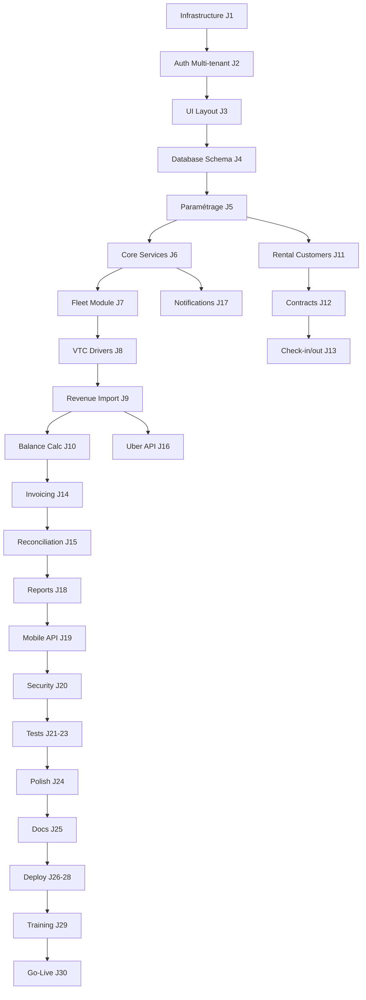

# FLEETCORE - PLANNING DE DÉVELOPPEMENT COMPLET

## 30 Jours - Du Zéro à Production

---

## VUE D'ENSEMBLE

### Principes de Séquencement

1. **Fondations avant Features** : Infrastructure → Core → Métier → UI
2. **Dépendances respectées** : Aucun module ne peut être construit sans ses prérequis
3. **Vertical Slicing** : Chaque module est livrable end-to-end
4. **Test-First** : Tests écrits avant ou pendant le code
5. **Documentation Continue** : Documenté au fur et à mesure

### Phases Principales

- **Phase 1 (J1-J5)** : Infrastructure & Fondations
- **Phase 2 (J6-J10)** : Core System & Paramétrage
- **Phase 3 (J11-J15)** : Module Fleet & VTC
- **Phase 4 (J16-J20)** : Module Rental & Finance
- **Phase 5 (J21-J25)** : Intégrations & Mobile
- **Phase 6 (J26-J30)** : Tests, Optimisation & Déploiement

---

## PHASE 1 : INFRASTRUCTURE & FONDATIONS (J1-J5)

### JOUR 1 : SETUP ENVIRONNEMENT & PROJET

**Objectif** : Environnement de développement complet et fonctionnel

**Matin (4h)**

```bash
09:00 - Setup Repository
- [ ] Créer repo GitHub
- [ ] Initialiser Next.js 15.5.3
    npx create-next-app@latest fleetcore --typescript --tailwind --app
- [ ] Structure dossiers de base
    /src/modules
    /src/shared
    /src/infrastructure
- [ ] Configuration TypeScript strict
- [ ] Setup ESLint + Prettier
- [ ] Pre-commit hooks (Husky)
```

**Après-midi (4h)**

```bash
13:00 - Setup Base de Données
- [ ] Créer projet Supabase
- [ ] Installer Prisma
    npm install prisma @prisma/client
- [ ] Initialiser Prisma
    npx prisma init
- [ ] Configuration connection strings
- [ ] Premier schema.prisma minimal (juste pour tester connexion)

15:00 - Setup Services Externes
- [ ] Compte Vercel (déploiement)
- [ ] Compte Upstash (Redis)
- [ ] Compte Sentry (monitoring)
- [ ] Compte Resend (emails)
- [ ] Configuration variables environnement (.env.local)
```

**Livrables J1**

- ✅ Projet initialisé avec toutes dépendances
- ✅ Connection base de données vérifiée
- ✅ Premier commit avec structure propre

---

### JOUR 2 : AUTHENTIFICATION & MULTI-TENANT

**Objectif** : Système d'auth multi-tenant fonctionnel

**Matin (4h)**

```typescript
09:00 - Tables Core Essentielles
// schema.prisma
model Tenant {
  id            String   @id @default(uuid())
  name          String
  subdomain     String   @unique
  country_code  String
  created_at    DateTime @default(now())
}

model User {
  id         String   @id @default(uuid())
  tenant_id  String
  email      String
  auth_id    String   @unique // Supabase auth.users.id
  role       String
  tenant     Tenant   @relation(fields: [tenant_id], references: [id])
}

- [ ] Créer migration
- [ ] Setup Supabase Auth
- [ ] Configuration RLS de base
```

**Après-midi (4h)**

```typescript
13:00 - Middleware & Context
// middleware.ts
- [ ] Middleware authentification
- [ ] Extraction tenant depuis JWT
- [ ] Context injection (tenant_id)

15:00 - Pages Auth
// app/(auth)/login/page.tsx
- [ ] Page login
- [ ] Page register (pour tests)
- [ ] Page forgot-password
- [ ] Test connexion multi-tenant
```

**Tests de validation**

```bash
- Créer 2 tenants via Supabase UI
- Créer 1 user par tenant
- Vérifier isolation login
- Vérifier JWT contient tenant_id
```

**Livrables J2**

- ✅ Auth multi-tenant fonctionnel
- ✅ RLS activé et testé
- ✅ Login/logout opérationnel

---

### JOUR 3 : LAYOUT & NAVIGATION

**Objectif** : Structure UI de base avec navigation

**Matin (4h)**

```typescript
09:00 - Installation UI
- [ ] Installer shadcn/ui
    npx shadcn-ui@latest init
- [ ] Components essentiels
    npx shadcn-ui@latest add button
    npx shadcn-ui@latest add card
    npx shadcn-ui@latest add form
    npx shadcn-ui@latest add table
    npx shadcn-ui@latest add dialog

11:00 - Layout Principal
// app/(dashboard)/layout.tsx
- [ ] Sidebar collapsible
- [ ] Header avec user menu
- [ ] Content area responsive
- [ ] Navigation items (vides pour l'instant)
```

**Après-midi (4h)**

```typescript
13:00 - Dashboard Placeholder
// app/(dashboard)/page.tsx
- [ ] Cards statistiques (fake data)
- [ ] Graphique simple (Recharts)
- [ ] Table récente (fake data)

15:00 - Theming & Responsive
- [ ] Dark mode setup (optionnel pour MVP)
- [ ] Mobile responsive
- [ ] Loading states
- [ ] Error boundaries
```

**Livrables J3**

- ✅ Layout navigable
- ✅ UI framework configuré
- ✅ Dashboard placeholder

---

### JOUR 4 : MODÈLE DE DONNÉES COMPLET

**Objectif** : Toutes les 57 tables créées

**Matin (4h)**

```bash
09:00 - Import Schema Complet
- [ ] Copier schema depuis FLEETCORE_DATABASE_SPECIFICATION_COMPLETE.md
- [ ] Adapter syntaxe Prisma
- [ ] Vérifier toutes relations
- [ ] Ajouter @@map() pour noms tables
- [ ] Ajouter @@index() pour performances
```

**Après-midi (4h)**

```bash
13:00 - Migration & Seed
- [ ] Générer migration complète
    npx prisma migrate dev --name complete_schema
- [ ] Créer seed.ts avec données test
    - 1 tenant "Demo Fleet"
    - 5 users (différents rôles)
    - 10 vehicles
    - 5 drivers
    - 3 customers
- [ ] Exécuter seed
    npx prisma db seed

16:00 - Validation Schema
- [ ] Tester toutes relations dans Prisma Studio
- [ ] Vérifier contraintes
- [ ] Documenter problèmes éventuels
```

**Livrables J4**

- ✅ 57 tables créées et migrées
- ✅ Données de test
- ✅ Schema validé

---

### JOUR 5 : SYSTÈME DE PARAMÉTRAGE

**Objectif** : Module paramétrage complet (zero hardcoding)

**Matin (4h)**

```typescript
09:00 - Service Paramètres
// modules/core/services/parameter.service.ts
class ParameterService {
  - getParameter(key, context)
  - setParameter(key, value)
  - validateFormat(value, rule)
  - getEffectiveValue(key, hierarchy)
}

11:00 - Paramètres Initiaux
- [ ] Insérer paramètres UAE
    - Formats validation (plaque, ID)
    - Règles commission
    - Règles TVA
- [ ] Insérer paramètres France
- [ ] Tester hiérarchie override
```

**Après-midi (4h)**

```typescript
13:00 - API Paramètres
// app/api/v1/parameters/route.ts
- [ ] GET /parameters (list)
- [ ] GET /parameters/:key (detail)
- [ ] PUT /parameters/:key (update)
- [ ] POST /parameters/validate (test)

15:00 - UI Paramètres (basique)
// app/(dashboard)/settings/parameters/page.tsx
- [ ] Liste paramètres groupés
- [ ] Formulaire édition
- [ ] Test en temps réel
- [ ] Audit trail
```

**Tests critiques**

```typescript
// Vérifier qu'aucune règle n'est hardcodée
- Format plaque change → Validation s'adapte
- Commission change → Calcul s'adapte
- TVA change → Facturation s'adapte
```

**Livrables J5**

- ✅ Système paramétrage fonctionnel
- ✅ ZERO règle hardcodée
- ✅ UI admin paramètres

---

## PHASE 2 : CORE SYSTEM & SERVICES (J6-J10)

### JOUR 6 : REPOSITORIES & SERVICES BASE

**Objectif** : Architecture services réutilisable

**Matin (4h)**

```typescript
09:00 - Base Repository Pattern
// shared/repositories/base.repository.ts
abstract class BaseRepository<T> {
  - findById(id)
  - findAll(filters)
  - create(data)
  - update(id, data)
  - delete(id)
  - withTenant(query) // Auto-inject tenant_id
}

10:00 - Core Repositories
// modules/core/repositories/
- [ ] TenantRepository
- [ ] UserRepository
- [ ] DocumentRepository
- [ ] AuditRepository
```

**Après-midi (4h)**

```typescript
13:00 - Core Services
// modules/core/services/
- [ ] TenantService
    - createTenant()
    - updateSettings()
- [ ] UserService
    - createUser()
    - assignRole()
- [ ] AuditService
    - logAction()
    - getTrail()

15:00 - Event Bus
// infrastructure/events/event-bus.ts
- [ ] EventBus class
- [ ] Domain events structure
- [ ] Test pub/sub
```

**Livrables J6**

- ✅ Architecture repository/service
- ✅ Services core fonctionnels
- ✅ Event bus prêt

---

### JOUR 7 : MODULE FLEET - VÉHICULES

**Objectif** : Gestion complète véhicules

**Dépendances** : Core system, Paramètres

**Matin (4h)**

```typescript
09:00 - Fleet Repository & Service
// modules/fleet/repositories/vehicle.repository.ts
- [ ] VehicleRepository avec méthodes spécifiques
    - findAvailable(date)
    - findByStatus(status)

// modules/fleet/services/vehicle.service.ts
- [ ] VehicleService
    - createVehicle(data)
    - updateStatus(vin, status)
    - checkAvailability(vin, period)
```

**Après-midi (4h)**

```typescript
13:00 - API Véhicules
// app/api/v1/fleet/vehicles/route.ts
- [ ] GET /vehicles (list avec filtres)
- [ ] POST /vehicles (création)
- [ ] GET /vehicles/:vin
- [ ] PUT /vehicles/:vin
- [ ] GET /vehicles/:vin/availability

15:00 - UI Véhicules
// app/(dashboard)/fleet/vehicles/page.tsx
- [ ] DataTable véhicules
- [ ] Filtres (status, type, location)
- [ ] Form création véhicule
- [ ] Détail véhicule
```

**Tests validation**

```typescript
- Créer véhicule avec VIN unique
- Vérifier format plaque selon pays (paramètres)
- Changer status → Vérifie disponibilité
```

**Livrables J7**

- ✅ CRUD véhicules complet
- ✅ Gestion disponibilité
- ✅ UI fonctionnelle

---

### JOUR 8 : MODULE VTC - DRIVERS

**Objectif** : Gestion drivers et employers

**Dépendances** : Véhicules (pour assignment)

**Matin (4h)**

```typescript
09:00 - Employers & Drivers
// modules/vtc/repositories/
- [ ] EmployerRepository
- [ ] DriverRepository
    - findByEmployer()
    - findActive()

// modules/vtc/services/
- [ ] EmployerService
- [ ] DriverService
    - createDriver()
    - validateLicense() // Utilise paramètres
    - linkToEmployer()
```

**Après-midi (4h)**

```typescript
13:00 - Vehicle Assignment
// modules/vtc/services/assignment.service.ts
- [ ] AssignmentService
    - assignVehicle(driver, vehicle, period)
    - checkOverlap()
    - returnVehicle()

15:00 - UI Drivers
// app/(dashboard)/vtc/drivers/page.tsx
- [ ] Liste drivers
- [ ] Form création (avec validation license)
- [ ] Assignment véhicule
- [ ] Historique assignments
```

**Tests validation**

```typescript
- Driver ne peut avoir qu'1 véhicule actif
- Véhicule ne peut avoir qu'1 driver actif
- Validation license selon pays
```

**Livrables J8**

- ✅ Gestion drivers complète
- ✅ Assignment véhicules
- ✅ Validation métier

---

### JOUR 9 : IMPORT REVENUS BASIQUE

**Objectif** : Import CSV/Manuel revenus

**Dépendances** : Drivers, Véhicules

**Matin (4h)**

```typescript
09:00 - Import Service
// modules/vtc/services/revenue-import.service.ts
- [ ] CSVParser
    - parseUberCSV()
    - parseBoltCSV()
    - parseCareemCSV()
- [ ] RevenueImportService
    - processImport()
    - validateData()
    - detectDuplicates()
    - mapDrivers()
```

**Après-midi (4h)**

```typescript
13:00 - API Import
// app/api/v1/vtc/revenues/import/route.ts
- [ ] POST /revenues/import
    - File upload
    - Format detection
    - Processing
    - Response with results

15:00 - UI Import
// app/(dashboard)/vtc/revenues/import/page.tsx
- [ ] Upload zone (drag & drop)
- [ ] Format selection
- [ ] Mapping interface
- [ ] Results summary
- [ ] Error handling
```

**Tests validation**

```bash
- Import fichier Uber sample
- Détecter doublons trip_id
- Mapper drivers correctement
- Calculer commissions selon paramètres
```

**Livrables J9**

- ✅ Import CSV fonctionnel
- ✅ Détection doublons
- ✅ UI upload

---

### JOUR 10 : CALCUL BALANCES & DÉDUCTIONS

**Objectif** : Calculs financiers drivers

**Dépendances** : Revenus importés

**Matin (4h)**

```typescript
09:00 - Deductions Service
// modules/vtc/services/deduction.service.ts
- [ ] DeductionService
    - addDeduction(driver, type, amount)
    - getDeductionsByPeriod()
    - calculateTotal()

11:00 - Balance Service
// modules/vtc/services/balance.service.ts
- [ ] BalanceService
    - calculatePeriodBalance(driver, start, end)
    - applyDeductions()
    - generateStatement()
```

**Après-midi (4h)**

```typescript
13:00 - API Balances
// app/api/v1/vtc/balances/route.ts
- [ ] GET /drivers/:id/balance
- [ ] POST /drivers/:id/deductions
- [ ] GET /drivers/:id/statement

15:00 - UI Balances
// app/(dashboard)/vtc/balances/page.tsx
- [ ] Table balances par driver
- [ ] Détail calcul
- [ ] Ajout déductions manuelles
- [ ] Export PDF statement
```

**Tests validation**

```typescript
// Scénario complet
- Driver avec 5000 AED revenus
- Déduction location 1200 AED
- Déduction fuel 300 AED
- Commission 15% = 750 AED
- Net = 2750 AED
```

**Livrables J10**

- ✅ Calcul balances complet
- ✅ Gestion déductions
- ✅ Statements générés

---

## PHASE 3 : MODULES RENTAL & FINANCE (J11-J15)

### JOUR 11 : MODULE RENTAL - CUSTOMERS

**Objectif** : Gestion customers et leads

**Dépendances** : Core system

**Matin (4h)**

```typescript
09:00 - Customer Management
// modules/rental/repositories/
- [ ] CustomerRepository
- [ ] LeadRepository

// modules/rental/services/
- [ ] CustomerService
    - createCustomer()
    - validateCreditLimit()
    - checkBlacklist()
- [ ] LeadService
    - captureLead()
    - convertToCustomer()
```

**Après-midi (4h)**

```typescript
13:00 - API Customers
// app/api/v1/rental/customers/route.ts
- [ ] CRUD customers
- [ ] Lead conversion

15:00 - UI Customers
// app/(dashboard)/rental/customers/page.tsx
- [ ] Liste customers
- [ ] Form création (individual/company)
- [ ] Pipeline leads (kanban view)
- [ ] Conversion lead → customer
```

**Livrables J11**

- ✅ Gestion customers
- ✅ Pipeline leads
- ✅ Conversion process

---

### JOUR 12 : CONTRACTS & QUOTES

**Objectif** : Devis et contrats location

**Dépendances** : Customers, Véhicules

**Matin (4h)**

```typescript
09:00 - Quote Service
// modules/rental/services/quote.service.ts
- [ ] QuoteService
    - createQuote()
    - calculatePricing() // Utilise paramètres
    - addVehicle()
    - applyDiscount()

11:00 - Contract Service
// modules/rental/services/contract.service.ts
- [ ] ContractService
    - convertQuoteToContract()
    - signContract()
    - scheduleVehicles()
```

**Après-midi (4h)**

```typescript
13:00 - API Contracts
// app/api/v1/rental/contracts/route.ts
- [ ] POST /quotes
- [ ] POST /contracts
- [ ] PUT /contracts/:id/sign
- [ ] GET /contracts/:id/pdf

15:00 - UI Contracts
// app/(dashboard)/rental/contracts/page.tsx
- [ ] Quote builder (wizard)
- [ ] Contract list
- [ ] Signature interface
- [ ] PDF preview/download
```

**Livrables J12**

- ✅ Quotes fonctionnels
- ✅ Contracts avec signature
- ✅ PDF generation

---

### JOUR 13 : CHECK-IN/OUT

**Objectif** : États des lieux digitaux

**Dépendances** : Contracts, Véhicules

**Matin (4h)**

```typescript
09:00 - CheckInOut Service
// modules/rental/services/checkinout.service.ts
- [ ] CheckInOutService
    - startCheckOut(contract, vehicle)
    - recordCondition()
    - uploadPhotos()
    - completeCheckIn()
    - calculateDamages()
```

**Après-midi (4h)**

```typescript
13:00 - UI Check-in/out
// app/(dashboard)/rental/checkinout/page.tsx
- [ ] Wizard check-out
    - Vehicle condition form
    - Photo capture (mobile friendly)
    - Signature pad
    - PDF generation
- [ ] Check-in process
    - Damage assessment
    - Cost calculation
```

**Tests validation**

```bash
- Check-out avec photos
- Check-in avec dommages
- Calcul automatique frais
- Génération PDF signé
```

**Livrables J13**

- ✅ Check-in/out digital
- ✅ Photos + signatures
- ✅ Damage calculation

---

### JOUR 14 : INVOICING & PAYMENTS

**Objectif** : Facturation et paiements

**Dépendances** : Contracts, Paramètres (TVA)

**Matin (4h)**

```typescript
09:00 - Invoice Service
// modules/finance/services/invoice.service.ts
- [ ] InvoiceService
    - generateInvoice()
    - calculateTax() // Selon paramètres pays
    - addLineItems()
    - applyPayment()

11:00 - Payment Service
// modules/finance/services/payment.service.ts
- [ ] PaymentService
    - recordPayment()
    - allocateToInvoices()
    - calculateOverdue()
```

**Après-midi (4h)**

```typescript
13:00 - API Invoicing
// app/api/v1/finance/invoices/route.ts
- [ ] POST /invoices/generate
- [ ] POST /payments
- [ ] GET /invoices/:id/pdf

15:00 - UI Invoicing
// app/(dashboard)/finance/invoices/page.tsx
- [ ] Liste invoices
- [ ] Génération batch
- [ ] Recording payments
- [ ] Overdue dashboard
```

**Livrables J14**

- ✅ Facturation complète
- ✅ Gestion paiements
- ✅ TVA/VAT automatique

---

### JOUR 15 : RÉCONCILIATION

**Objectif** : Réconciliation driver-customer

**Dépendances** : Balances drivers, Invoices customers

**Matin (4h)**

```typescript
09:00 - Reconciliation Service
// modules/finance/services/reconciliation.service.ts
- [ ] ReconciliationService
    - findDriverCustomerLinks()
    - calculateOffset()
    - processReconciliation()
    - generateReport()

11:00 - Calcul Complexe
// Exemple: Mohammed driver ET customer
- [ ] Driver balance: 5000 AED
- [ ] Customer debt: 3000 AED
- [ ] Offset: 3000 AED
- [ ] Final payment: 2000 AED
```

**Après-midi (4h)**

```typescript
13:00 - API Reconciliation
// app/api/v1/finance/reconciliation/route.ts
- [ ] POST /reconciliation/calculate
- [ ] POST /reconciliation/approve
- [ ] GET /reconciliation/report

15:00 - UI Reconciliation
// app/(dashboard)/finance/reconciliation/page.tsx
- [ ] Matching interface
- [ ] Preview calculations
- [ ] Approval workflow
- [ ] Reports generation
```

**Tests validation**

```typescript
// Scénarios complexes
- Driver simple (pas customer)
- Customer simple (pas driver)
- Driver-Customer même personne
- Employer-Customer même société
```

**Livrables J15**

- ✅ Réconciliation automatique
- ✅ Gestion cas complexes
- ✅ Reports détaillés

---

## PHASE 4 : INTÉGRATIONS & MOBILE (J16-J20)

### JOUR 16 : INTÉGRATION UBER API

**Objectif** : Import automatique Uber

**Dépendances** : Import revenus, OAuth

**Matin (4h)**

```typescript
09:00 - Uber OAuth
// integrations/uber/uber-auth.service.ts
- [ ] OAuth flow implementation
- [ ] Token management
- [ ] Refresh mechanism

11:00 - Uber API Service
// integrations/uber/uber.service.ts
- [ ] fetchPayments()
- [ ] fetchTrips()
- [ ] normalizeData()
```

**Après-midi (4h)**

```typescript
13:00 - Scheduler Integration
// jobs/uber-import.job.ts
- [ ] Daily import job
- [ ] Error handling
- [ ] Retry logic
- [ ] Notification on completion

15:00 - UI Configuration
// app/(dashboard)/integrations/uber/page.tsx
- [ ] OAuth connection flow
- [ ] Test connection
- [ ] Import history
- [ ] Manual trigger
```

**Livrables J16**

- ✅ Uber OAuth fonctionnel
- ✅ Import automatique
- ✅ Historique imports

---

### JOUR 17 : AUTRES INTÉGRATIONS

**Objectif** : WhatsApp, Email, SMS

**Matin (4h)**

```typescript
09:00 - WhatsApp Business API
// integrations/whatsapp/whatsapp.service.ts
- [ ] Setup Meta Business
- [ ] Template messages
- [ ] Send notifications
- [ ] Payment reminders

11:00 - Email Service (Resend)
// integrations/email/email.service.ts
- [ ] Templates (invoices, statements)
- [ ] Bulk sending
- [ ] Tracking
```

**Après-midi (4h)**

```typescript
13:00 - Notification Center
// modules/core/services/notification.service.ts
- [ ] Unified notification service
- [ ] Channel selection (email/whatsapp/in-app)
- [ ] Templates management
- [ ] Scheduling

15:00 - UI Notifications
// app/(dashboard)/notifications/page.tsx
- [ ] Template editor
- [ ] Send test
- [ ] History
- [ ] Analytics
```

**Livrables J17**

- ✅ Multi-channel notifications
- ✅ Templates configurables
- ✅ Tracking envois

---

### JOUR 18 : REPORTS & ANALYTICS

**Objectif** : Tableaux de bord et rapports

**Dépendances** : Toutes données métier

**Matin (4h)**

```typescript
09:00 - Analytics Service
// modules/analytics/services/analytics.service.ts
- [ ] KPI calculations
- [ ] Trend analysis
- [ ] Aggregations
- [ ] Caching results

11:00 - Report Generator
// modules/reports/services/report.service.ts
- [ ] Financial reports
- [ ] Operational reports
- [ ] Compliance reports
- [ ] Export formats (PDF, Excel)
```

**Après-midi (4h)**

```typescript
13:00 - Dashboard Widgets
// components/dashboard/widgets/
- [ ] Revenue chart
- [ ] Fleet utilization
- [ ] Driver performance
- [ ] Collection rate
- [ ] Maintenance schedule

15:00 - UI Dashboards
// app/(dashboard)/analytics/page.tsx
- [ ] Customizable dashboard
- [ ] Date range selector
- [ ] Export functionality
- [ ] Real-time updates
```

**Livrables J18**

- ✅ Analytics complets
- ✅ Reports exportables
- ✅ Dashboards temps réel

---

### JOUR 19 : MOBILE API & OPTIMISATIONS

**Objectif** : API optimisée pour mobile

**Matin (4h)**

```typescript
09:00 - Mobile API Endpoints
// app/api/mobile/v1/
- [ ] /auth/login (JWT léger)
- [ ] /driver/dashboard (données agrégées)
- [ ] /driver/revenues (paginé)
- [ ] /driver/documents (upload)

11:00 - API Optimizations
- [ ] Response compression
- [ ] Field selection (?fields=)
- [ ] Pagination curseur
- [ ] Cache headers
```

**Après-midi (4h)**

```typescript
13:00 - Performance Backend
- [ ] Database indexes review
- [ ] Query optimization
- [ ] N+1 queries fix
- [ ] Connection pooling

15:00 - Performance Frontend
- [ ] Code splitting
- [ ] Lazy loading
- [ ] Image optimization
- [ ] Bundle analysis
```

**Livrables J19**

- ✅ API mobile ready
- ✅ Performance optimisée
- ✅ Bundle size réduit

---

### JOUR 20 : SÉCURITÉ & COMPLIANCE

**Objectif** : Sécurisation complète

**Matin (4h)**

```typescript
09:00 - Security Audit
- [ ] Dependencies scan
- [ ] OWASP compliance
- [ ] SQL injection tests
- [ ] XSS prevention
- [ ] CSRF protection

11:00 - Data Protection
- [ ] PII encryption
- [ ] Audit logging
- [ ] GDPR compliance
- [ ] Data retention
```

**Après-midi (4h)**

```typescript
13:00 - Access Control
- [ ] Role permissions review
- [ ] API rate limiting
- [ ] IP whitelisting
- [ ] Session management

15:00 - Compliance Reports
// modules/compliance/
- [ ] VAT/TVA reports
- [ ] Regulatory exports
- [ ] Audit trail reports
- [ ] Data privacy reports
```

**Livrables J20**

- ✅ Security hardened
- ✅ GDPR compliant
- ✅ Audit complete

---

## PHASE 5 : TESTS & STABILISATION (J21-J25)

### JOUR 21 : TESTS UNITAIRES

**Objectif** : Coverage 80% services critiques

**Matin (4h)**

```typescript
09:00 - Tests Services Core
// __tests__/services/
- [ ] parameter.service.test.ts
- [ ] auth.service.test.ts
- [ ] audit.service.test.ts

11:00 - Tests Services VTC
- [ ] driver.service.test.ts
- [ ] revenue-import.service.test.ts
- [ ] balance.service.test.ts
```

**Après-midi (4h)**

```typescript
13:00 - Tests Services Finance
- [ ] invoice.service.test.ts
- [ ] payment.service.test.ts
- [ ] reconciliation.service.test.ts

15:00 - Tests Utils & Helpers
- [ ] validators.test.ts
- [ ] formatters.test.ts
- [ ] calculations.test.ts
```

**Livrables J21**

- ✅ 80% coverage services
- ✅ Tests critiques passants

---

### JOUR 22 : TESTS INTÉGRATION

**Objectif** : Tests API complets

**Matin (4h)**

```typescript
09:00 - Tests API Auth
// __tests__/api/auth/
- [ ] Login multi-tenant
- [ ] Token refresh
- [ ] Permission checks

11:00 - Tests API Fleet
- [ ] Vehicle CRUD
- [ ] Assignment logic
- [ ] Availability checks
```

**Après-midi (4h)**

```typescript
13:00 - Tests API VTC
- [ ] Revenue import
- [ ] Balance calculation
- [ ] Deduction application

15:00 - Tests API Finance
- [ ] Invoice generation
- [ ] Payment allocation
- [ ] Reconciliation process
```

**Livrables J22**

- ✅ API tests complets
- ✅ Postman collection

---

### JOUR 23 : TESTS E2E

**Objectif** : Parcours critiques testés

**Matin (4h)**

```typescript
09:00 - Setup Playwright
// e2e/setup/
- [ ] Configuration
- [ ] Test data
- [ ] Helper functions

11:00 - Test Parcours VTC
// e2e/vtc.spec.ts
- [ ] Create driver
- [ ] Assign vehicle
- [ ] Import revenues
- [ ] Calculate balance
```

**Après-midi (4h)**

```typescript
13:00 - Test Parcours Rental
// e2e/rental.spec.ts
- [ ] Create customer
- [ ] Generate quote
- [ ] Sign contract
- [ ] Check-out vehicle
- [ ] Generate invoice

15:00 - Test Parcours Admin
// e2e/admin.spec.ts
- [ ] Configure parameters
- [ ] Create users
- [ ] View reports
```

**Livrables J23**

- ✅ E2E tests critiques
- ✅ CI/CD ready

---

### JOUR 24 : BUG FIXES & POLISH

**Objectif** : Correction bugs et finitions

**Matin (4h)**

```bash
09:00 - Bug Priority 1
- [ ] Fixes critiques (blocking)
- [ ] Security issues
- [ ] Data integrity

11:00 - Bug Priority 2
- [ ] Functional bugs
- [ ] UI inconsistencies
- [ ] Performance issues
```

**Après-midi (4h)**

```bash
13:00 - UI Polish
- [ ] Loading states
- [ ] Error messages
- [ ] Empty states
- [ ] Animations

15:00 - UX Improvements
- [ ] Keyboard navigation
- [ ] Form validation
- [ ] Tooltips
- [ ] Help texts
```

**Livrables J24**

- ✅ Bugs critiques fixés
- ✅ UI/UX améliorée

---

### JOUR 25 : DOCUMENTATION

**Objectif** : Documentation complète

**Matin (4h)**

```markdown
09:00 - Documentation Technique

- [ ] README.md complet
- [ ] API documentation
- [ ] Database schema
- [ ] Architecture diagrams

11:00 - Documentation Déploiement

- [ ] Setup instructions
- [ ] Environment variables
- [ ] Migration guide
- [ ] Troubleshooting
```

**Après-midi (4h)**

```markdown
13:00 - Documentation Utilisateur

- [ ] Admin guide
- [ ] User manual
- [ ] FAQ
- [ ] Video tutorials (scripts)

15:00 - Documentation Code

- [ ] JSDoc comments
- [ ] Type definitions
- [ ] Example usage
- [ ] Best practices
```

**Livrables J25**

- ✅ Documentation complète
- ✅ Onboarding facilité

---

## PHASE 6 : DÉPLOIEMENT & GO-LIVE (J26-J30)

### JOUR 26 : INFRASTRUCTURE PRODUCTION

**Objectif** : Environnement production prêt

**Matin (4h)**

```bash
09:00 - Setup Vercel Production
- [ ] Project configuration
- [ ] Environment variables
- [ ] Domain setup
- [ ] SSL certificates

11:00 - Database Production
- [ ] Supabase production project
- [ ] Connection pooling
- [ ] Backup configuration
- [ ] RLS policies review
```

**Après-midi (4h)**

```bash
13:00 - Services Externes
- [ ] Redis production (Upstash)
- [ ] Monitoring (Sentry)
- [ ] Analytics (Vercel)
- [ ] CDN (Cloudflare)

15:00 - CI/CD Pipeline
- [ ] GitHub Actions setup
- [ ] Auto-deploy staging
- [ ] Manual deploy production
- [ ] Rollback procedure
```

**Livrables J26**

- ✅ Infrastructure production
- ✅ CI/CD fonctionnel

---

### JOUR 27 : MIGRATION & SEED

**Objectif** : Données production initiales

**Matin (4h)**

```bash
09:00 - Migration Production
- [ ] Run migrations
- [ ] Verify schema
- [ ] Create indexes
- [ ] Verify constraints

11:00 - Seed Data
- [ ] Create production tenant
- [ ] Admin users
- [ ] Initial parameters
- [ ] Test vehicles (3)
```

**Après-midi (4h)**

```bash
13:00 - Data Import
- [ ] Import real vehicles
- [ ] Import real drivers
- [ ] Import customers
- [ ] Historical revenues (si disponible)

15:00 - Validation
- [ ] Data integrity checks
- [ ] Calculations verification
- [ ] Reports test
```

**Livrables J27**

- ✅ Database production ready
- ✅ Initial data loaded

---

### JOUR 28 : TESTS PRODUCTION

**Objectif** : Validation environnement production

**Matin (4h)**

```bash
09:00 - Smoke Tests
- [ ] Login/logout
- [ ] Create vehicle
- [ ] Create driver
- [ ] Import revenue
- [ ] Generate invoice

11:00 - Performance Tests
- [ ] Page load times
- [ ] API response times
- [ ] Database queries
- [ ] Concurrent users
```

**Après-midi (4h)**

```bash
13:00 - Security Tests
- [ ] SSL verification
- [ ] Headers check
- [ ] Auth flow
- [ ] Permission tests

15:00 - Integration Tests
- [ ] Email sending
- [ ] WhatsApp (si configuré)
- [ ] File uploads
- [ ] PDF generation
```

**Livrables J28**

- ✅ Production validée
- ✅ Performance acceptable

---

### JOUR 29 : TRAINING & HANDOVER

**Objectif** : Formation utilisateurs

**Matin (4h)**

```bash
09:00 - Admin Training
- [ ] System overview
- [ ] User management
- [ ] Parameter configuration
- [ ] Troubleshooting

11:00 - Fleet Manager Training
- [ ] Vehicle management
- [ ] Driver management
- [ ] Assignment process
- [ ] Reports
```

**Après-midi (4h)**

```bash
13:00 - Finance Training
- [ ] Invoice generation
- [ ] Payment recording
- [ ] Reconciliation
- [ ] Financial reports

15:00 - Support Documentation
- [ ] Ticket process
- [ ] Escalation path
- [ ] Known issues
- [ ] FAQ
```

**Livrables J29**

- ✅ Users trained
- ✅ Documentation remise

---

### JOUR 30 : GO-LIVE

**Objectif** : Mise en production officielle

**Matin (4h)**

```bash
09:00 - Pre-Launch Checklist
- [ ] ✓ All systems operational
- [ ] ✓ Backups verified
- [ ] ✓ Monitoring active
- [ ] ✓ Support ready

10:00 - Launch
- [ ] DNS switch
- [ ] Announcement
- [ ] Monitor metrics
- [ ] First user onboarding

11:00 - Post-Launch Monitoring
- [ ] Error rates
- [ ] Performance metrics
- [ ] User activity
- [ ] System health
```

**Après-midi (4h)**

```bash
13:00 - Issue Resolution
- [ ] Address immediate issues
- [ ] User feedback
- [ ] Quick fixes
- [ ] Communication

15:00 - Day 1 Report
- [ ] Metrics summary
- [ ] Issues encountered
- [ ] Resolutions applied
- [ ] Next steps

16:00 - Celebration! 🎉
```

**Livrables J30**

- ✅ SYSTÈME EN PRODUCTION
- ✅ Utilisateurs actifs
- ✅ Monitoring opérationnel

---

## MATRICE DE DÉPENDANCES



---

## RESSOURCES REQUISES

### Outils Développement

- VS Code + Extensions
- Postman
- TablePlus (DB viewer)
- Chrome DevTools

### Comptes Services

- GitHub
- Vercel
- Supabase
- Upstash
- Sentry
- Resend
- Cloudflare

### Documentation

- Next.js docs
- Prisma docs
- Supabase docs
- Shadcn/ui docs

### Support

- ChatGPT/Claude pour debug
- Stack Overflow
- GitHub Issues
- Discord communautés

---

## RISQUES & MITIGATIONS

| Risque                              | Impact | Probabilité | Mitigation                      |
| ----------------------------------- | ------ | ----------- | ------------------------------- |
| Retard intégration Uber             | Moyen  | Moyen       | Fallback sur import CSV         |
| Complexité réconciliation           | Haut   | Moyen       | Tests exhaustifs J15            |
| Performance avec 1000 véhicules     | Haut   | Faible      | Optimisation J19                |
| Bug critique en production          | Haut   | Moyen       | Tests J21-23, Rollback ready    |
| Formation utilisateurs insuffisante | Moyen  | Moyen       | Documentation J25, Training J29 |

---

## CRITÈRES DE SUCCÈS

### Fonctionnels

- ✅ Multi-tenant isolation vérifiée
- ✅ Import revenus sans erreur
- ✅ Réconciliation correcte
- ✅ Zero hardcoding validé
- ✅ Paramètres modifiables sans code

### Techniques

- ✅ Temps réponse < 500ms
- ✅ Test coverage > 70%
- ✅ Zero faille sécurité critique
- ✅ Uptime > 99%
- ✅ Mobile responsive

### Business

- ✅ 3 tenants créés
- ✅ 100 véhicules gérés
- ✅ 50 drivers actifs
- ✅ Import quotidien automatique
- ✅ Utilisateurs autonomes

---

## NOTES IMPORTANTES

### Points d'Attention

1. **J4-J5** : Le système de paramétrage est CRITIQUE. Tout en dépend.
2. **J9-J10** : L'import revenus doit être robuste (gestion erreurs, doublons).
3. **J15** : La réconciliation est la feature différenciante. Tester tous les cas.
4. **J16** : Si Uber API bloque, avoir le CSV prêt.
5. **J19** : L'optimisation performance est cruciale pour 1000+ véhicules.
6. **J26-28** : Ne pas rusher le déploiement. Mieux vaut 1 jour de plus que des bugs en prod.

### Décisions à Prendre

- **J7** : Format VIN unique ou UUID + VIN ?
- **J11** : Kanban pour leads ou simple table ?
- **J16** : Payer Uber API ou scraping ?
- **J17** : WhatsApp Business API ou SMS simple ?
- **J26** : Multi-région immédiat ou phase 2 ?

### Quick Wins Possibles

- Utiliser Vercel Analytics (gratuit)
- Shadcn/ui pour UI rapide et pro
- Supabase Auth au lieu de custom
- CSV import prioritaire vs API

---

## CONCLUSION

Ce planning de 30 jours permet de construire FleetCore de manière structurée en respectant toutes les dépendances. Chaque jour a des livrables clairs et mesurables. L'ordre a été pensé pour :

1. **Fondations solides** : Infrastructure avant features
2. **Dépendances respectées** : Pas de module sans prérequis
3. **Testable tôt** : Dès J7, features utilisables
4. **Risques mitigés** : Points critiques testés multiple fois
5. **Production ready** : Tests et docs avant go-live

Le système sera fonctionnel et utilisable dès J15 (MVP), avec amélioration continue jusqu'à J30.

---

**Document généré le** : 18 Septembre 2025  
**Version** : 1.0.0  
**Status** : PRÊT POUR EXÉCUTION
