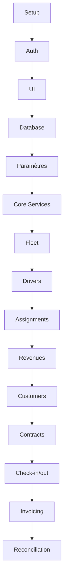

# FLEETCORE - PLANNING DES TÂCHES COMPLET

## Vision Séquencée et Hiérarchique - 30 Jours

---

## 🎯 VUE D'ENSEMBLE DES PHASES

```
PHASE 1 (J1-J5)   : Infrastructure & Fondations ━━━━━━━━━━━
PHASE 2 (J6-J10)  : Core System & Services     ━━━━━━━━━━━
PHASE 3 (J11-J15) : Rental & Finance           ━━━━━━━━━━━
PHASE 4 (J16-J20) : Intégrations & Mobile      ━━━━━━━━━━━
PHASE 5 (J21-J25) : Polish & Features          ━━━━━━━━━━━
PHASE 6 (J26-J30) : Production & Deploy        ━━━━━━━━━━━
```

## 📋 MATRICE DES DÉPENDANCES



---

## 📅 PHASE 1 : INFRASTRUCTURE & FONDATIONS (J1-J5)

### **JOUR 1 : SETUP ENVIRONNEMENT & PROJET**

#### Tâches Principales

- [ ] **Setup Repository**
  - [ ] Créer repository GitHub
  - [ ] Initialiser projet Next.js 15.5.3
  - [ ] Configurer structure dossiers
  - [ ] Setup TypeScript strict
  - [ ] Configurer ESLint + Prettier
  - [ ] Installer pre-commit hooks (Husky)

- [ ] **Setup Base de Données**
  - [ ] Créer projet Supabase
  - [ ] Installer et initialiser Prisma
  - [ ] Configurer connection strings
  - [ ] Tester connexion base

- [ ] **Setup Services Externes**
  - [ ] Créer compte Vercel
  - [ ] Créer compte Upstash (Redis)
  - [ ] Créer compte Sentry
  - [ ] Créer compte Resend
  - [ ] Configurer variables environnement

#### Points de Contrôle

✅ Projet démarre avec `npm run dev`
✅ Connexion DB vérifiée
✅ Git configuré avec hooks

---

### **JOUR 2 : AUTHENTIFICATION CLERK & MULTI-TENANT**

#### Prérequis

- J1 complété (environnement setup)

#### Tâches Principales

- [ ] **Setup Clerk Auth**
  - [ ] Créer compte Clerk
  - [ ] Installer packages Clerk
  - [ ] Configurer middleware auth
  - [ ] Setup JWT avec metadata tenant

- [ ] **Tables Multi-Tenant**
  - [ ] Créer table tenants
  - [ ] Créer table users avec tenant_id
  - [ ] Configurer RLS Supabase
  - [ ] Créer première migration

- [ ] **Pages Authentification**
  - [ ] Page login
  - [ ] Page register
  - [ ] Page forgot-password
  - [ ] Test multi-tenant isolation

#### Points de Contrôle

✅ Login fonctionne
✅ JWT contient tenant_id
✅ Isolation tenant vérifiée

---

### **JOUR 3 : INTERFACE & COMPOSANTS UI**

#### Prérequis

- J2 complété (auth fonctionnelle)

#### Tâches Principales

- [ ] **Installation Shadcn/ui**
  - [ ] Initialiser shadcn/ui
  - [ ] Installer composants essentiels
  - [ ] Configurer thème
  - [ ] Setup dark mode (optionnel)

- [ ] **Layout Principal**
  - [ ] Créer sidebar navigation
  - [ ] Créer header avec user menu
  - [ ] Implémenter content area responsive
  - [ ] Ajouter breadcrumbs

- [ ] **Dashboard Placeholder**
  - [ ] Créer cards statistiques
  - [ ] Ajouter graphique simple
  - [ ] Créer table données exemple
  - [ ] Implémenter loading states

#### Points de Contrôle

✅ Navigation fonctionne
✅ Responsive mobile OK
✅ Composants réutilisables prêts

---

### **JOUR 4 : TABLES CORE & MIGRATIONS**

#### Prérequis

- J3 complété (UI base)

#### Tâches Principales

- [ ] **Import Schéma Complet**
  - [ ] Copier 57 tables depuis specs
  - [ ] Adapter syntaxe Prisma
  - [ ] Vérifier toutes relations
  - [ ] Ajouter index performance

- [ ] **Migration Database**
  - [ ] Générer migration complète
  - [ ] Exécuter migration
  - [ ] Vérifier intégrité
  - [ ] Créer backup point

- [ ] **Seed Data**
  - [ ] Créer script seed
  - [ ] Ajouter tenant demo
  - [ ] Créer users test (5 rôles)
  - [ ] Ajouter véhicules test (10)
  - [ ] Ajouter drivers test (5)

#### Points de Contrôle

✅ 57 tables créées
✅ Relations validées
✅ Seed data disponible

---

### **JOUR 5 : SYSTÈME PARAMÉTRAGE**

#### Prérequis

- J4 complété (database prête)

#### Tâches Principales

- [ ] **Service Paramètres**
  - [ ] Créer ParameterService
  - [ ] Implémenter getParameter
  - [ ] Implémenter setParameter
  - [ ] Gérer hiérarchie override

- [ ] **Paramètres Initiaux**
  - [ ] Insérer params UAE
  - [ ] Insérer params France
  - [ ] Configurer formats validation
  - [ ] Configurer règles commission

- [ ] **API Paramètres**
  - [ ] Endpoint list parameters
  - [ ] Endpoint update parameter
  - [ ] Endpoint validate format
  - [ ] Test endpoints

- [ ] **UI Paramètres**
  - [ ] Page liste paramètres
  - [ ] Formulaire édition
  - [ ] Test validation temps réel
  - [ ] Audit trail changements

#### Points de Contrôle

✅ Zero hardcoding vérifié
✅ Paramètres modifiables
✅ Validation dynamique

---

## 📅 PHASE 2 : CORE SYSTEM & SERVICES (J6-J10)

### **JOUR 6 : REPOSITORIES & SERVICES BASE**

#### Prérequis

- J5 complété (paramètres)

#### Tâches Principales

- [ ] **Base Repository Pattern**
  - [ ] Créer BaseRepository abstract
  - [ ] Implémenter méthodes CRUD
  - [ ] Ajouter tenant isolation
  - [ ] Gérer pagination

- [ ] **Core Repositories**
  - [ ] TenantRepository
  - [ ] UserRepository
  - [ ] DocumentRepository
  - [ ] AuditRepository

- [ ] **Core Services**
  - [ ] TenantService
  - [ ] UserService
  - [ ] AuditService
  - [ ] NotificationService base

- [ ] **Event Bus**
  - [ ] Setup EventBus class
  - [ ] Définir domain events
  - [ ] Test pub/sub
  - [ ] Logger events

#### Points de Contrôle

✅ Pattern repository appliqué
✅ Services testables
✅ Event bus fonctionnel

---

### **JOUR 7 : MODULE FLEET - VÉHICULES**

#### Prérequis

- J6 complété (services base)
- Paramètres configurés

#### Tâches Principales

- [ ] **Repository Véhicules**
  - [ ] VehicleRepository
  - [ ] Méthode findAvailable
  - [ ] Méthode findByStatus
  - [ ] Gestion maintenance

- [ ] **Service Véhicules**
  - [ ] createVehicle
  - [ ] updateStatus
  - [ ] checkAvailability
  - [ ] scheduleMainenance

- [ ] **API Véhicules**
  - [ ] GET /vehicles (list + filtres)
  - [ ] POST /vehicles
  - [ ] PUT /vehicles/:vin
  - [ ] GET /vehicles/:vin/availability

- [ ] **UI Véhicules**
  - [ ] DataTable véhicules
  - [ ] Formulaire création
  - [ ] Page détail véhicule
  - [ ] Filtres et recherche

#### Points de Contrôle

✅ CRUD véhicules complet
✅ Disponibilité calculée
✅ VIN unique validé

---

### **JOUR 8 : MODULE VTC - DRIVERS**

#### Prérequis

- J7 complété (véhicules)

#### Tâches Principales

- [ ] **Repositories VTC**
  - [ ] EmployerRepository
  - [ ] DriverRepository
  - [ ] Méthodes recherche

- [ ] **Services Drivers**
  - [ ] createDriver
  - [ ] validateLicense (via params)
  - [ ] linkToEmployer
  - [ ] getDriverBalance

- [ ] **Service Assignment**
  - [ ] assignVehicle
  - [ ] checkOverlap
  - [ ] returnVehicle
  - [ ] getAssignmentHistory

- [ ] **UI Drivers**
  - [ ] Liste drivers
  - [ ] Formulaire création
  - [ ] Interface assignment
  - [ ] Historique assignments

#### Points de Contrôle

✅ Drivers créés avec validation
✅ Assignment sans conflit
✅ Un driver = un véhicule actif

---

### **JOUR 9 : IMPORT REVENUS BASIQUE**

#### Prérequis

- J8 complété (drivers)

#### Tâches Principales

- [ ] **CSV Parser**
  - [ ] Parser Uber CSV
  - [ ] Parser Bolt CSV
  - [ ] Parser Careem CSV
  - [ ] Détection format auto

- [ ] **Service Import**
  - [ ] processImport
  - [ ] validateData
  - [ ] detectDuplicates
  - [ ] mapDrivers

- [ ] **API Import**
  - [ ] POST /revenues/import
  - [ ] Progress tracking
  - [ ] Error reporting
  - [ ] Result summary

- [ ] **UI Import**
  - [ ] Zone drag & drop
  - [ ] Preview données
  - [ ] Mapping interface
  - [ ] Résultats import

#### Points de Contrôle

✅ Import CSV fonctionne
✅ Doublons détectés
✅ Mapping drivers OK

---

### **JOUR 10 : CALCUL BALANCES & DÉDUCTIONS**

#### Prérequis

- J9 complété (import revenus)

#### Tâches Principales

- [ ] **Service Déductions**
  - [ ] addDeduction
  - [ ] getDeductionsByPeriod
  - [ ] calculateTotal
  - [ ] applyPriority

- [ ] **Service Balance**
  - [ ] calculatePeriodBalance
  - [ ] applyDeductions
  - [ ] generateStatement
  - [ ] getBalanceHistory

- [ ] **API Balances**
  - [ ] GET /drivers/:id/balance
  - [ ] POST /drivers/:id/deductions
  - [ ] GET /drivers/:id/statement
  - [ ] Export PDF

- [ ] **UI Balances**
  - [ ] Table balances drivers
  - [ ] Détail calcul
  - [ ] Ajout déductions
  - [ ] Génération statements

#### Points de Contrôle

✅ Calculs corrects
✅ Déductions appliquées
✅ Statements générés

---

## 📅 PHASE 3 : RENTAL & FINANCE (J11-J15)

### **JOUR 11 : MODULE RENTAL - CUSTOMERS**

#### Prérequis

- Core system opérationnel

#### Tâches Principales

- [ ] **Repositories Customers**
  - [ ] CustomerRepository
  - [ ] LeadRepository
  - [ ] BlacklistRepository

- [ ] **Services Customers**
  - [ ] createCustomer
  - [ ] validateCreditLimit
  - [ ] checkBlacklist
  - [ ] convertLead

- [ ] **API Customers**
  - [ ] CRUD customers
  - [ ] Lead conversion
  - [ ] Credit check
  - [ ] Document upload

- [ ] **UI Customers**
  - [ ] Liste customers
  - [ ] Form création (B2B/B2C)
  - [ ] Pipeline leads
  - [ ] Documents management

#### Points de Contrôle

✅ Customers créés
✅ Leads convertis
✅ Documents uploadés

---

### **JOUR 12 : CONTRACTS & QUOTES**

#### Prérequis

- J11 complété (customers)
- Véhicules disponibles

#### Tâches Principales

- [ ] **Service Quote**
  - [ ] createQuote
  - [ ] calculatePricing
  - [ ] addVehicle
  - [ ] applyDiscount

- [ ] **Service Contract**
  - [ ] convertQuoteToContract
  - [ ] signContract
  - [ ] scheduleVehicles
  - [ ] generatePDF

- [ ] **API Contracts**
  - [ ] POST /quotes
  - [ ] POST /contracts
  - [ ] PUT /contracts/:id/sign
  - [ ] GET /contracts/:id/pdf

- [ ] **UI Contracts**
  - [ ] Quote builder wizard
  - [ ] Contract list
  - [ ] Signature interface
  - [ ] PDF preview

#### Points de Contrôle

✅ Quotes générés
✅ Contracts signés
✅ PDF générés

---

### **JOUR 13 : CHECK-IN/OUT**

#### Prérequis

- J12 complété (contracts)

#### Tâches Principales

- [ ] **Service Check-in/out**
  - [ ] startCheckOut
  - [ ] recordCondition
  - [ ] uploadPhotos
  - [ ] completeCheckIn
  - [ ] calculateDamages

- [ ] **API Check-in/out**
  - [ ] POST /checkout/start
  - [ ] POST /checkin/complete
  - [ ] POST /damages
  - [ ] Upload photos

- [ ] **UI Check-in/out**
  - [ ] Wizard checkout
  - [ ] Photo capture
  - [ ] Condition form
  - [ ] Signature pad
  - [ ] Damage assessment

#### Points de Contrôle

✅ Photos uploadées
✅ Dommages calculés
✅ PDF état des lieux

---

### **JOUR 14 : INVOICING & PAYMENTS**

#### Prérequis

- Contracts actifs
- Paramètres TVA

#### Tâches Principales

- [ ] **Service Invoice**
  - [ ] generateInvoice
  - [ ] calculateTax
  - [ ] addLineItems
  - [ ] sendInvoice

- [ ] **Service Payment**
  - [ ] recordPayment
  - [ ] allocateToInvoices
  - [ ] calculateOverdue
  - [ ] sendReminders

- [ ] **API Finance**
  - [ ] POST /invoices/generate
  - [ ] POST /payments
  - [ ] GET /overdue
  - [ ] Export comptable

- [ ] **UI Finance**
  - [ ] Liste invoices
  - [ ] Recording payments
  - [ ] Overdue dashboard
  - [ ] Batch generation

#### Points de Contrôle

✅ Invoices générées
✅ TVA calculée
✅ Paiements alloués

---

### **JOUR 15 : RÉCONCILIATION**

#### Prérequis

- J14 complété (invoicing)
- Balances drivers calculées

#### Tâches Principales

- [ ] **Service Réconciliation**
  - [ ] findDriverCustomerLinks
  - [ ] calculateOffset
  - [ ] processReconciliation
  - [ ] generateReport

- [ ] **Cas Complexes**
  - [ ] Driver = Customer
  - [ ] Employer = Customer
  - [ ] Multi-liens
  - [ ] Compensation partielle

- [ ] **API Réconciliation**
  - [ ] POST /reconciliation/calculate
  - [ ] POST /reconciliation/approve
  - [ ] GET /reconciliation/report
  - [ ] Preview avant validation

- [ ] **UI Réconciliation**
  - [ ] Matching interface
  - [ ] Preview calculs
  - [ ] Approval workflow
  - [ ] Reports génération

#### Points de Contrôle

✅ Liens détectés
✅ Compensations calculées
✅ Reports corrects

---

## 📅 PHASE 4 : INTÉGRATIONS & MOBILE (J16-J20)

### **JOUR 16 : INTÉGRATION STRIPE**

#### Prérequis

- Module Finance opérationnel

#### Tâches Principales

- [ ] **Setup Stripe**
  - [ ] Créer compte Stripe
  - [ ] Configurer webhooks
  - [ ] Setup products/prices
  - [ ] Test mode configuration

- [ ] **Service Stripe**
  - [ ] createCustomer
  - [ ] createSubscription
  - [ ] processPayment
  - [ ] handleWebhooks

- [ ] **Stripe Connect** (si B2B2C)
  - [ ] Onboarding flow
  - [ ] Account management
  - [ ] Payout handling
  - [ ] Fee structure

- [ ] **UI Paiement**
  - [ ] Payment methods
  - [ ] Subscription management
  - [ ] Payment history
  - [ ] Refunds interface

#### Points de Contrôle

✅ Paiements processés
✅ Webhooks reçus
✅ Subscriptions actives

---

### **JOUR 17 : INTÉGRATIONS PLATEFORMES**

#### Prérequis

- Import CSV fonctionnel

#### Tâches Principales

- [ ] **Uber Integration**
  - [ ] OAuth setup
  - [ ] Token management
  - [ ] API Fleet endpoints
  - [ ] Scheduler import

- [ ] **Bolt Scraping**
  - [ ] Puppeteer setup
  - [ ] Session management
  - [ ] Anti-detection
  - [ ] Error recovery

- [ ] **WhatsApp Business**
  - [ ] Meta Business setup
  - [ ] Template messages
  - [ ] Send notifications
  - [ ] Delivery tracking

- [ ] **Email Service**
  - [ ] Resend configuration
  - [ ] Templates création
  - [ ] Bulk sending
  - [ ] Tracking setup

#### Points de Contrôle

✅ Uber OAuth fonctionne
✅ Messages WhatsApp envoyés
✅ Emails trackés

---

### **JOUR 18 : REPORTS & ANALYTICS**

#### Prérequis

- Données métier disponibles

#### Tâches Principales

- [ ] **Service Analytics**
  - [ ] KPI calculations
  - [ ] Trend analysis
  - [ ] Aggregations
  - [ ] Cache results

- [ ] **Report Generator**
  - [ ] Financial reports
  - [ ] Operational reports
  - [ ] Compliance reports
  - [ ] Export formats

- [ ] **Dashboard Widgets**
  - [ ] Revenue chart
  - [ ] Fleet utilization
  - [ ] Driver performance
  - [ ] Collection rate

- [ ] **UI Analytics**
  - [ ] Custom dashboards
  - [ ] Date range selector
  - [ ] Export functionality
  - [ ] Real-time updates

#### Points de Contrôle

✅ KPIs calculés
✅ Reports exportables
✅ Charts interactifs

---

### **JOUR 19 : MOBILE API & OPTIMISATIONS**

#### Prérequis

- APIs métier stables

#### Tâches Principales

- [ ] **Mobile API**
  - [ ] JWT léger
  - [ ] Endpoints optimisés
  - [ ] Pagination curseur
  - [ ] Field selection

- [ ] **Performance Backend**
  - [ ] Database indexes
  - [ ] Query optimization
  - [ ] Fix N+1 queries
  - [ ] Connection pooling

- [ ] **Performance Frontend**
  - [ ] Code splitting
  - [ ] Lazy loading
  - [ ] Image optimization
  - [ ] Bundle analysis

- [ ] **Caching Strategy**
  - [ ] Redis setup
  - [ ] Cache invalidation
  - [ ] CDN configuration
  - [ ] Static assets

#### Points de Contrôle

✅ API response < 200ms
✅ Bundle size optimisé
✅ Lighthouse score > 90

---

### **JOUR 20 : SÉCURITÉ & COMPLIANCE**

#### Prérequis

- Application fonctionnelle

#### Tâches Principales

- [ ] **Security Audit**
  - [ ] Dependencies scan
  - [ ] OWASP checks
  - [ ] SQL injection tests
  - [ ] XSS prevention

- [ ] **Data Protection**
  - [ ] PII encryption
  - [ ] Audit logging
  - [ ] GDPR compliance
  - [ ] Data retention

- [ ] **Access Control**
  - [ ] Role permissions
  - [ ] API rate limiting
  - [ ] IP whitelisting
  - [ ] Session management

- [ ] **Compliance Reports**
  - [ ] VAT/TVA reports
  - [ ] Regulatory exports
  - [ ] Audit trails
  - [ ] Privacy reports

#### Points de Contrôle

✅ Vulnerabilities zero
✅ GDPR compliant
✅ Audit logs actifs

---

## 📅 PHASE 5 : POLISH & FEATURES (J21-J25)

### **JOUR 21 : REAL-TIME AVEC WEBSOCKETS**

#### Prérequis

- Infrastructure stable

#### Tâches Principales

- [ ] **Setup WebSockets**
  - [ ] Supabase Realtime
  - [ ] Channel configuration
  - [ ] Authentication
  - [ ] Error handling

- [ ] **Real-time Features**
  - [ ] Vehicle tracking
  - [ ] Balance updates
  - [ ] Notifications push
  - [ ] Dashboard live

- [ ] **Subscriptions UI**
  - [ ] Auto-refresh data
  - [ ] Status indicators
  - [ ] Connection state
  - [ ] Retry logic

#### Points de Contrôle

✅ Updates < 100ms
✅ Reconnection auto
✅ No memory leaks

---

### **JOUR 22 : ADVANCED UI COMPONENTS**

#### Prérequis

- Features métier complètes

#### Tâches Principales

- [ ] **Complex Components**
  - [ ] Advanced DataTable
  - [ ] Calendar scheduler
  - [ ] Drag-drop uploads
  - [ ] Charts interactifs

- [ ] **UX Improvements**
  - [ ] Keyboard navigation
  - [ ] Accessibility (A11y)
  - [ ] Progressive disclosure
  - [ ] Contextual help

- [ ] **Polish UI**
  - [ ] Micro-animations
  - [ ] Loading skeletons
  - [ ] Empty states
  - [ ] Error boundaries

#### Points de Contrôle

✅ Components réutilisables
✅ Accessibility AA
✅ Animations fluides

---

### **JOUR 23 : EMAIL & NOTIFICATIONS**

#### Prérequis

- Services communication setup

#### Tâches Principales

- [ ] **Email Templates**
  - [ ] Design templates
  - [ ] Multi-language
  - [ ] Preview system
  - [ ] Test sending

- [ ] **Notification Center**
  - [ ] In-app notifications
  - [ ] Push notifications
  - [ ] SMS integration
  - [ ] Preferences management

- [ ] **Automation Rules**
  - [ ] Trigger configuration
  - [ ] Scheduling
  - [ ] Batching
  - [ ] Tracking

#### Points de Contrôle

✅ Emails responsive
✅ Notifications received
✅ Unsubscribe works

---

### **JOUR 24 : BACKUP & RECOVERY**

#### Prérequis

- Production data available

#### Tâches Principales

- [ ] **Backup Strategy**
  - [ ] Database backups
  - [ ] File storage backup
  - [ ] Configuration backup
  - [ ] Schedule setup

- [ ] **Recovery Procedures**
  - [ ] Test restore
  - [ ] RTO validation
  - [ ] RPO validation
  - [ ] Documentation

- [ ] **Data Export**
  - [ ] Full export
  - [ ] Selective export
  - [ ] Format options
  - [ ] Archiving

#### Points de Contrôle

✅ Backups automated
✅ Restore tested
✅ < 4h recovery time

---

### **JOUR 25 : DOCUMENTATION & TESTS**

#### Prérequis

- Features complètes

#### Tâches Principales

- [ ] **Documentation Technique**
  - [ ] API documentation
  - [ ] Database schema
  - [ ] Architecture diagrams
  - [ ] Setup instructions

- [ ] **Documentation Utilisateur**
  - [ ] Admin guide
  - [ ] User manual
  - [ ] FAQ
  - [ ] Video scripts

- [ ] **Tests Coverage**
  - [ ] Unit tests (>80%)
  - [ ] Integration tests
  - [ ] E2E tests
  - [ ] Performance tests

- [ ] **Code Quality**
  - [ ] Refactoring
  - [ ] Comments/JSDoc
  - [ ] Type definitions
  - [ ] Linting

#### Points de Contrôle

✅ Coverage > 80%
✅ Docs complètes
✅ Zero linting errors

---

## 📅 PHASE 6 : PRODUCTION & DEPLOY (J26-J30)

### **JOUR 26 : INFRASTRUCTURE PRODUCTION**

#### Prérequis

- Application testée

#### Tâches Principales

- [ ] **Vercel Production**
  - [ ] Project setup
  - [ ] Environment variables
  - [ ] Domain configuration
  - [ ] SSL certificates

- [ ] **Database Production**
  - [ ] Supabase production
  - [ ] Connection pooling
  - [ ] Backup config
  - [ ] RLS review

- [ ] **External Services**
  - [ ] Redis production
  - [ ] Monitoring setup
  - [ ] Analytics setup
  - [ ] CDN configuration

- [ ] **CI/CD Pipeline**
  - [ ] GitHub Actions
  - [ ] Auto-deploy staging
  - [ ] Manual production
  - [ ] Rollback procedure

#### Points de Contrôle

✅ Infrastructure ready
✅ Monitoring active
✅ CI/CD functional

---

### **JOUR 27 : MIGRATION & SEED**

#### Prérequis

- J26 complété (infra)

#### Tâches Principales

- [ ] **Migration Production**
  - [ ] Run migrations
  - [ ] Verify schema
  - [ ] Create indexes
  - [ ] Check constraints

- [ ] **Seed Production**
  - [ ] Production tenant
  - [ ] Admin users
  - [ ] Initial parameters
  - [ ] Test vehicles

- [ ] **Data Import**
  - [ ] Real vehicles
  - [ ] Real drivers
  - [ ] Real customers
  - [ ] Historical data

- [ ] **Validation**
  - [ ] Data integrity
  - [ ] Calculations check
  - [ ] Reports test
  - [ ] Access control

#### Points de Contrôle

✅ Data migrated
✅ Integrity verified
✅ Access controlled

---

### **JOUR 28 : TESTS PRODUCTION**

#### Prérequis

- J27 complété (data)

#### Tâches Principales

- [ ] **Smoke Tests**
  - [ ] Critical paths
  - [ ] Login flows
  - [ ] Core features
  - [ ] Payment flow

- [ ] **Performance Tests**
  - [ ] Load testing
  - [ ] Response times
  - [ ] Database queries
  - [ ] Concurrent users

- [ ] **Security Tests**
  - [ ] SSL verification
  - [ ] Headers check
  - [ ] Auth testing
  - [ ] Permission tests

- [ ] **Integration Tests**
  - [ ] Email sending
  - [ ] WhatsApp
  - [ ] File uploads
  - [ ] PDF generation

#### Points de Contrôle

✅ All tests pass
✅ Performance OK
✅ Security validated

---

### **JOUR 29 : TRAINING & HANDOVER**

#### Prérequis

- Production stable

#### Tâches Principales

- [ ] **Admin Training**
  - [ ] System overview
  - [ ] User management
  - [ ] Parameters config
  - [ ] Troubleshooting

- [ ] **User Training**
  - [ ] Fleet managers
  - [ ] Finance team
  - [ ] Operations agents
  - [ ] Support team

- [ ] **Documentation Handover**
  - [ ] Technical docs
  - [ ] User guides
  - [ ] Support procedures
  - [ ] Known issues

- [ ] **Support Setup**
  - [ ] Ticket process
  - [ ] Escalation path
  - [ ] On-call schedule
  - [ ] FAQ update

#### Points de Contrôle

✅ Users trained
✅ Docs delivered
✅ Support ready

---

### **JOUR 30 : GO-LIVE**

#### Prérequis

- J29 complété

#### Tâches Principales

- [ ] **Pre-Launch Checklist**
  - [ ] Systems check
  - [ ] Backups verified
  - [ ] Monitoring active
  - [ ] Support ready

- [ ] **Launch Execution**
  - [ ] DNS switch
  - [ ] Announcement
  - [ ] Monitor metrics
  - [ ] First users

- [ ] **Post-Launch Monitor**
  - [ ] Error tracking
  - [ ] Performance metrics
  - [ ] User activity
  - [ ] System health

- [ ] **Day 1 Report**
  - [ ] Metrics summary
  - [ ] Issues found
  - [ ] Resolutions
  - [ ] Next steps

#### Points de Contrôle

✅ System live
✅ Users active
✅ Metrics normal
✅ 🎉 CELEBRATION!

---

## 📊 MÉTRIQUES DE SUIVI

### Indicateurs Quotidiens

- [ ] Tâches complétées / planifiées
- [ ] Blockers identifiés
- [ ] Tests passés
- [ ] Bugs trouvés/résolus

### Jalons Hebdomadaires

- **Semaine 1**: Infrastructure complète
- **Semaine 2**: Core modules fonctionnels
- **Semaine 3**: Finance opérationnel
- **Semaine 4**: Intégrations actives
- **Semaine 5**: Polish & tests
- **Semaine 6**: Production live

### Points d'Attention Critiques

⚠️ **J5**: Paramètres - TOUT en dépend
⚠️ **J10**: Import revenus - Feature clé
⚠️ **J15**: Réconciliation - Différenciateur
⚠️ **J20**: Sécurité - Non négociable
⚠️ **J28**: Tests production - Go/No-Go

---

## 🚀 FACTEURS DE SUCCÈS

### Must-Have pour MVP (J15)

✅ Multi-tenant isolation
✅ Vehicles + Drivers
✅ Revenue import
✅ Balance calculation
✅ Basic invoicing

### Nice-to-Have (J20)

⭐ Real-time updates
⭐ WhatsApp notifications
⭐ Advanced analytics
⭐ Mobile optimized

### Post-Launch (>J30)

🔮 AI predictions
🔮 IoT integration
🔮 Blockchain docs
🔮 Multi-country

---

**Document généré le**: 22 Septembre 2025
**Version**: 1.0.0
**Status**: PRÊT POUR EXÉCUTION
**Dernière révision**: Basé sur documents projet existants
