# Fleetcore — Architecture Fonctionnelle (Vue d'ensemble)

_Mise à jour: 2025-10-12_

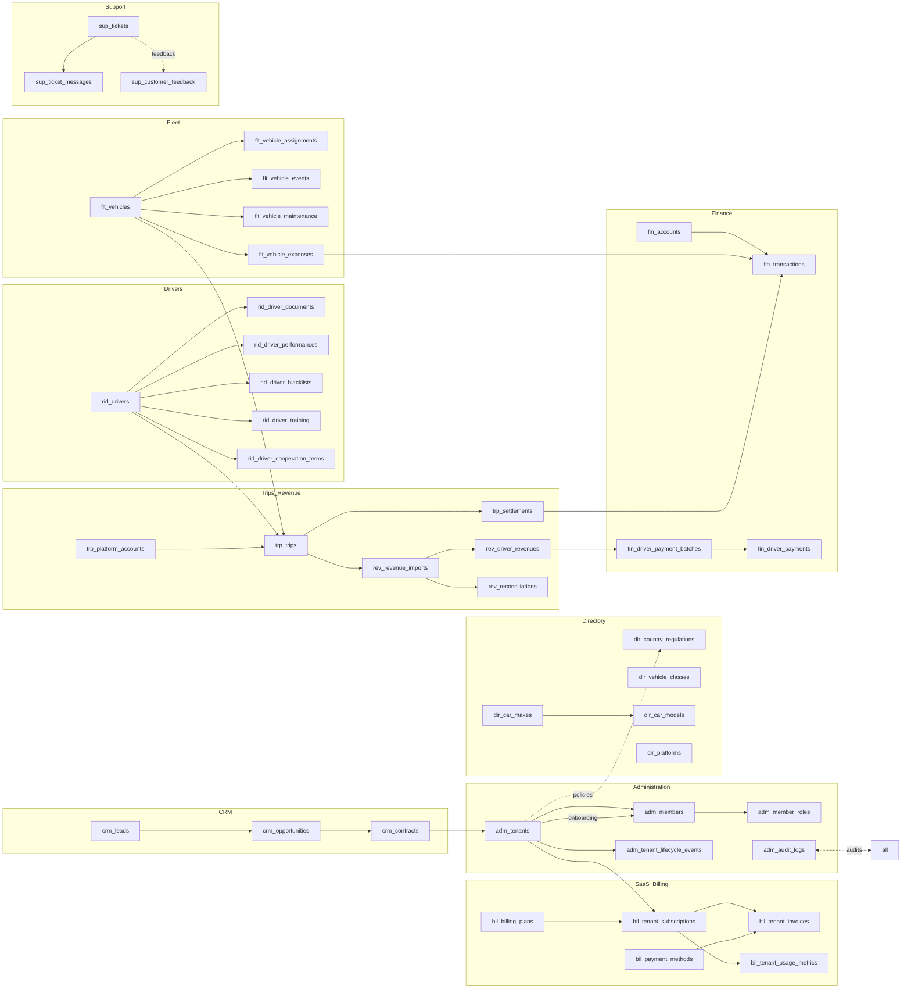

## Patterns d'accès recommandés

- **CQRS léger**: vues matérialisées de reporting pour KPI journaliers, tables OLTP inchangées.
- **Event-sourcing minimal**: `adm_audit_logs`, `adm_tenant_lifecycle_events`, `trp_settlements` servent de journal métier.
- **Intégrations**: `dir_platforms` + `trp_platform_accounts` pour paramétrer les connecteurs (Uber/Bolt/…).

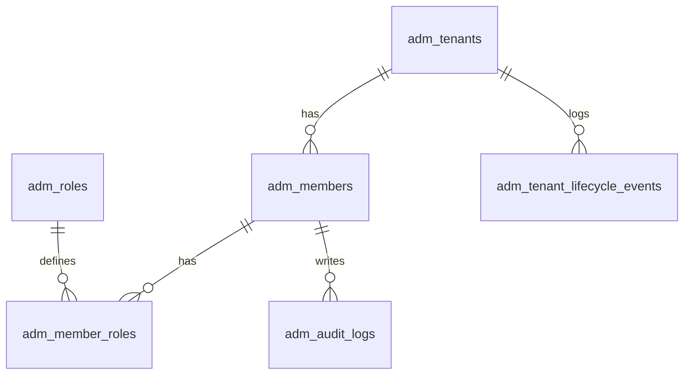

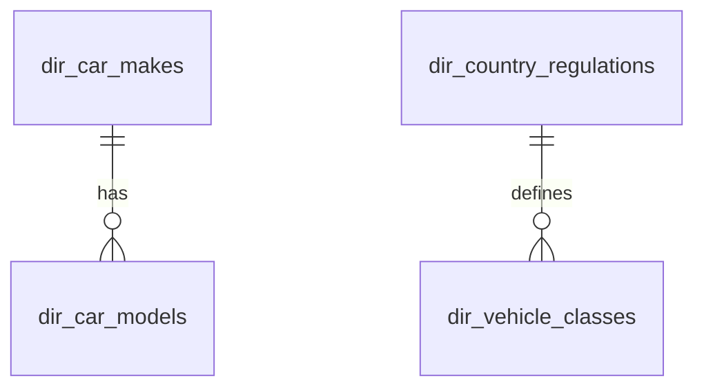

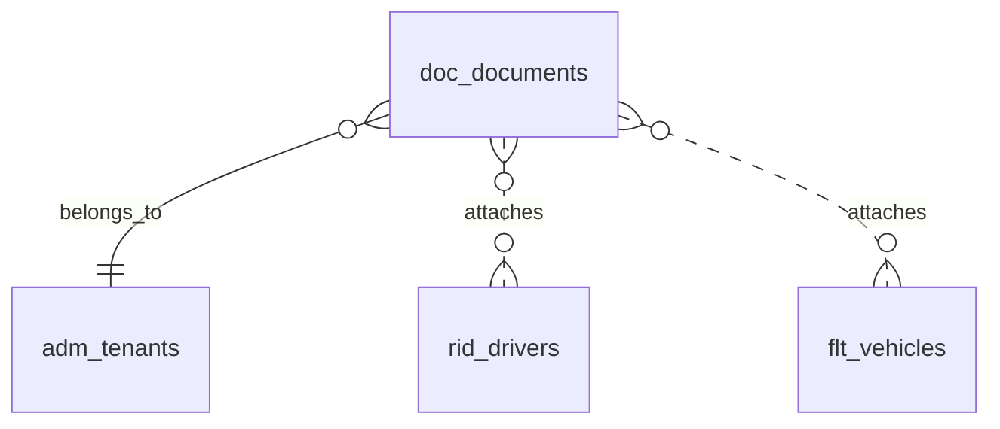

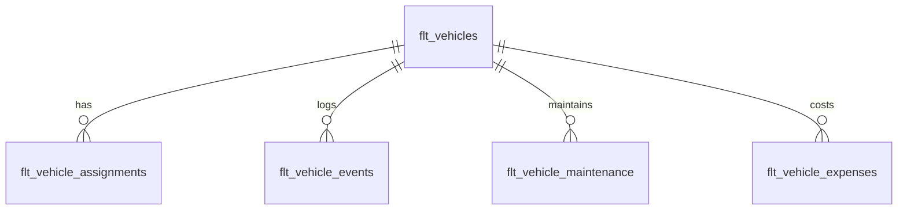

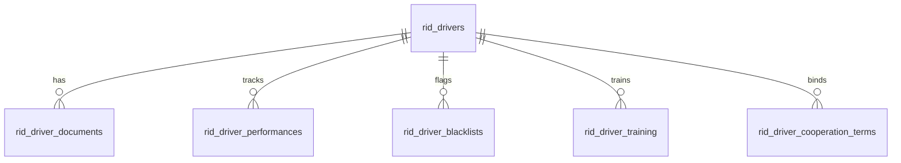

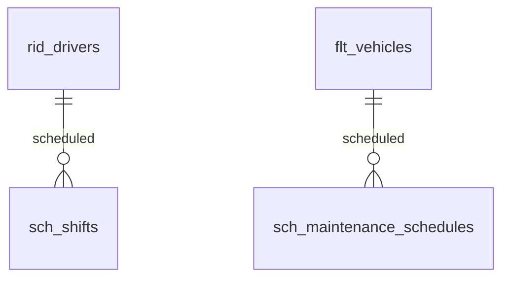

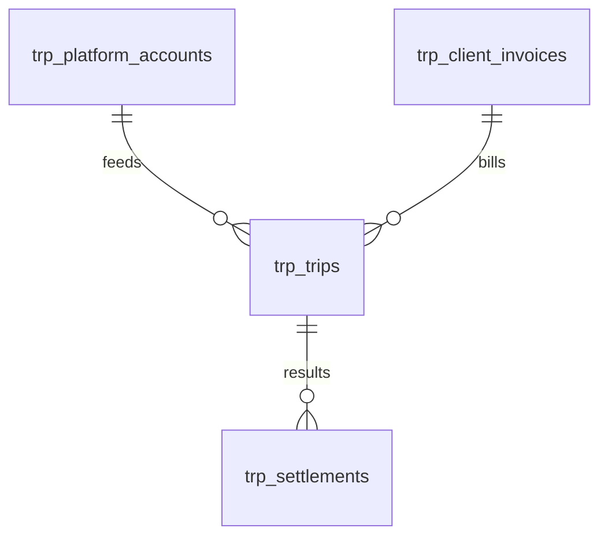

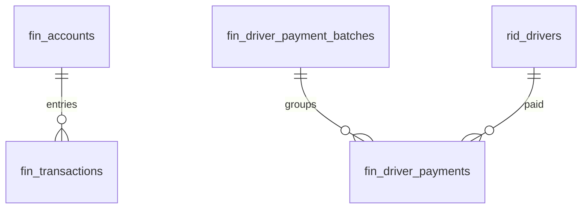

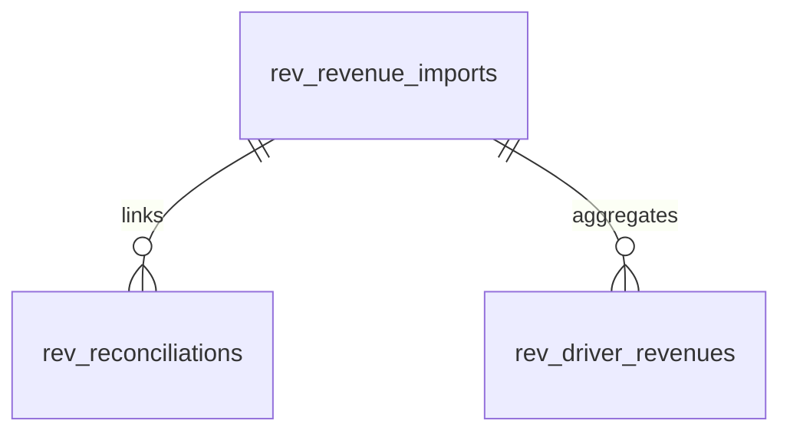

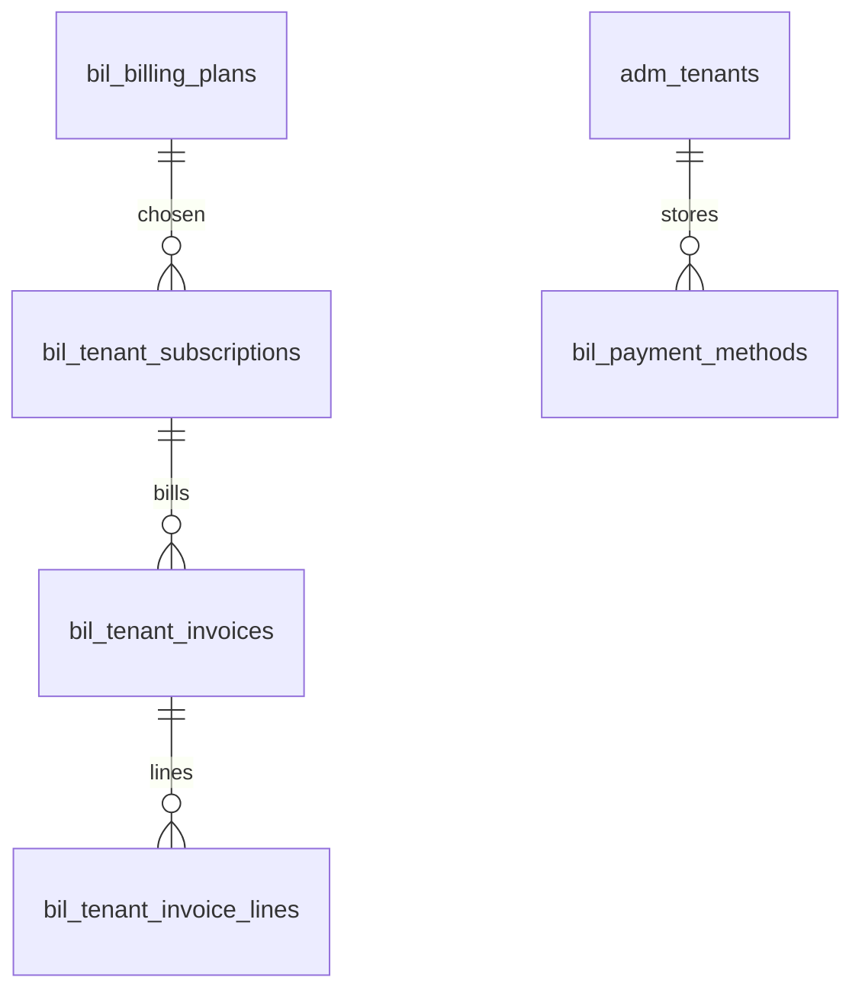

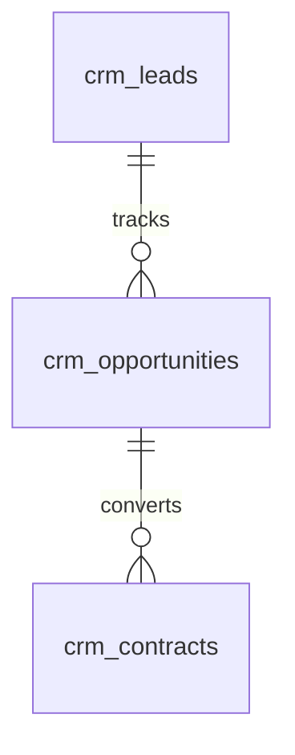

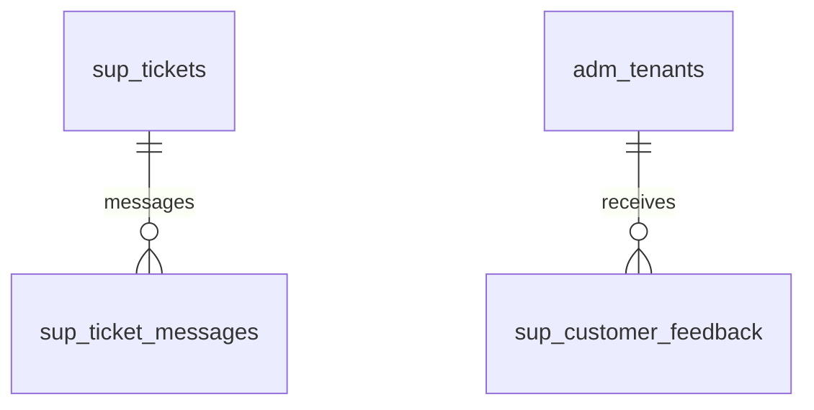
